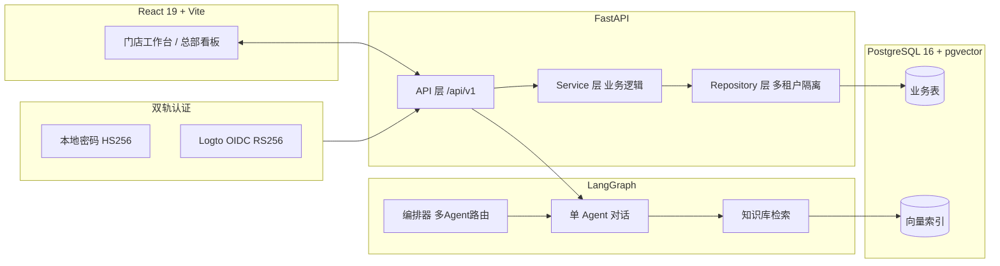

# 颐和堂大健康连锁 —— 业务场景说明

> 本文档面向「想了解这套平台能解决什么问题」的对外读者(潜在客户、合作伙伴、技术评审)。
> 配套阅读:[02-演示账号清单](./02-演示账号清单.md) · [03-日常使用剧本](./03-日常使用剧本.md) · [04-种子数据复现指南](./04-种子数据复现指南.md)

---

## 一、行业背景:大健康连锁的数字化痛点

中医理疗、艾灸养生、推拿按摩等大健康连锁门店在运营中普遍面临三类问题:

| 痛点 | 具体表现 | 业务后果 |
|------|---------|---------|
| **会员分散** | 同一客户在 A 店建档、B 店消费,但两店互不认识,无法识别「这是老客户」 | 老客到新店被当新客接待,服务标准断层,复购率流失 |
| **服务标准难统一** | 各店理疗手法、话术、禁忌掌握不一致,依赖师傅个人经验 | 服务质量参差,品牌口碑难沉淀,新店扩张慢 |
| **健康数据无法跨店** | 客户在朝阳店做的颈椎理疗记录,海淀店针灸时看不到,无法延续治疗 | 重复问诊、方案冲突,客户体验差,也埋下医疗安全隐患 |

本平台以「**颐和堂大健康连锁**」(虚构品牌)为演示场景,展示如何用一套 SaaS 系统解决上述问题。

---

## 二、颐和堂场景设定

### 2.1 组织架构

```
颐和堂大健康连锁(品牌)
├── 颐和堂中医馆(直营连锁组织)
│   ├── 朝阳理疗中心   —— 颈椎理疗、推拿为主
│   └── 海淀中医门诊   —— 针灸、中药调理为主
└── 独立养生馆(加盟组织)
    └── 王府井理疗馆   —— 艾灸养生为主
```

- **3 家门店**:朝阳理疗中心、海淀中医门诊、王府井理疗馆(真实地名组合,便于对外讲)
- **2 个组织(Group)**:把门店按经营归属分组,支撑「跨店数据可见」的权限边界
- **1 个总部**:平台 super_admin(品牌运营总部),统筹全连锁

### 2.2 业务范围

中医诊疗、推拿理疗、艾灸养生、健康咨询、会员管理。

### 2.3 人员配置(8 个账号,覆盖全角色)

| 身份 | 账号 | 能干什么 |
|------|------|---------|
| 平台超管 | `admin` | 开门店、充值、配定价、看全局 |
| 门店馆长(owner) | 3 位(陈/赵/吴馆长) | 管店全权:配 Agent、管客户、看账 |
| 资深理疗师(自定义角色) | 李师傅 | 读写客户、对话(不能删/建客户)——演示自定义权限 |
| 门店理疗师(member) | 王/孙师傅 | 只读 Agent、对话 |
| 总部督导(hq_staff) | 督导员 | 跨店只读看数据/客户/用量 |

> 完整账号清单与权限差异见 [02-演示账号清单](./02-演示账号清单.md)。

---

## 三、平台核心能力(为什么用这套系统)

### 3.1 多租户隔离

每家门店是一个独立**租户(tenant)**,数据在数据库层物理隔离:朝阳店看不到海淀店的客户、账单、对话。这是 SaaS 的基石——**不同门店的数据绝不会串**,既是合规要求,也是品牌方对各加盟商的承诺。

### 3.2 跨店客户身份复用(本场景的亮点)

这是解决「会员分散」痛点的关键能力:

- 客户「张先生」(手机 138...)在**朝阳店**建档做颈椎理疗
- 他转诊到**海淀店**做针灸巩固时,海淀店输入同一手机号,**系统识别出这是同一个张先生**,自动复用其全局身份,只在海淀店新建一份「门店档案(profile)」
- 结果:张先生的**全局身份唯一**,但**每家店有自己的服务记录/备注/标签**,互不干扰又可追溯

> 数据模型上:全局 `Customer`(按手机号唯一)+ 每店 `CustomerProfile`(门店视角的档案)。演示数据里张先生在朝阳+海淀各有一份 profile,刘女士在朝阳+王府井各有一份。

### 3.3 RAG 知识库(解决服务标准统一)

每家门店灌入标准操作文档(颈椎理疗操作规范、中药针灸禁忌、艾灸注意事项等),AI 顾问对话时**检索本店知识库**作答,确保话术和操作标准统一:

- 朝阳店灌「颈椎理疗操作规范」
- 海淀店灌「中药与针灸禁忌」
- 王府井店灌「艾灸养生注意事项」

门店顾问提问时,AI 基于本店文档回答,新手也能给出符合标准的服务建议。

### 3.4 预付钱包 + 按量计费(透明计费)

- 每家门店有一个**钱包**,总部充值(预付 token 额度)
- 每次 AI 对话按实际 token 消耗**实时扣费**,单价由平台配置(如 DeepSeek 输入/输出每 1k token 单价)
- 账单明细可追溯到每一条对话,总部能看清「哪家店、哪个 Agent、哪个客户花了多少」

### 3.5 三级权限 + 行级数据范围

权限不是简单的「能进/不能进」,而是精细到行级:

| 数据范围 | 含义 | 适用角色 |
|---------|------|---------|
| `tenant` | 只看本店数据 | owner / member(默认) |
| `group` | 看本组织(连锁)内所有门店 | 督导员 |
| `all` | 看全平台所有门店 | super_admin |

例如「颐和堂中医馆」组织(含朝阳+海淀)的督导,能看到这两家店的数据,但看不到加盟的「独立养生馆」(王府井)。

### 3.6 多智能体编排(进阶能力)

平台支持**编排器(orchestrator)Agent**:一个「智能分诊调度员」Agent 根据问题类别,把用户消息路由给最合适的专科顾问(理疗顾问/中医顾问),而不是自己作答。演示了多 Agent 协作能力。

---

## 四、商业价值

| 价值点 | 对应能力 | 业务收益 |
|--------|---------|---------|
| 统一服务标准 | RAG 知识库 + AI 顾问 | 新店/新人快速上手,服务不走样,品牌可复制 |
| 会员跨店识别 | 跨店客户身份复用 | 老客到任何门店都被识别,提升复购与体验 |
| AI 辅助诊疗 | LangGraph Agent + RAG | 顾问有标准方案参考,降低对个人经验依赖 |
| 计费透明可控 | 预付钱包 + 按量计费 | 总部精确掌控每店成本,加盟商账目清晰 |
| 数据安全合规 | 多租户隔离 + 行级权限 | 各店数据不串,满足品牌方与加盟商的信任要求 |

---

## 五、系统架构



**技术栈**:FastAPI + SQLAlchemy 2.0(async)+ pycasbin(RBAC 多租户)+ LangGraph(AI Agent)+ Alembic;React 19 + TanStack Query + Tailwind;PostgreSQL 16 + pgvector;双轨认证(本地 bcrypt + Logto OIDC)。

---

## 六、如何看到这套演示

完整复现步骤见 [04-种子数据复现指南](./04-种子数据复现指南.md)。最短路径:

```bash
docker-compose up -d              # 起 PostgreSQL(pgvector)+ Logto
alembic upgrade head              # 建表
python scripts/init_admin.py      # 建超管
python scripts/seed_demo.py       # 灌入颐和堂数据
cd frontend && npm run dev        # 启动前端
```

然后用任意演示账号登录(开发环境登录页会预填 `admin`),对照 [03-日常使用剧本](./03-日常使用剧本.md) 体验各角色视角。
