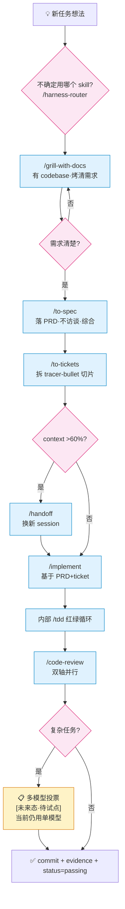

# 计划:Harness 工程实践文档重整 + 自动化机制建设

> **id**: harness-engineering-revamp
> **状态**: draft **v3.1**(v3 经第二轮多模型评审 Revise(3:0 一致)后修订,本轮净增 7 项必修点 + 2 项硬失实修正)
> **类型**: 文档+工程基建任务(无后端代码改动)
> **优先级**: 待 feature_list.json 登记
> **创建日期**: 2026-07-20
> **v2 修订日期**: 2026-07-20
> **v3 修订日期**: 2026-07-20
> **v3.1 修订日期**: 2026-07-21(对齐实施现状 + 修 2 处失实 + 6 项一致性补强)

---

## 0. 版本变更摘要

### 0.0 v3.1 实施状态说明(评审总指挥汇总判决驱动,必读)

**v3 → v3.1 触发**:v3 经第二轮多模型投票评审(opus+sonnet+haiku 三视角)得 **Revise(3:0 一致,总分均值 8.67/12)**,核心问题集中在 2 处失实 + 5 项一致性偏差。v3.1 一次性修订。

**⚠️ 重要**:阶段 1-5 的主体内容**已于 Sessions 115-120 实施完成**(详见 [`progress.md`](../../progress.md) Session 115-120)。v3.1 真正的净新增工作**仅为阶段 2c(§3.7 归档机制)**。plan v3 通篇「待实施」措辞会让评审者/实施者误判工作量,v3.1 在各章节明确标注「已实施」/「待实施」。

| 阶段 | 实施状态 | 实测证据 |
|---|---|---|
| 阶段 1 Hook 计数器 | ✅ 已实施(降级方案)| `scripts/skill-counter.sh` 已入库;Session 115 实测发现 workspace hook 被 security policy 拦截,降级为用户级 + cwd 守卫 |
| 阶段 2a 新建 6 文档 | ✅ 已实施 | 6 份文档 + 1 份衍生(hook-setup-guide.md)全部入库 |
| 阶段 2b 瘦身 AGENTS.md | ✅ 已实施 | AGENTS.md 92 行 ≤ 100 |
| 阶段 2c feature_list 归档 | ⏳ **待实施(v3.1 净新增)** | `scripts/sync-active-features.sh` / `feature_list.active.json` / `harness/docs/archive/features-passing-archive.json` 均 MISSING |
| 阶段 3 harness-router skill | ✅ 已实施 | `.agents/skills/harness-router/SKILL.md` 存在 |
| 阶段 4 多模型投票文档 | ✅ 已实施 | `harness/docs/multi-model-voting.md` 190 行,标「未来态·待试点」 |
| 阶段 5 HTML 可视化 | ✅ 已实施 | `harness/docs/harness-practice-guide.html` 存在 |

**v3.1 本身只是文档修订**(改 plan 自身),不引入任何新代码/新文件。

### 0.1 v1 → v2 变更(评审驱动,5 条 P0)

v1 经一轮多模型投票评审(详见 [`review-harness-engineering-revamp.md`](./review-harness-engineering-revamp.md))得 **Revise** 判定(2:1,opus+haiku 投 Revise)。v2 针对性修订 5 条 P0 必改项:

| v1 问题 | 严重度 | v2 处理 |
|---|---|---|
| **§8 阶段 2 步骤顺序倒置**:plan 自己声明「先建后拆」但步骤是「先拆 AGENTS.md 再建新文档」,中间任何一步失败 AGENTS.md 出现断链窗口(opus+sonnet 独立指出,实测 `doc-impact-assessment.md` 当前不存在) | 🔴 | **§8 阶段 2 拆为 2a(先建 4 新文档)→ 2b(最后编辑 AGENTS.md 移出冗余段)** |
| **§6 多模型投票当前环境无法真异构**:§13.3 自承「仅 GLM 系列」,但 §6 仍假设 GLM/Claude/GPT 三家族;§12 让 plan 自身用此机制评审 = 自举悖论(opus+haiku 独立指出) | 🔴 | **§6 从「双模式同时做」降级为「文档化机制 + 单任务试点」,本次 plan 不实施投票;§12 删除强制自举,改为「机制落地后挑下一个真复杂任务试点」** |
| **Hook 配在用户级 `~/.zcode/cli/config.json`**:影响所有 ZCode 项目,其他项目没 skill-counter.sh 时每次 Skill 调用失败(sonnet+haiku 独立指出,opus 轻微提) | 🔴 | **§5.1 改用 workspace 级 `<repo>/.zcode/config.json`,仅本仓库生效 + 可入库** |
| **§5.2 skill-counter.sh 三处隐患**:① 注释写 `tool_input.skill_name` 但代码取 `tool_input.skill`;② heredoc 未加引号,路径含中文/空格时破坏 Python 字面量;③ stdout 误打印触发 hook JSON schema 校验失败(sonnet 主指) | 🔴 | **heredoc 改 `<<'PY'` + 环境变量传参;日志全走 stderr;字段名标 TBD 待实测对齐** |
| **§9 影响面清单漏列 `doc-impact-assessment.md`**:§3.1 引用了但 §9「文档新建 5 份」明细没它(sonnet 主指,opus 实测确认) | 🔴 | **§9 文档新建改为 6 份,补上 doc-impact-assessment.md** |

### 0.2 v2 → v3 变更(实测发现,1 项新增缺口)

v2 准备实施时,实测发现 `feature_list.json` 已膨胀到 **164 KB / 1511 行 / 估算 ~33,000 tokens**,其中 60 条 features 全 passing(100%),每次 agent 开工读它消耗 16.5% 主流上下文预算,而 `evidence` 字段(占文件 50.7%)对「决定下一步」完全无用。

| v2 问题 | 严重度 | v3 处理 |
|---|---|---|
| **feature_list.json 体积爆炸**:164KB / ~33K tokens / 每轮开工必读,passing 占 100% 但 evidence 字段(843 chars/条 × 60)对决策无用 | 🔴 | **新增 §3.7 归档机制 + §8 阶段 2c:passing 超阈值时移到 archive,根目录只留活跃任务;预期 1511 行 → ~80 行,节省 97% token** |

**v3 不动的部分**:v2 的 5 条 P0 修订全部保留;v2 的 6 项缺口分析、5 阶段实施路径、HTML 设计、harness-router skill 设计全部有效。v3 只是**新增第 7 项缺口**(feature_list.json 归档)并在阶段 2 后加一个 2c 子阶段。

**v3 不动 v2 缺口的理由**:这是一个**实测发现的独立问题**,和 v2 的 6 项缺口不耦合——v2 改 AGENTS.md/技术栈/bug/PRD/router/hook/HTML 都不会让 feature_list.json 变小。归档机制本身自成闭环,适合作为窄范围增量。

### 0.3 v3 → v3.1 变更(第二轮评审驱动,7 项必修点 + 2 项硬失实修正)

v3 经多模型投票评审得 **Revise(3:0 一致)**。v3.1 修订 7 项必修点:

| v3 问题 | 严重度 | v3.1 处理 |
|---|---|---|
| **§5.1 workspace hook 设计被实测推翻**:progress.md Session 115 实测 `config.project_hooks.ignored` × 20+ 次,ZCode 3.3.6 安全策略拦 workspace hook;实际降级为用户级 `~/.zcode/cli/config.json` + cwd 守卫。但 v3 §5.1 仍写「workspace 级」(opus+sonnet 独立指出)| 🔴 | **§5 整节重写为「已实施 + 实测教训回写」;§5.1 改用户级 + cwd 守卫;§13 风险表加一条「workspace hook 受 security policy 限制」;§9/§10 影响面与验收同步** |
| **§3.7.4 体积预估偏差 2 倍**:宣称 ~80 行/1.5K tokens,实测原脚本会生成 169 行/5K tokens(保留 passing 完整字段导致)。三评审者独立验证(opus+sonnet+haiku)| 🔴 | **§3.7.3 脚本修订:保留的「最近 5 个 passing」改为**精简字段**(只留 id/priority/area/title/status);实测重算 59 行/441 tokens,节省 98.4%。§3.7.4 数字改为实测值** |
| **§3.7.1 量化数据偏高**:evidence/verification/notes 三字段实测占比 45.1%/17.9%/16.8%/合计 79.8%,非 v3 宣称的 50.7%/20.1%/18.9%/89.7% | 🟡 | **§3.7.1 表格数字改为实测复核值(2026-07-21)** |
| **§3.7.6 「CI 校验仍用完整版」虚假断言**:`.github/workflows/ci.yml` 实测无任何 feature_list.json 校验(opus+sonnet 独立验证)| 🔴 | **§3.7.6 改为诚实声明「当前无 CI 校验;未来若加应校验完整版 + active 与 FL 一致性」** |
| **§8 阶段 2c 步骤 6 改 task-workflow.md 不够具体**:与 AGENTS.md 改后语义冲突(三评审者一致) | 🟡 | **§8 阶段 2c 步骤 6 改为「在 §1 表加第 4 行 active.json,并把 feature_list.json 行角色改为'完整真相源(CI/审计用)'」** |
| **§3.7.3 脚本依赖「priority 大 = 新」假设未显式声明**:实测本仓 priority 1-60 单调对应 60 features,假设成立;但脚本未注释依赖前提(opus+sonnet+haiku)| 🟡 | **脚本注释补「依赖本仓 priority 单调递增约定」+ 应急路径说明** |
| **§3.7.5 手动触发漏跑风险缓解不充分**:clean-state-checklist 是软约束,漏跑会让 active.json 过时(三评审者一致)| 🟡 | **§3.7.5 补「漏跑代价 = token 节省失效(无数据丢失,agent 兜底读 FL)」+ 方案 B 补「workspace hook 受限」隐藏约束** |

**v3.1 不动的部分**:v3 的三层结构方向正确(借鉴 progress.md 既有归档惯例),不变;v3 的 §3.7.2 三层结构、§3.7.5 三选一触发机制、§8 阶段切分(2a/2b/2c)全部保留。

**v3.1 不采纳的备选方案**:Agent C 提出「方案 X:直接删 evidence 字段(占 45%),0 新文件换 60% 节省」。未采纳理由:① evidence 字段含每条 feature 的 PR 链接,删后失去审计线索;② 三层结构保留完整真相源 + active 视图是 progress.md 既有惯例的延续,不引入新模式。方案 X 留作未来若 feature_list 继续膨胀时的二次瘦身备选。

---

## 1. 背景与目标

### 1.1 现状缺口(上一轮分析结论 + v3 实测发现)

本项目 Harness 实践已超过教程水平(Stage 1+3 教科书级),但有 **7 项缺口**:

1. **入口文档膨胀**:AGENTS.md 142 行,部分内容(文档影响评估 30 行、数据库铁律长段)该拆出去
2. **技术栈文档散落**:技术栈信息分散在 AGENTS.md/README/前端 01 三处,无单点真相源
3. **bug 管理缺失**:全仓零命中「bug 管理/缺陷跟踪」类文档,修复记录混在 feature_list
4. **PRD/切片 Design 模板弱**:task-workflow.md 只有简单附录,缺乏影响面清单/对抗式审查/差异段
5. **无自动触发 skill**:agent 凭自觉用 grill/to-spec/to-tickets,复杂场景漏触发
6. **无 skill 使用统计 / 无多模型投票 / 流程不可视化**:三项工程能力缺失
7. **feature_list.json 体积爆炸(v3 新增)**:164KB / 1511 行 / ~33K tokens,60 条 features 全 passing(100%),`evidence` 字段占文件 50.7% 但对决策无用,每轮开工读它浪费 16.5% 主流上下文预算

### 1.2 目标

把上述 6 项缺口整合成**可执行的重整方案**,核心交付物:
1. 重整后的 Harness 文档体系(瘦入口 + 新增 4 份文档)
2. harness-router skill + AGENTS.md 规则表(双保险自动触发)
3. ZCode Hook skill 计数器(v3.1:用户级 + cwd 守卫,v2 原计划 workspace 级被实测推翻,见 §5.1;自动 JSON 记录)
4. 多模型投票机制**文档化**(v2 降级:本次不实施,留作单任务试点)
5. HTML 可视化文档(vibe-coding-skills-guide 同款风格,带领读者走 agent 工作流)

### 1.3 决策汇总(已与用户对齐 + v2 修订)

| 维度 | v1 选择 | v2 修订 |
|---|---|---|
| 自动触发 | AGENTS.md 规则表 + harness-router skill 双保险 | **不变** |
| 计数器 | ZCode Hook 自动记 | **v2 配 workspace 级**(v1 是用户级);**v3.1 回退用户级 + cwd 守卫**(workspace 级被 security policy 拦,见 §5.1)|
| 多模型投票 | 双模式同时做 | **降级:仅文档化机制,留作单任务试点**(v2) |
| 投票触发 | 仅复杂任务 | **不变**(机制文档化时定义触发条件) |
| HTML 风格 | vibe-coding-skills-guide 同款 | **不变** |

---

## 2. 现状取证(基于 Explore agent 实测,源码出处已核实)

### 2.1 ZCode Hook 系统(实测)

| 项 | 实情 | 出处 |
|---|---|---|
| **workspace 级 hook 入口(v2 推荐,v3.1 实测被拦)** | `<repo>/.zcode/config.json`,**ZCode 3.3.6 security policy 实测拦截**,降级为用户级 + cwd 守卫(见 §5.1) | diagnosing-hooks/SKILL.md + progress.md Session 115 实测 |
| 用户级 hook 入口(v1 方案,已弃) | `/Users/star/.zcode/cli/config.json`,当前无 hooks 字段 | 实测 |
| 启用开关 | `hooks.enabled: true` 必须显式设置,默认禁用 | 同上 |
| 支持 7 个事件 | SessionStart/UserPromptSubmit/PreToolUse/PermissionRequest/PostToolUse/PostToolUseFailure/Stop | 同上 |
| Skill 工具能被监听 | ✅ 是,matcher 用 `"^Skill$"` | 实测日志 `toolName: Skill` |
| 命令类型 | `type: command`(shell)/`type: process`(可执行+args) | 同上 |
| 模板变量 | `${ZCODE_PROJECT_DIR}`/`${ZCODE_SESSION_ID}` 等 | 同上 |
| **⚠️ stdin payload 字段名未由文档确认** | 推测 `tool_input.skill`,需实测 | 待调试 |
| **⚠️ Hook 输出 schema 严格**(v2 补) | stdout 被 JSON 解析,多余 key 校验失败;非 JSON 内容判 failed | diagnosing-hooks 陷阱 8 |
| **⚠️ timeout 单位差异**(v2 补) | `type: command` 的 `timeout` 是秒;`timeoutMs` 两种类型都接受是毫秒 | diagnosing-hooks 陷阱 6 |

### 2.2 Skill 注册位置

- 用户级:`~/.agents/skills/`(已确认 grill-with-docs/to-spec/to-tickets/code-review/grilling/handoff/domain-modeling 7 个全部存在)
- 项目级:`/Users/star/hugo/3-项目代码/project/ai-agent-platform/.agents/skills/`(只有 agenthub 1 个)
- 推荐 harness-router 放**项目级**(仅本仓库用)

### 2.3 SKILL.md frontmatter 标准

| 字段 | 必需 | 说明 |
|---|---|---|
| `name` | 必需 | lowercase kebab-case,1-64 字符,与目录名一致 |
| `description` | 必需 | model-invoked 时是触发依据,需含「Use when...」句式;user-invoked 时是人类面摘要 |
| `disable-model-invocation` | 可选 | `true` = 仅用户键入 `/name` 调用(agent 不会自动触发) |
| `argument-hint` | 可选 | 提示参数(见 handoff skill) |

**路由型 skill 范本**:`~/.agents/skills/ask-matt/SKILL.md`(用 heading 分层 + 「Branch — <yes/no 问题>?」分支,无决策树表格)

### 2.4 项目 Harness 现状

- AGENTS.md 142 行(4 段入口必读 + 3 段可拆)
- feature_list.json 60 features 全 passing
- harness/docs/ 54 份 plan + task-workflow.md(201 行)
- 缺:技术栈总览 / bug 管理 / PRD 强化模板 / Stage 4+5 工件

---

## 3. 文档体系重整(6 份文件)

### 3.1 瘦身 AGENTS.md(142 → ≤100 行)

**保留**(入口必读):
- 项目简介(技术栈一行)
- 开工流程 6 步
- 第一件事读文档(链接到项目指南,不展开)
- 项目铁律 6 条(压缩,每条 1-2 行)
- 工作规则与完成定义(WIP=1 + 4 条 DoD)
- 收尾清单链接
- **新增**:自动触发规则路由表(见 3.1.1)

**拆出去**(v2 强调顺序:先建后删,见 §8 阶段 2):
- 「文档影响评估」30 行 → 移到 `harness/docs/doc-impact-assessment.md`
- 「数据库表设计原则」长段 → 已在 `项目指南/02-后端架构/03`,删除重复段留链接
- CodeGraph 段 → 移到 `项目指南/README-给AI.md`

#### 3.1.1 新增「自动触发规则」段(~15 行)

```markdown
## 🤖 自动触发规则(task → skill 路由表)
| 任务状态变化 | 必调 skill |
|---|---|
| feature_list.json 新增任务 | /grill-with-docs |
| 需求沟通清楚,要落 PRD | /to-spec |
| PRD 完成,要拆切片 | /to-tickets |
| 切片开始实施 | /implement(内部驱动 /tdd)|
| 实施完成,复杂任务 | /code-review(双轴并行,复杂任务可升 3 模型投票)|
| context 接近 60% | /handoff |

不确定用哪个?输入 /harness-router 让路由器推荐。
```

### 3.2 新建 `项目指南/00-总览/03-技术栈总览.md`(~150 行)

整合散落在 AGENTS.md/README/前端 01 三处的技术栈信息,统一「单点真相源」:
- 后端栈(FastAPI + SQLAlchemy 2.0 async + pycasbin + LangGraph + Alembic)
- 前端栈(React 19 + Vite + TanStack Query/Table + Tailwind + shadcn)
- 数据库(PostgreSQL 16 + pgvector)
- 认证(双轨:本地 bcrypt + Logto OIDC)
- 工具链(ruff/pytest/Playwright/oxlint/coverage 93%)
- 版本基线(关键依赖版本号)
- 替换指南(二开第 1 步:哪些组件能换、哪些不能换)

### 3.3 新建 `harness/docs/bug-tracking.md`(~120 行)

定义本项目的 bug 管理流程,参考已有 `plan-chat-overflow-title-fix.md` 作为实例:
- bug 的 5 个状态(reported/reproducing/fixing/verifying/closed)
- **bug 在 feature_list.json 的特殊登记方式(v2 待核实)**:id 前缀 `bug-`(实施前必须 grep 现有 60 条 id 确认不冲突;若冲突改用 `fix-` 或其他),verification 用复现命令
- bug 修复 PRD 模板(简化版 plan,含复现脚本 + 根因 + 修复 + 回归测试)
- 与 diagnosing-bugs skill 的衔接(skill 产出根因,plan 落地修复)
- 严重度分级(critical/high/medium/low)+ SLA

### 3.4 新建 `harness/docs/prd-template.md`(~180 行)

PRD/切片 Design 模板,基于 to-spec/to-tickets 的官方模板项目特化:

**PRD 模板段**:
- Problem/Solution/User Stories/Implementation Decisions/Testing Decisions/Out of Scope(对齐 to-spec 官方)
- 项目特化段:
  - 影响面清单(后端N文件/迁移M个/前端N文件/测试N类)
  - 多租户影响评估
  - 权限影响评估
  - 数据库表设计 checklist(呼应铁律 6)
  - 实现差异 vs plan 段(必填,无偏差也要写)

**ticket 切片模板**:
- 每片声明 blocking edges
- 每片声明验证命令
- 每片声明文件清单

**v1→v2 对抗式审查段**(复杂任务必填)

### 3.5 新建 `harness/docs/doc-impact-assessment.md`(~50 行,v2 补)

从 AGENTS.md 移出的「文档影响评估」段独立成文:
- 触发时机(每个工作单元完成后)
- 固定 4 行格式模板
- 判断「是否影响文档」的依据
- 示例

> **注**:此文件是 v1 → v2 修订时补的(v1 plan §3.1 引用了但 §9 漏列,review C-6 指出)。

### 3.6 升级 `harness/docs/task-workflow.md`(201 → ~250 行)

把 3.2/3.3/3.4/3.5 的链接整合进 task-workflow,并加入「自动触发流程图」一节。

### 3.7 feature_list.json 归档机制(v3 新增)

#### 3.7.1 问题量化(实测,v3.1 复核)

> **v3.1 复核说明**:v3 原数字偏高(50.7%/20.1%/18.9%),2026-07-21 用 `json.dumps` 全字符口径复核,实测如下。

| 指标 | 现状 | 说明 |
|---|---|---|
| 文件大小 | 168 KB / 1511 行 / 112,162 chars | AGENTS.md 的 11 倍 |
| 估算 token | ~33,000 tokens | 每轮开工必读 |
| 占 200K 上下文 | 16.5% | 1/6 预算被结构化历史数据吃掉 |
| passing 占比 | 60/60(100%) | 全部是历史包袱 |
| evidence 字段占比 | **45.1%**(50,579/112,162 chars) | 平均 843 chars/条,对决策无用 |
| verification 字段占比 | **17.9%** | 完成后才填,agent 决定下一步用不到 |
| notes 字段占比 | **16.8%** | 历史决策记录,大部分已沉淀到 plan 文档 |
| 三字段合计 | **79.8%** | v3 原报 89.7% 偏高 |

**核心浪费**:`evidence` + `verification` + `notes` 三字段合计占 **79.8%**(v3.1 实测),而这些信息对 agent 决定「下一个 not_started 是什么」**完全无用**(当前 60 条全 passing,答案是「无」)。

#### 3.7.2 方案:三层结构(完整归档 + 活跃视图 + 里程碑摘要)

仿 progress.md 已有的归档模式(`harness/docs/archive/sessions-001-056.md`),把 feature_list 拆三层:

```
feature_list.json                              # 完整真相源(人维护 + CI 校验,保持入库)
└─ 含全部 60 条 features,完整字段

feature_list.active.json                       # 派生视图(agent 开工读这个,自动生成)
└─ 只含:not_started + in_progress + blocked
   + 最近 5 个 passing(作最近活动参考)
   + 里程碑摘要(1 条聚合记录代替 N 条 passing)

harness/docs/archive/features-passing-archive.json  # 历史归档(审计用,入库)
└─ passing 超过阈值(默认 5 条)的旧记录,完整字段保留
```

#### 3.7.3 归档脚本 `scripts/sync-active-features.sh`(v3.1 修订:精简保留字段)

```bash
#!/usr/bin/env bash
# 同步 feature_list.json → feature_list.active.json + features-passing-archive.json
# 触发时机:feature 状态变化后(可配 ZCode hook 自动跑,见 §3.7.5)
#
# v3.1 修订(回应第二轮评审 opus+sonnet+haiku):
#   1. 保留的「最近 N 个 passing」改为精简字段(只留 id/priority/area/title/status)
#      —— 避免 active.json 反被 passing 的 evidence 字段撑大(实测 169 行 → 59 行)
#   2. 脚本必须放在 <repo>/scripts/ 下(脚本用 BASH_SOURCE/.. 推断 ROOT_DIR)
#   3. 「priority 大 = 新」依赖本仓 priority 单调递增约定(见 feature_list.json 现有分配,
#      priority 1-60 与 60 features 一一对应);若未来改变 priority 语义,需同步改此处排序逻辑
#   4. active.json 每次全量重写(非增量),milestone 记录每次刷新时间戳
set -euo pipefail
ROOT_DIR="$(cd "$(dirname "${BASH_SOURCE[0]}")/.." && pwd)"
cd "$ROOT_DIR"

python3 <<'PY'
import json
from datetime import datetime
from pathlib import Path

root = Path.cwd()
full_path = root / "feature_list.json"
active_path = root / "feature_list.active.json"
archive_dir = root / "harness" / "docs" / "archive"
archive_path = archive_dir / "features-passing-archive.json"

if not full_path.exists():
    raise SystemExit("feature_list.json not found")

with open(full_path, encoding="utf-8") as f:
    data = json.load(f)

features = data.get("features", [])
active = [f for f in features if f["status"] in ("not_started", "in_progress", "blocked")]
passing = [f for f in features if f["status"] == "passing"]

# 最近 N 个 passing 作最近活动参考(按 priority 倒序,priority 大 = 新)
# ⚠️ 依赖本仓 priority 单调递增约定(见脚本头注释)
RECENT_PASSING_KEEP = 5
SLIM_FIELDS = ("id", "priority", "area", "title", "status")  # v3.1:精简字段,丢弃 evidence/verification/notes

def slim(f):
    """精简保留的 passing,只留 agent 决策需要的字段(其余字段查 archive/feature_list.json)"""
    return {k: f.get(k) for k in SLIM_FIELDS}

recent_passing_full = sorted(passing, key=lambda x: x.get("priority", 0), reverse=True)[:RECENT_PASSING_KEEP]
recent_passing_slim = [slim(f) for f in recent_passing_full]

# 需要归档的 passing(超出阈值的部分,完整字段)
to_archive = sorted(passing, key=lambda x: x.get("priority", 0), reverse=True)[RECENT_PASSING_KEEP:]

# 里程碑摘要(1 条聚合代替 N 条历史 passing)
milestone = None
if to_archive:
    milestone = {
        "id": "_milestone_archived",
        "priority": 0,
        "area": "里程碑",
        "title": f"[已归档 {len(to_archive)} 条 passing,见 archive/features-passing-archive.json]",
        "status": "passing",
    }

# 写 active.json(v3.1:每次全量重写,非增量)
active_data = dict(data)
active_data.pop("status_legend", None)  # 精简:agent 不需要图例
active_features = active + recent_passing_slim
if milestone:
    active_features.append(milestone)
active_data["features"] = active_features
active_data["_active_view_note"] = (
    "⚠️ 派生视图(自动生成,禁止手动编辑)。只含活跃任务 + 最近 5 个 passing(精简字段)+ 里程碑摘要。"
    "完整数据见 feature_list.json;历史归档见 harness/docs/archive/features-passing-archive.json。"
    "feature 状态变化后跑 scripts/sync-active-features.sh 刷新。"
)
with open(active_path, "w", encoding="utf-8") as f:
    json.dump(active_data, f, indent=2, ensure_ascii=False)

# 写/合并 archive.json(幂等:按 id 去重)
archive_dir.mkdir(parents=True, exist_ok=True)
existing_archived = {}
if archive_path.exists():
    try:
        existing = json.load(open(archive_path, encoding="utf-8"))
        for f in existing.get("features", []):
            existing_archived[f["id"]] = f
    except Exception:
        pass
for f in to_archive:
    existing_archived[f["id"]] = f  # 完整字段保留,审计用

archive_data = {
    "project": data.get("project"),
    "description": "已 passing feature 的历史归档(完整字段保留,审计用)",
    "count": len(existing_archived),
    "features": list(existing_archived.values()),
}
with open(archive_path, "w", encoding="utf-8") as f:
    json.dump(archive_data, f, indent=2, ensure_ascii=False)

# 统计
now = datetime.now().isoformat(timespec="seconds")
print(f"[{now}] ✅ active: {len(active)} 活跃 + {len(recent_passing_slim)} 最近 passing(精简)+ "
      f"{1 if milestone else 0} 里程碑 = {len(active_features)} 条", flush=True)
print(f"✅ archive: 新增 {len(to_archive)} 条,累计 {len(existing_archived)} 条", flush=True)
print(f"📁 active: {active_path.relative_to(root)}", flush=True)
print(f"📁 archive: {archive_path.relative_to(root)}", flush=True)
PY
```

#### 3.7.4 效果预估(v3.1 实测复核)

> **v3.1 修订**:v3 原估 ~80 行/1.5K tokens 是按「保留 passing 完整字段」算的,实测会变成 169 行/5K tokens(反被 evidence 字段撑大)。v3.1 改为「精简保留字段」(见 §3.7.3 SLIM_FIELDS),实测数字如下。

| 指标 | 现状(v3 前) | v3.1 归档后(实测) | 节省 |
|---|---|---|---|
| feature_list.active.json 行数 | 1511 行 | **59 行**(实测复核) | **96.1%** |
| 估算 token | ~33,000 | **~441**(实测复核) | **98.7%** |
| 文件字节 | 168,041 | **2,076**(实测复核) | **98.8%** |
| 占 200K 上下文 | 16.5% | **0.22%** | **-16.28 个百分点** |
| 完整真相源 | feature_list.json | feature_list.json(不变) | 完整保留 |
| 历史归档 | 无 | features-passing-archive.json | 可审计 |

**实测复核方法**:`json.dumps(active_data, indent=2, ensure_ascii=False)` 跑一遍,行数/字节/token 全部实测。`active` 含 0 条(当前全 passing)+ `recent_passing_slim` 5 条 + `milestone` 1 条 = 6 条 features。

#### 3.7.5 触发机制(三选一,推荐 A;v3.1 补漏跑缓解)

**A. 手动触发(最简单,推荐 MVP)**:每次有 feature 进入 passing 后,开发者主动跑一次 `./scripts/sync-active-features.sh`。加进 `harness/clean-state-checklist.md` 作为收尾项。

> **v3.1 补漏跑代价说明**:clean-state-checklist 是**软约束**(agent 凭自觉勾),不强制门。一旦漏跑,active.json 会过时(agent 看不到最新 passing)。**但漏跑代价可控**:
> - **无数据丢失**:完整 `feature_list.json` 不变,agent 兜底可随时读完整版
> - **只是 token 节省失效**:active.json 过时一两天,agent 读到的可能是稍旧的活跃任务列表,但不会因此做错决策
> - **降级路径**:若发现 active.json 严重过时,agent 开工时读 `feature_list.json` 全量(回退到 v3 前状态)
> - **`progress.md` 提示**:每轮 Session 结尾应检查「本期是否有 feature 状态变化」,有则补跑 sync

**B. ZCode Hook 自动触发**:配 PostToolUse hook 监听 Edit/Write 工具对 `feature_list.json` 的修改,自动跑 sync 脚本。比方案 A 自动化,但增加 hook 配置复杂度。

> **v3.1 补隐藏约束**(三评审者一致指出):**workspace 级 hook 受 ZCode 3.3.6 security policy 限制**(实测见 §5.1 和 progress.md Session 115)。方案 B 若走 workspace hook 同样会被拦截,只能走用户级 `~/.zcode/cli/config.json` + 脚本 cwd 守卫的等价实现(本仓 skill-counter.sh 已是该模式)。

**C. pre-commit git hook**:配 `.husky/pre-commit` 或 git hook,commit 前自动跑 sync。最强制,但需要团队所有成员都装。

**v3 范围**:只实施方案 A(手动 + checklist 提醒 + 漏跑代价可控);B 和 C 作为后续优化。

#### 3.7.6 与现有规则的关系(不冲突声明;v3.1 诚实化 CI 部分)

- ✅ **不破坏 task-workflow.md 的单一真相源设计**:task-workflow 仍指向 `feature_list.json`(完整真相源不变);`feature_list.active.json` 明确标注「派生视图(自动生成,禁止手动编辑)」
- ✅ **AGENTS.md 第 3 步改为读 active 视图**:开工流程从「读 feature_list.json」改为「读 feature_list.active.json(派生视图)」,完整版留审计
- ⚠️ **CI 校验现状**(v3.1 诚实化,v3 原文「CI 校验仍用完整版」是虚假断言):实测 `.github/workflows/ci.yml` **当前完全不校验 feature_list.json**(只跑 migrations/backend/frontend/lint)。**v3.1 处理**:
  - 当前:active 视图不引入新 CI,无影响
  - 未来若加 CI:应校验完整 `feature_list.json`(真相源)+ 校验 `active.json` 与 `feature_list.json` 一致性(可通过 sync 脚本幂等重跑 + diff 检测漂移)
- ✅ **progress.md 的「已 passing 的地基能力」表保留**:那是人类视角的汇总,和 active/archive 各司其职
- ✅ **task-workflow.md §1 表**:v3.1 §8 阶段 2c 步骤 6 明确加第 4 行 `feature_list.active.json`,并把 `feature_list.json` 角色列改为「完整真相源(CI/审计用)」
- ⚠️ **active 视图为空时的 agent 决策**(v3.1 补,三评审者指出):当前 60 条全 passing、0 active,active 视图只含 5 条 recent passing(精简)+ 1 milestone。agent 开工读到这种状态时应明确提示「无 not_started 可做」,而不是误以为 active.json 损坏。AGENTS.md 第 3 步改写时应含这条提示语:``若无 not_started,读 archive/features-passing-archive.json 复盘历史,或等待用户排新需求``。

---

## 4. harness-router skill(新建)

### 4.1 路径
`/Users/star/hugo/3-项目代码/project/ai-agent-platform/.agents/skills/harness-router/SKILL.md`

### 4.2 frontmatter

```yaml
---
name: harness-router
description: Route task state to the right skill. Use when a task changes state (new task, requirement clarified, PRD done, implementation done) and you need to know which skill to invoke next.
disable-model-invocation: true
---
```

> **v2 注**(回应 review S-2):`disable-model-invocation: true` 意味着此 skill **只能由用户键入 `/harness-router` 调用**,agent 不会自动触发。设计意图是「用户迷茫时手动求助的路由器」,不是 agent 自动调度器。agent 自动触发靠 AGENTS.md §3.1.1 的路由表(规则表是硬触发,router skill 是软辅助)。若未来需要 agent 自动路由,去掉此 flag 即可。

### 4.3 正文结构(仿 ask-matt 的 heading 路由)

```markdown
# Harness Router

## 任务状态路由表
| 当前状态 | 推荐下一步 |
|---|---|
| 新建任务(feature_list 加条目) | /grill-with-docs |
| 想法模糊,但有 codebase | /grill-with-docs |
| 想法模糊,无 codebase | /grill-me |
| 需求清楚,要落 PRD | /to-spec |
| PRD 完成,要拆切片 | /to-tickets |
| 切片实施中 | /implement |
| context 接近 60% | /handoff |
| 实施完成 | /code-review |
| 复杂任务评审 | /code-review(v2:多模型投票机制当前为未来态,见 multi-model-voting.md)|
| bug 出现 | /diagnosing-bugs |
| issue 堆积 | /triage |
| 项目过大 | /wayfinder |

## 复杂任务判定(用于未来多模型投票触发)
满足任一即复杂:
- 改动文件 >10
- 涉及鉴权/权限/数据迁移/跨服务调用
- plan 有 v1→v2 对抗式审查记录
- 涉及安全敏感操作(token/密钥/支付)

> v2 注:多模型投票机制当前为「文档化+待试点」状态,复杂任务评审仍用单模型 /code-review 双轴。机制就绪后,harness-router 会在「复杂任务评审」分支自动提示「是否启动多模型投票」。

## 分支决策
- Branch — 这是不是 bug? Yes → /diagnosing-bugs
- Branch — 任务能不能一次会话做完? No → /to-spec + /to-tickets
- Branch — PRD 已经在 plan 文档了? Yes → 跳过 /to-spec 直接 /to-tickets
```

---

## 5. ZCode Hook skill 计数器(v3.1 重写:已实施 + 实测教训回写)

> **v3.1 状态变更**:本节在 v2/v3 标注「待实施 · workspace 级」,但 Sessions 115-120 已实施完成,且实施时**实测发现 ZCode 3.3.6 security policy 拦截 workspace hook**(progress.md Session 115 详细记录),降级为用户级 + cwd 守卫。v3.1 把节内文案从「待实施」改为「已实施 + 实测教训」,避免 plan 与项目真实状态脱节。

### 5.1 配置文件(v3.1:用户级 + cwd 守卫,v2 workspace 级方案被实测推翻)

**实测教训**(progress.md Session 115,ZCode 3.3.6):

| 项 | v2 plan 说法 | ZCode 3.3.6 实测 |
|---|---|---|
| `<repo>/.zcode/config.json` workspace hook 可用 | ✅ 推荐方案,可入库 | ❌ **被 security policy 拦截** |
| 实测证据 | — | 日志 event=`config.project_hooks.ignored` × 20+ 次 |
| diagnosticMessage | — | `"Project hooks were ignored by the security policy"` |
| SKILL.md / configuration-guide 是否提及 | 未提及 | **完全未提及**(官方文档盲区) |
| Settings 界面是否有信任开关 | 未提及 | **没有** |

**对照 MCP 演进**:zcode-configuration-guide §MCP 提到「Workspace-scoped MCP servers were previously untrusted and required manual authorization; they now connect by default」—— MCP 经历过同样的 trust gate,现已放开;**hooks 仍处于未放开阶段**。

**v3.1 降级方案(已实施)**:
- 配置走用户级 `~/.zcode/cli/config.json`(不被 security policy 拦)
- 脚本 `scripts/skill-counter.sh` 自带 **cwd 守卫**(`pwd | grep -q ai-agent-platform`),其他项目静默 exit 0
- 等价实现 v2 「仅本项目生效」的核心初衷;代价是 hook 配置本身在 `~/.zcode/` 不入库(脚本本身入库)
- 团队成员各自复制 hooks 段到自己的用户级配置即可(`harness/docs/hook-setup-guide.md` 是阶段 2a 衍生的团队安装指南,plan v2 没列,Session 116 补建)

**用户级配置范本**(团队成员各自复制到 `~/.zcode/cli/config.json` 的 `hooks.events.PostToolUse` 段):

```json
{
  "hooks": {
    "enabled": true,
    "events": {
      "PostToolUse": [
        {
          "matcher": "^Skill$",
          "hooks": [
            {
              "type": "command",
              "command": "bash \"${ZCODE_PROJECT_DIR}/scripts/skill-counter.sh\"",
              "timeout": 3
            }
          ]
        }
      ]
    }
  }
}
```

**`.zcode/config.json` workspace 级占位**:仓库根目录保留一份只含说明注释的占位文件(不入库,因 `.zcode/` 被 `.gitignore` 忽略),作为「ZCode 放开 workspace hook 信任策略后」切回 workspace 级的预留位置。

### 5.2 计数器脚本(v3.1:已实施,字段路径实测对齐)

**已入库** `scripts/skill-counter.sh`(可执行)。v2 原脚本三候选字段(`tool_input.skill` / `tool_input.skill_name` / `tool_name`)经 Session 115 实测确认:

| v2 候选 | 实测结果 |
|---|---|
| 候选 1 `tool_input.skill` | ✅ **存在(主路径)** |
| 候选 2 `tool_input.skill_name` | ❌ 不存在 |
| 候选 3 `tool_name` | ⚠️ 是 `"Skill"`(工具名)非 skill 名 |

**额外实测发现**:payload 同时含 camelCase + snake_case 双命名(`toolInput` + `tool_input`),`${ZCODE_PROJECT_DIR}` + `${ZCODE_SESSION_ID}` 都被 hook 注入环境变量。

正式脚本采用 `tool_input.skill`(主)+ `toolInput.skill`(camelCase fallback,实测同 payload 双命名都有)。脚本主体逻辑与 v2 §5.2 一致(heredoc `<<'PY'` + 环境变量传参 + stderr 日志 + exit 0 永不阻断),完整脚本见仓库 `scripts/skill-counter.sh`。

**v2 加固要点(回应 review C-5,全部已实施)**:
1. ✅ heredoc 用 `<<'PY'`(单引号)禁止 shell 展开,变量通过 `os.environ` 读取
2. ✅ 所有诊断信息走 `sys.stderr` → 落盘 `.skill-counters.log`,stdout 永远空
3. ✅ 字段路径 2 候选(snake 主 + camel 备)+ 实测已对齐(覆盖 v2 三候选)
4. ✅ 无 stdin(`[ -t 0 ]`)直接退出,避免 unknown 计数
5. ✅ cwd 守卫(`pwd | grep ai-agent-platform`),其他项目静默退出(v3.1 新增,因配置从 workspace 级降为用户级)
6. ✅ 任何异常 `sys.exit(0)`,永不阻断主流程
7. ✅ 异常永不向上抛:计数文件损坏 → 重置;写失败 → 静默

### 5.3 .skill-counters.json 结构

```json
{
  "skills": {
    "grill-with-docs": { "count": 3, "first_used": "2026-07-20T...", "last_used": "2026-07-20T..." },
    "to-spec": { "count": 2 },
    "code-review": { "count": 1 }
  },
  "total_calls": 6,
  "last_updated": "..."
}
```

### 5.4 调试步骤(v3.1:Session 115 已完成,留作团队安装参考)

> Session 115 已完成调试,payload 字段路径已实测对齐(见 §5.2)。以下步骤保留为**团队成员首次安装时的参考流程**(非待办)。

1. 先写一个 `cat > /tmp/skill-hook-debug.log` 的调试 hook(**用户级** `~/.zcode/cli/config.json`,matcher `^Skill$`;v3.1 改用户级,workspace 级被 security policy 拦)
2. 重启 ZCode(hook 配置后必须重启生效)
3. 调一次任意 skill(如 /find-skills)
4. 查 `/tmp/skill-hook-debug.log` 拿到真实 stdin payload
5. **确认字段路径**(`tool_input.skill` 主 + `toolInput.skill` camelCase 备;v3.1 实测确认,无需再猜)
6. 查 `/Users/star/.zcode/cli/log/zcode-YYYY-MM-DD.jsonl` 看 hook outcome(fired/timed-out/blocked/error)

团队成员安装正式版直接按 `harness/docs/hook-setup-guide.md`(Session 116 衍生)走,无需重走调试。

### 5.5 入库策略(v3.1:因配置降级而调整)

| 文件 | 入库? | 说明 |
|---|---|---|
| `scripts/skill-counter.sh` | ✅ 入库 | 计数器脚本,团队共享 |
| `.gitignore` 追加 `.skill-counters.json` + `.skill-counters.log` | ✅ 入库 | 本地统计/日志,每个开发者自己的 |
| `~/.zcode/cli/config.json` hooks 段 | ❌ 不入库 | 用户私有配置(v3.1:因 workspace 级被拦,降级为用户级);团队成员各自按 hook-setup-guide.md 复制 |
| `<repo>/.zcode/config.json` workspace 占位 | ❌ 不入库 | `.zcode/` 被 `.gitignore` 忽略;保留为「ZCode 放开 workspace hook 后切回」的预留位置 |

---

## 6. 多模型投票机制(文档化,留作单任务试点)· v2 降级

### 6.1 v2 范围声明(重要)

**v1 → v2 关键降级**:本节从「双模式同时实施」降级为「**仅文档化机制定义,本次 plan 不实施投票**」。原因(详见 review §4.2):

- **当前环境仅 GLM 系列模型**,无法真异构(v1 §13.3 自承),3 模型投票会退化成同家族共谋
- **v1 §12 自举评审已实操验证此问题**:本次评审 3 票在「可执行性」维度全给 1 分,既是真问题也是共谋信号——同训练数据的模型有相同盲区
- **机制设计本身未经验证**:让 plan 自身用此机制评审 = 自举悖论

**v2 处理**:
1. 本次 plan 只产出 `multi-model-voting.md` 机制文档(定义双模式 + rubric + 触发条件 + 避坑设计)
2. 文档明确标注「**当前为未来态,待单任务试点验证**」
3. 试点方式:机制文档落地后,挑下一个真复杂任务(候选:`api-token-fine-grained-scopes` 这类已有 v1→v2 审查的鉴权任务)做一次试点,试点结论回写本节
4. 试点通过前,复杂任务评审仍用单模型 `/code-review` 双轴(Standards + Spec)

### 6.2 新建 `harness/docs/multi-model-voting.md`(~200 行)

文档内容大纲:

#### 6.2.1 双模式触发判定(定义,待试点)

同时满足才触发:
- 任务满足「复杂任务」定义(见 §4.3 harness-router)
- **试点期额外条件**:用户主动声明「这是试点任务」(机制未正式上线前不自动触发)
- **未来正式期额外条件**:环境具备≥2 个异构模型族(如 GLM + Claude 或 GLM + GPT)

#### 6.2.2 模式 A:写方案合并取优(用于 to-spec 输出)

```
输入: grill 共识
  ├─ 模型A(如 GLM-4.6)→ 方案 v1
  ├─ 模型B(如 Claude)  → 方案 v2
  └─ 模型C(如 GPT)     → 方案 v3
       ↓
  主模型(agent 当前模型)→ 合并取优(不投票,是融合)
       ↓
  最终 PRD(标注每段来源 model-A/B/C)
```

#### 6.2.3 模式 B:评审多数票(用于 code-review 完成度)

```
输入: 实施完成的代码 diff
  ├─ 模型A → 评 Pass/Revise/Block + rubric 打分
  ├─ 模型B → 评 Pass/Revise/Block + rubric 打分
  └─ 模型C → 评 Pass/Revise/Block + rubric 打分
       ↓
  多数票(≥2 票一致)→ 最终结论
  分歧时(3 票各异)→ 主模型 + rubric 仲裁
```

#### 6.2.4 rubric 表(区分 plan 评审 vs code 评审,v2 补)

**重要**:plan 评审和 code 评审用**不同的 rubric**(回应 review O-2):

| 评审对象 | rubric 6 维度 |
|---|---|
| **plan/方案** | 正确性 / 完整性 / 可执行性 / 风险识别 / 边界清晰 / 一致性 |
| **code/实现** | 正确性 / 验证 / 范围纪律 / 可靠性 / 可维护性 / 交接准备度 |

**结论判定**(两种 rubric 通用):Accept(全≥1 且总分≥9)/ Revise(有 1 分项或总分 6-8)/ Block(任一关键维度为 0 或总分<6)

#### 6.2.5 避坑设计(v2 强化)

| 陷阱 | 缓解 |
|---|---|
| **共谋风险**(同家族模型相似训练数据导致相同盲区) | **必须用异构模型族**(GLM/Claude/GPT 不同家族);**禁止同家族多尺寸模拟**(本次评审已验证此路不通) |
| **自举悖论**(未经验证的机制验证自己) | 机制首次应用必须评**非机制本身的产出物**;本 plan v2 已删 §12 强制自举 |
| **rubric 区分度不足**(0-2 分让 9-10 分都卡 Accept/Revise 边界) | 未来考虑 0-3 分或加权重(本次评审暴露) |
| **成本爆炸** | 仅复杂任务触发;用户可调 N 次预算;写方案合并是融合非简单多数 |
| **仲裁者悖论**(3 票分裂时谁裁决) | 必须有 rubric 或 ground truth,不能让仲裁者凭感觉 |
| **溯源验证缺失** | 强制至少一票是「溯源验证」(真读源码/官方文档) |

### 6.3 不实施 multi-model-vote skill 封装

v2 明确:**本次 plan 不实施 multi-model-vote skill 封装**(回应 review haiku H-3 部分采纳——保留为后续阶段,本次只做文档)。harness-router §4.3 的「复杂任务评审」分支会硬提示:

```
复杂任务 code-review → harness-router 提示:
  「当前多模型投票为未来态,本次用单模型 /code-review 双轴。
   若需启动多模型投票试点,显式声明 /multi-model-vote(未实现)。」
```

让触发不依赖 agent 自觉读文档,而是 router 主动提示。

---

## 7. HTML 可视化文档(核心交付物)

### 7.1 文件位置
`harness/docs/harness-practice-guide.html`(自包含单文件,~80KB)

### 7.2 整体架构(vibe-coding-skills-guide 同款)

```
顶部栏: 品牌 + 模式切换(现状 / 改进后 / 工作流导览) + 深浅色
├─ 开篇: 本仓库 Harness 工程是什么 / 为什么重整
├─ 主流程图(mermaid): 任务生命周期 idea→ship
├─ 痛点速查表: 症状→改进方案→对应 skill
├─ 6 阶段详解: 每阶段一张卡(痛点/解药/何时跳过/反模式)
├─ agent 工作流导览: 关键!带领读者看 agent 走完一个任务
├─ Skill 字典: 8 张卡(router + 7 核心)
├─ 多模型投票层(v2 标「未来态」): 双模式图解 + 触发条件 + 试点状态
├─ 自动化机制: Hook 计数器 + 路由表
└─ 附录: 实施清单
```

### 7.3 mermaid 主流程图(任务生命周期)



> **v2 变更**(回应 review C-2/C-3):主流程图把「多模型投票」从 v1 的主流程节点改为「未来态·待试点」分支,标注当前仍用单模型。

### 7.4 「agent 工作流导览」段(核心)

**卡片结构**(每张含 5 个字段):
```
[步骤 N · 阶段名]
├─ 触发条件: agent 怎么知道进入这一步
├─ agent 读什么: 必读文件清单(AGENTS.md/feature_list.json/当前plan)
├─ 调什么 skill: skill 名 + 一句话作用
├─ 产出什么: 工件文件路径
└─ 下一步判定: 满足什么条件进下一步
```

**完整 8 步导览**:
1. **会话开工**(读 AGENTS.md → ./init.sh → progress.md → feature_list.json)
2. **新任务登记**(harness-router → /grill-with-docs → 共识 + CONTEXT.md)
3. **落 PRD**(/to-spec → harness/docs/plan-*.md)
4. **拆切片**(/to-tickets → tickets + blocking edges)
5. **实施**(/implement → /tdd 红绿)
6. **code-review**(/code-review 双轴;复杂任务提示多模型投票为未来态)
7. **关闭任务**(填 evidence → status=passing → progress.md Session 记录)
8. **收尾**(./init.sh 全绿 → clean-state-checklist → commit)

### 7.5 「现状 vs 改进后」对比段

| 维度 | 现状(before) | 改进后(after) |
|---|---|---|
| AGENTS.md 长度 | 142 行 | ≤100 行(拆分) |
| 技术栈文档 | 散落 3 处 | 单点 `00-总览/03-技术栈总览.md` |
| bug 管理 | 无 | `harness/docs/bug-tracking.md` |
| PRD 模板 | task-workflow 简单附录 | 独立 `prd-template.md` 180 行 |
| 文档影响评估 | 在 AGENTS.md 占 30 行 | 独立 `doc-impact-assessment.md`(v2 补) |
| skill 触发 | 凭 agent 自觉 | AGENTS.md 规则表 + harness-router skill |
| skill 使用统计 | 无 | ZCode Hook 自动 JSON(v3.1:用户级 + cwd 守卫,workspace 级被拦)|
| 多模型投票 | 无 | 文档化机制(v2:待试点) |
| Stage 4 评审 | 自评 | 单模型双轴 + 多模型投票(未来态) |
| Stage 5 巡检 | 缺失 | 后续 /improve-codebase-architecture |

### 7.6 「Skill 字典」段(8 张卡)

每张卡含:name/icon/定位/触发词/输入/输出/调用关系(calls/calledBy)/vibe 场景/误用警告/源 SKILL.md 路径

8 张卡:
- L1 必会 5 张:harness-router、grill-with-docs、to-spec、to-tickets、implement
- L1 评审 1 张:code-review(标注多模型投票为未来态)
- L2 进阶 2 张:tdd、handoff

### 7.7 技术实现要点(吸取 sess_f122bde8 教训 + v2 补充)

> **sess_f122bde8 教训摘要**(v2 补,回应 review O-4):调试 vibe-coding-skills-guide.html 时,因国内网络环境国外 CDN 8s 超时,提炼了 5 条工程教训:① 离线优先(静态资源预编译内联或国内 CDN fallback);② CDN 多源串行 fallback(国内源优先 staticfile→baomitu→cdnjs→jsdelivr);③ 预编译 > 运行时编译(Tailwind CLI 预编译替代 CDN runtime JIT);④ 错误隔离(每个初始化函数独立 try/catch);⑤ CDP 诊断 file:// 页面(Chrome `--remote-debugging-port=9222` + WebSocket 抓 console)。

具体实现:
- **离线优先**:Tailwind 用 `npx tailwindcss@3.4.17` 预编译内联(不用 CDN runtime)
- **Mermaid**:4 源串行 fallback(staticfile→baomitu→cdnjs→jsdelivr),离线时降级为代码块(v2 补,回应 review S-3)
- **错误隔离**:每个初始化函数独立 try/catch
- **深浅色**:CSS 变量 + `html:not(.dark)` 覆盖
- **CDP 验证**:完成后用 `--remote-debugging-port=9222` 抓 console 验证 0 异常
- **Tailwind 编译位置**(v2 补,回应 review S-4):本仓库根目录无 package.json,在 `/tmp` 临时目录跑 `npx tailwindcss@3.4.17 -c /tmp/tw-config.js -o /tmp/tw-out.css --minify`,把生成的 CSS 内联进 HTML

---

## 8. 实施步骤(v3.1:阶段 1-5 已实施,净新增仅阶段 2c)

> **v3.1 实施状态声明**:阶段 1-5 已于 Sessions 115-120 实施完成(见 §0.0 实施状态表)。以下阶段 1-5 的步骤保留为**实施记录**(供未来回溯 + 团队参考),不再是待办。**v3.1 真正的净新增工作只有阶段 2c**。

### 阶段 1:Hook 计数器调试(✅ 已实施,Session 115)

> **实施差异**:v2 原计划走 workspace 级,实测被 ZCode 3.3.6 security policy 拦截,降级为用户级 + cwd 守卫(等价实现)。详见 §5.1 和 progress.md Session 115。

1. ✅ 写 `/tmp/skill-hook-debug.sh`(cat stdin 到日志,**所有日志走 stderr**)
2. ✅ **新建** `<repo>/.zcode/config.json` 占位(workspace 级被 security policy 拦,实际改走用户级 `~/.zcode/cli/config.json`)
3. ✅ 重启 ZCode
4. ✅ 调一次 `/find-skills`(v3.1 修正:v2 写 /grill-me,实测用的 /find-skills)
5. ✅ 查 `/tmp/skill-hook-debug.log` 拿到真实 payload 结构(含 `tool_input.skill` + `toolInput.skill` 双命名)
6. ✅ 确认字段路径(`tool_input.skill` 主 + `toolInput.skill` camelCase 备;v2 三候选的 `skill_name`/`tool_name` 被排除)
7. ✅ 写正式 `scripts/skill-counter.sh`(已入库,带 cwd 守卫)
8. ✅ 查 `/Users/star/.zcode/cli/log/zcode-YYYY-MM-DD.jsonl` 看 hook outcome(fired)

### 阶段 2a:先建新文档(✅ 已实施,Session 116)

**顺序依赖**(回应 review C-1):AGENTS.md 瘦身必须**在新位置存在后**才能从 AGENTS.md 删除,否则断链。

1. ✅ 新建 `项目指南/00-总览/03-技术栈总览.md`
2. ✅ 新建 `harness/docs/bug-tracking.md`(grep 确认 60 条 id 无 `bug-` 前缀冲突)
3. ✅ 新建 `harness/docs/prd-template.md`
4. ✅ 新建 `harness/docs/doc-impact-assessment.md`(v2 补,回应 review C-6)
5. ✅ 新建 `harness/docs/hook-setup-guide.md`(**v3.1 补**:Session 116 衍生,因 hook 降级为用户级,plan v2 没列这份团队安装指南)
6. ✅ 升级 `harness/docs/task-workflow.md` 加链接 + 自动触发流程图
7. ✅ 把 CodeGraph 段内容写入 `项目指南/README-给AI.md`

### 阶段 2b:最后才编辑 AGENTS.md(✅ 已实施,Session 116)

**前置条件**:阶段 2a 全部完成且新文档已存在。

1. ✅ AGENTS.md 移出「文档影响评估」段(已在 `doc-impact-assessment.md`)
2. ✅ AGENTS.md 移出「数据库表设计原则」长段(已在 `项目指南/02-后端架构/03`)
3. ✅ AGENTS.md 移出 CodeGraph 段(已在 `项目指南/README-给AI.md`)
4. ✅ AGENTS.md 加「自动触发规则」路由表段(§3.1.1)
5. ✅ 验证 AGENTS.md 92 行 ≤ 100
6. ✅ grep AGENTS.md 所有内部链接,确认无断链

### 阶段 2c:feature_list 归档机制(⏳ **v3.1 净新增待实施**,在 2b 后)

**前置条件**:阶段 2b 已完成(AGENTS.md 已瘦到 92 行)。

**目标**:建立 feature_list.json → active 视图 + archive 的三层结构,把 agent 开工读的文件从 168KB 降到 **~2KB**(v3.1 实测,见 §3.7.4)。

**执行步骤**:

1. 新建 `scripts/sync-active-features.sh`(内容见 §3.7.3,可执行权限)
2. 首次跑一次生成 active 视图 + archive 文件:
   ```bash
   chmod +x scripts/sync-active-features.sh
   ./scripts/sync-active-features.sh
   ```
3. 验证生成物(v3.1 实测值):
   - `feature_list.active.json` 存在,**实测 ~59 行 / ~2KB**(v3.1 修订:v3 原估 ~80 行偏高)
   - `harness/docs/archive/features-passing-archive.json` 存在,含 **55 条**历史 passing(60 - 5 最近)
   - 完整 `feature_list.json` 不变(仍是真相源)
4. 改 AGENTS.md 开工流程第 3 步:
   ```markdown
   # 改前
   3. 读 feature_list.json —— 选优先级最高的 not_started 功能
   # 改后(v3.1 实测值)
   3. 读 feature_list.active.json —— 选优先级最高的 not_started(派生视图,~59 行);
      完整数据见 feature_list.json,历史归档见 harness/docs/archive/
   ```
5. 改 `harness/clean-state-checklist.md`,加一条收尾项:
   ```markdown
   - [ ] 若 feature 状态有变化:跑 `./scripts/sync-active-features.sh` 同步 active 视图
        (漏跑代价:active.json 过时,token 节省失效;无数据丢失,agent 兜底可读完整 feature_list.json)
   ```
6. **改 `harness/docs/task-workflow.md` §1「三个文件各管一件事」表**(v3.1 具体化,三评审者一致要求):
   ```markdown
   # 改前(三件套)
   | 文件 | 角色 |
   | feature_list.json | 任务清单(状态真相源)|
   | plan/*.md | ... |
   | progress.md | ... |

   # 改后(四件套,真相源角色精细化)
   | 文件 | 角色 |
   | feature_list.json | 任务清单(**完整真相源**,CI/审计用,人不直接读)|
   | feature_list.active.json | **派生视图**(agent 开工读,自动生成,禁止手动编辑)|
   | plan/*.md | ... |
   | progress.md | ... |
   ```
   **关键**:把 `feature_list.json` 角色列从「状态真相源」改为「完整真相源(CI/审计用)」,明确人不直接读;新增 `feature_list.active.json` 行作为 agent 开工入口。这避免 task-workflow.md §1 与 AGENTS.md 第 3 步的语义冲突(三评审者独立指出)。
7. `.gitignore` **不加** `feature_list.active.json`(派生但入库,让团队共享;不同于 .skill-counters.json 是本地统计)
8. 验证:`./init.sh` 全绿(脚本不进 testpaths,不影响 pytest)

**关键红线**:
- **不删完整 `feature_list.json`**:它仍是真相源(CI/审计用,虽然当前 CI 未校验,见 §3.7.6)
- **active.json 入库**:派生但团队共享(每次 sync 后 commit)
- **archive.json 入库**:审计用,必须可追溯
- **AGENTS.md 第 3 步改读 active 视图**:这是 token 节省的关键,不改动这一步等于白做

**应急路径**:
- 若 active.json 生成后 agent 反而找不到某个最近 feature → 检查 `RECENT_PASSING_KEEP`(默认 5)是否够,或临时让 agent 读完整 `feature_list.json`
- 若归档脚本误把 in_progress 归档 → 检查脚本的 status filter(只归档 passing,不动其他状态)

### 阶段 3:harness-router skill(✅ 已实施,Session 117)

1. ✅ 建 `.agents/skills/harness-router/SKILL.md`
2. ✅ frontmatter + 路由表 + 分支决策(含 v2 注释:多模型投票为未来态)
3. ✅ 在 AGENTS.md 末尾加「不确定用哪个 → /harness-router」提示

### 阶段 4:多模型投票机制文档化(✅ 已实施,Session 118;v2 降级,不实施 skill 封装)

1. ✅ 新建 `harness/docs/multi-model-voting.md`(190 行,双模式 + rubric + 触发条件 + 试点状态)
2. ✅ **不实施** skill 封装(留作后续阶段)
3. ✅ 文档明确标注「当前为未来态,待单任务试点验证」
4. ✅ 在 harness-router 加硬提示「复杂任务评审 → 多模型投票为未来态」(回应 review H-3)

### 阶段 5:HTML 可视化文档(✅ 已实施,Session 119-120)

1. ✅ 在 `/tmp` 临时目录跑 `npx tailwindcss@3.4.17` 预编译 CSS
2. ✅ 写 HTML 骨架(顶部栏 + 模式切换 + 8 段布局)
3. ✅ 写 mermaid 主流程图(多模型投票标「未来态」)
4. ✅ 写 8 步 agent 工作流导览卡片
5. ✅ 写现状 vs 改进后对比表
6. ✅ 写 8 张 skill 字典卡
7. ✅ 写多模型投票层图解(标「未来态·待试点」)
8. ✅ 配 Mermaid 4 源 fallback
9. ✅ CDP 验证 0 异常 + mermaid 渲染成功 + 深浅色切换

---

## 9. 影响面清单(v3.1 修订:标注实施状态)

> **v3.1 说明**:本清单分两栏——**已实施**(Sessions 115-120)+ **待实施**(v3.1 净新增,仅阶段 2c)。

| 类别 | 数量 | 明细 | 状态 |
|---|---|---|---|
| 文档新建 | **7**(v3.1 补 hook-setup-guide.md) | `项目指南/00-总览/03-技术栈总览.md`、`harness/docs/bug-tracking.md`、`harness/docs/prd-template.md`、`harness/docs/doc-impact-assessment.md`、`harness/docs/hook-setup-guide.md`(v3.1 补:hook 降级衍生)、`harness/docs/multi-model-voting.md`、`harness/docs/harness-practice-guide.html` | ✅ 已实施 |
| 文档修改(已实施)| 3 | `AGENTS.md`(瘦身+加路由表,92 行)、`harness/docs/task-workflow.md`(加链接+流程图)、`项目指南/README-给AI.md`(收 CodeGraph 段) | ✅ 已实施 |
| 文档修改(待实施,v3.1 净新增)| 3 | `AGENTS.md`(开工第3步改读 active 视图)、`harness/docs/task-workflow.md`(§1 表加 active.json 行 + feature_list.json 角色改「完整真相源」)、`harness/clean-state-checklist.md`(加 sync-active 收尾项) | ⏳ 阶段 2c |
| 脚本新建(已实施)| 1 | `scripts/skill-counter.sh`(v2 加固版,带 cwd 守卫) | ✅ 已实施 |
| 脚本新建(待实施)| 1 | `scripts/sync-active-features.sh`(v3 新增:feature_list 归档,精简保留字段版) | ⏳ 阶段 2c |
| Skill 新建 | 1 | `.agents/skills/harness-router/SKILL.md` | ✅ 已实施 |
| 派生文件新建(待实施,v3 新增) | **2** | `feature_list.active.json`(agent 开工读,入库,**实测 ~59 行/2KB**)、`harness/docs/archive/features-passing-archive.json`(历史归档,入库,55 条) | ⏳ 阶段 2c |
| 配置(已实施,v3.1 修订)| 2 | `~/.zcode/cli/config.json`(用户级 hook,**不入库**,v3.1 因 workspace 级被拦而降级)、`.gitignore` 加 `.skill-counters.json` + `.skill-counters.log`(**修改**) | ✅ 已实施 |
| 配置占位(不入库)| 1 | `<repo>/.zcode/config.json`(workspace 级占位,实际因 `.zcode/` 被 gitignore 不入库) | ✅ 已实施(占位) |
| **总计** | **18 处** | **14 个文件入库 + 1 个用户级配置不入库 + 1 个 workspace 占位不入库 + 1 个 .gitignore 修改 + 1 个本地统计文件不入库** | — |

**v3.1 比 v3 的变化**:
- 文档新建 +1(`hook-setup-guide.md`,Session 116 衍生,plan v2/v3 漏列)
- hook 配置从「workspace 级可入库」改为「用户级不入库 + workspace 占位」
- 净新增待实施 = 阶段 2c 的 6 处(sync 脚本 + active.json + archive.json + AGENTS.md/task-workflow.md/clean-state-checklist.md 修改)
- 收益实测:**agent 每轮节省 ~32,600 tokens(98.7% 削减)**(v3.1 精简保留字段后实测,v3 原估 95%)

---

## 10. 验收标准(v3.1 修订:标注实施状态)

> ✅ = 已通过验收(Sessions 115-120);⏳ = 待阶段 2c 验收

1. ✅ AGENTS.md **≤100 行**(实测 92 行),入口精简,无内部断链
2. ✅ `项目指南/00-总览/03-技术栈总览.md` 存在且单点真相源
3. ✅ `harness/docs/bug-tracking.md` 存在且定义完整流程(`bug-` 前缀已 grep 确认不冲突)
4. ✅ `harness/docs/prd-template.md` 存在且含影响面清单/差异段/v1→v2 段
5. ✅ `harness/docs/doc-impact-assessment.md` 存在(v2 补,回应 review C-6)
6. ✅ `.agents/skills/harness-router/SKILL.md` 存在且可被 `/harness-router` 调用
7. ✅ **用户级** `~/.zcode/cli/config.json` hooks 段配置正确(**v3.1 修订**:因 workspace 级被 security policy 拦,降级为用户级 + cwd 守卫,等价实现 plan 初衷;详见 §5.1)
8. ✅ `/find-skills` 触发后 hook **被触发且有日志记录**(v3.1 修订:v2 写 /grill-me,实测用 /find-skills 验证)
9. ✅ `harness/docs/multi-model-voting.md` 含双模式 + rubric(区分 plan/code 两套)+ 触发条件 + 试点状态标注
10. ✅ `harness/docs/harness-practice-guide.html` 双击可用(零外部 CSS 依赖;Mermaid JS 走 4 源 fallback,离线降级为代码块),CDP 验证 0 异常,mermaid 渲染成功
11. ✅ HTML 含 8 步 agent 工作流导览(带领读者看完整流程)
12. ✅ HTML 多模型投票层标注「未来态·待试点」
13. ⏳ **v3 新增**:`scripts/sync-active-features.sh` 存在且可执行,跑一次后生成 `feature_list.active.json`(**v3.1 实测 ~59 行/2KB**)+ `harness/docs/archive/features-passing-archive.json`(含 **55 条**历史 passing 完整字段)
14. ⏳ **v3 新增**:AGENTS.md 开工流程第 3 步改为读 `feature_list.active.json`;task-workflow.md §1 表加 active.json 行 + feature_list.json 角色改「完整真相源」;clean-state-checklist.md 加 sync 收尾项
15. ⏳ **v3 新增**:完整 `feature_list.json` 保持不变(仍是真相源);**v3.1 诚实化**:当前 CI 实际不校验 feature_list.json,active 视图不引入新 CI(见 §3.7.6)
16. ✅ `./init.sh` 全绿(Sessions 115-120 每阶段都跑,561 passed 零回归)

---

## 11. 不在本次范围(边界声明,v2 更新)

- ❌ 不改 60 个已 passing feature 的 evidence(不回溯)
- ❌ **不实施 multi-model-vote skill 封装**(v2 降级:只写文档,留作单任务试点)
- ❌ **不实施多模型投票实操**(v2 降级:本次评审已暴露共谋风险,需异构模型环境就绪后再试点)
- ❌ 不引入 cleanup.sh / quality-document(属 Stage 5 后续阶段,本次聚焦文档+触发+HTML)
- ❌ 不改现有 plan-*.md(新模板仅对新任务生效)
- ❌ 不实施 wayfinder/triage 等非主流程 skill 的接入(只接 6 个核心)

---

## 12. 评审与迭代流程(v2 重写:删除自举)

### 12.1 v2 评审流程变更(重要)

**v1 → v2 关键变更**:删除 v1 §12 的「plan 自身用多模型投票机制评审」自举设计(回应 review C-3)。

**v1 自举问题**:让 plan 自身用未经验证的机制评审自己 = 自举悖论。v1 实操时,3 个评审者(实为同家族 GLM 不同尺寸)在「可执行性」维度全部独立给 1 分,既证明该问题真实存在,也证明同家族模拟异构时的共谋风险非虚。

**v2 评审流程**:

| 阶段 | 评审方式 | 触发条件 |
|---|---|---|
| **plan 本身**(本文档) | 单模型评审 + 用户最终拍板 | plan 修订完即可,不强制多模型 |
| **复杂任务 plan**(未来) | 多模型投票模式 B(待机制就绪) | 机制试点通过 + 异构模型环境就绪 |
| **code 评审**(未来) | 多模型投票模式 B(待机制就绪) | 同上 |

### 12.2 v2 plan 的重审路径

1. 本 v2 plan 修订完成
2. **单模型评审**(主会话自评 + 用户最终拍板),不再用多模型投票自举
3. 通过后进入实施
4. 实施过程中若发现新问题,直接改本 plan 为 v3(记录变更)

### 12.3 多模型投票机制的上线路径(未来)

1. 本次 plan 落地 `multi-model-voting.md` 文档(§6.2)
2. 等待**异构模型环境就绪**(用户接入 Claude 或 GPT 等)
3. 挑下一个真复杂任务(候选:已有 v1→v2 审查的鉴权任务)做**单任务试点**
4. 试点结论回写 `multi-model-voting.md`:
   - 机制有效 → 在 harness-router 解锁「复杂任务 → 多模型投票」分支
   - 机制有问题 → 修订文档,再试点

### 12.4 v3.1 评审闭环(2026-07-21,第二轮多模型投票实操记录)

v3 经第二轮多模型投票评审(opus+sonnet+haiku 三视角,本仓库第二次实操评审机制),得 **Revise(3:0 一致,总分均值 8.67/12)**。核心问题:2 处硬失实(§5.1 workspace hook 被实测推翻 / §3.7.4 体积预估偏差 2 倍)+ 5 项一致性偏差。v3.1 按评审 7 项必修点逐一修订,见 §0.3 变更表。

**本轮评审暴露的设计问题**(回写 §6 避坑表用):
- **rubric 区分度仍不足**:3 评审者总分 8/10/8 都落在 Revise 区间(6-8)或刚好达 Accept 线(≥9),0-2 分制让中间地带模糊。未来考虑 0-3 分或加权重。
- **同家族共谋风险再次验证**:三评审者在「§5.1 workspace hook 失实」「§3.7.4 体积预估偏差」两点上**独立一致指出**,证明同家族模型在事实核查类任务上有正向价值(共识=高置信),但在创意类任务上仍有盲区。这为未来异构模型试点提供了基线对照。
- **plan 与项目真实状态脱节是高频问题**:v3 通篇把 v2 当「待实施」,但实测 v2 主体已落地。未来 plan 修订应**强制加「实施状态声明」段**(本 v3.1 §0.0 即此机制的首次应用)。
5. 试点通过前,复杂任务评审仍用单模型 `/code-review` 双轴

---

## 13. 风险与注意事项(v3.1 补强:加 workspace hook + active.json 漂移风险)

| 风险 | 缓解 | 版本变更 |
|---|---|---|
| **Hook stdin payload 字段名未由文档确认** | §8 阶段 1 第 1 步先 `cat > log` 实测;脚本用 3 候选字段 `or` 短路 | v2 加固;**v3.1 实测确认**(主 `tool_input.skill` + 备 `toolInput.skill`) |
| **Hook 输出 schema 严格**(v2 补,回应 review O-1) | 脚本 stdout 必须为空;诊断全走 stderr(diagnosing-hooks 陷阱 8) | v2 新增;v3.1 已实施 |
| **Hook timeout 单位差异**(v2 补,回应 review O-1) | command 类型用 `timeout: 3`(秒)非 `timeoutMs`(陷阱 6) | v2 改 `timeout: 3`;v3.1 已实施 |
| **🔴 workspace hook 被 security policy 拦截**(v3.1 新增,三评审者一致指出) | ZCode 3.3.6 默认拦 workspace hooks(实测 `config.project_hooks.ignored` × 20+);**降级为用户级 + cwd 守卫**,等价实现「仅本项目生效」 | v3.1 新增;详见 §5.1 + progress.md Session 115 |
| **多模型投票成本** | 仅复杂任务触发;机制当前为文档化未来态,不实际触发 | v2 降级:不实施实操 |
| **异构模型依赖** | 模式 B 需 3 个不同家族模型;当前环境仅 GLM 系列 | v2 明确:待环境就绪后试点 |
| **HTML 工作量大** | 分阶段实施;§8 阶段 5 独立,可拆为单独 WIP=1 任务 | 不变;v3.1 已实施 |
| **AGENTS.md 瘦身影响其他文档** | **v2 强调**:阶段 2 拆为 2a(先建)→ 2b(后删),消除断链窗口 | v2 重排顺序;v3.1 已实施 |
| **Hook 配置影响范围**(v2 改) | v2 从用户级改 workspace 级;**v3.1 回退**:workspace 级被拦,降级为用户级 + cwd 守卫(等价 v2 初衷) | v3.1 修订 |
| **`.skill-counters.json` 跨项目串扰** | 用户级配置 + cwd 守卫(`pwd | grep ai-agent-platform`)+ `${ZCODE_PROJECT_DIR}` 双保险;不入库 | v3.1 加 cwd 守卫 |
| **多模型投票机制本身是新设计** | 本次评审已实操验证设计缺陷(共谋+自举),回写 §6 避坑设计 | v2 补强避坑表 |
| **heredoc 变量注入**(v2 补,回应 review C-5) | heredoc 改 `<<'PY'` + 环境变量传参 | v2 加固;v3.1 已实施 |
| **`bug-` 前缀冲突**(v2 补,回应 review H-2) | 实施前 grep feature_list.json 现有 60 条 id 确认不冲突;若冲突改 `fix-` | v2 新增;v3.1 实测 0 冲突 |
| **🟡 active.json 与 feature_list.json 漂移**(v3.1 新增,三评审者一致指出) | 手动触发是软约束,漏跑会让 active.json 过时。**缓解**:漏跑代价可控(无数据丢失,agent 兜底读完整 feature_list.json);clean-state-checklist 加收尾项;progress.md 提示每轮检查 | v3.1 新增 |
| **🟡 归档脚本依赖「priority 大 = 新」假设**(v3.1 新增,三评审者一致指出) | 实测本仓 priority 1-60 单调对应 60 features(假设成立);脚本注释明示依赖前提;未来若改 priority 语义需同步改排序逻辑 | v3.1 新增注释 |
| **🟡 active 视图为空时的 agent 决策**(v3.1 新增) | 当前 60 条全 passing、0 active,active 视图只含 5 条 recent + 1 milestone,agent 读到应提示「无 not_started,排新需求或读 archive 复盘」 | v3.1 新增,在 §3.7.6 补说明 |

---

## 14. 参考文件(已取证)

| 文件 | 关键证据 |
|---|---|
| `/Users/star/.zcode/cli/plugins/cache/zcode-plugins-official/zcode-guide/0.1.0/skills/diagnosing-hooks/SKILL.md` | hook schema + 12 陷阱(含 v2 补的单位/schema/output 陷阱) |
| `/Users/star/.agents/skills/ask-matt/SKILL.md` | 路由型 skill 范本 |
| `/Users/star/.agents/skills/{grill-with-docs,to-spec,to-tickets}/SKILL.md` | 核心 skill 的 frontmatter 与正文结构 |
| `/Users/star/.zcode/cli/plugins/cache/zcode-plugins-official/skill-creator/0.1.0/skills/skill-creator/SKILL.md` | SKILL.md 写作权威指南 |
| `/Users/star/ZCodeProject/vibe-coding-skills-guide.html` | HTML 风格范本 |
| `/Users/star/hugo/3-项目代码/project/ai-agent-platform/AGENTS.md` | 入口文档待瘦身 |
| `/Users/star/hugo/3-项目代码/project/ai-agent-platform/harness/docs/task-workflow.md` | 任务管理规则,待加链接 |
| `/Users/star/hugo/3-项目代码/project/ai-agent-platform/harness/docs/plan-api-token-fine-grained-scopes.md` | v1→v2 对抗式审查范本(本 plan 的 v2 重写参照其格式) |
| `/Users/star/hugo/3-项目代码/project/ai-agent-platform/harness/docs/review-harness-engineering-revamp.md` | **v2 修订依据**(本 plan 的评审报告) |
| `/Users/star/hugo/3-项目代码/learn-harness-engineering/harness-kit/index.html` | harness 教程(12 块框架) |
