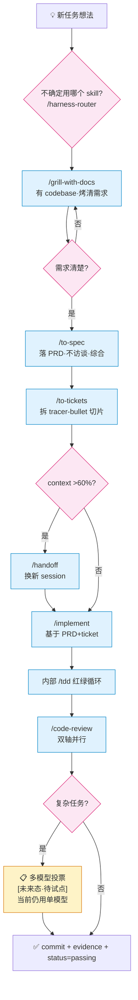

# 计划:Harness 工程实践文档重整 + 自动化机制建设

> **id**: harness-engineering-revamp
> **状态**: draft **v2**(按 review §4.3 P0 清单修订,待单模型重审)
> **类型**: 文档+工程基建任务(无后端代码改动)
> **优先级**: 待 feature_list.json 登记
> **创建日期**: 2026-07-20
> **v2 修订日期**: 2026-07-20

---

## 0. v1 → v2 变更摘要(为什么重写)

v1 经一轮多模型投票评审(详见 [`review-harness-engineering-revamp.md`](./review-harness-engineering-revamp.md))得 **Revise** 判定(2:1,opus+haiku 投 Revise)。本版针对性修订 5 条 P0 必改项:

| v1 问题 | 严重度 | v2 处理 |
|---|---|---|
| **§8 阶段 2 步骤顺序倒置**:plan 自己声明「先建后拆」但步骤是「先拆 AGENTS.md 再建新文档」,中间任何一步失败 AGENTS.md 出现断链窗口(opus+sonnet 独立指出,实测 `doc-impact-assessment.md` 当前不存在) | 🔴 | **§8 阶段 2 拆为 2a(先建 4 新文档)→ 2b(最后编辑 AGENTS.md 移出冗余段)** |
| **§6 多模型投票当前环境无法真异构**:§13.3 自承「仅 GLM 系列」,但 §6 仍假设 GLM/Claude/GPT 三家族;§12 让 plan 自身用此机制评审 = 自举悖论(opus+haiku 独立指出) | 🔴 | **§6 从「双模式同时做」降级为「文档化机制 + 单任务试点」,本次 plan 不实施投票;§12 删除强制自举,改为「机制落地后挑下一个真复杂任务试点」** |
| **Hook 配在用户级 `~/.zcode/cli/config.json`**:影响所有 ZCode 项目,其他项目没 skill-counter.sh 时每次 Skill 调用失败(sonnet+haiku 独立指出,opus 轻微提) | 🔴 | **§5.1 改用 workspace 级 `<repo>/.zcode/config.json`,仅本仓库生效 + 可入库** |
| **§5.2 skill-counter.sh 三处隐患**:① 注释写 `tool_input.skill_name` 但代码取 `tool_input.skill`;② heredoc 未加引号,路径含中文/空格时破坏 Python 字面量;③ stdout 误打印触发 hook JSON schema 校验失败(sonnet 主指) | 🔴 | **heredoc 改 `<<'PY'` + 环境变量传参;日志全走 stderr;字段名标 TBD 待实测对齐** |
| **§9 影响面清单漏列 `doc-impact-assessment.md`**:§3.1 引用了但 §9「文档新建 5 份」明细没它(sonnet 主指,opus 实测确认) | 🔴 | **§9 文档新建改为 6 份,补上 doc-impact-assessment.md** |

**v2 不动的部分**:正确性/完整性/风险识别/边界/一致性 5 个维度 rubric 均分均≥1.67(达 Accept 线),plan 主体结构、交付物清单、HTML 设计、harness-router skill 设计全部保留。

---

## 1. 背景与目标

### 1.1 现状缺口(上一轮分析结论)

本项目 Harness 实践已超过教程水平(Stage 1+3 教科书级),但有 6 项缺口:

1. **入口文档膨胀**:AGENTS.md 142 行,部分内容(文档影响评估 30 行、数据库铁律长段)该拆出去
2. **技术栈文档散落**:技术栈信息分散在 AGENTS.md/README/前端 01 三处,无单点真相源
3. **bug 管理缺失**:全仓零命中「bug 管理/缺陷跟踪」类文档,修复记录混在 feature_list
4. **PRD/切片 Design 模板弱**:task-workflow.md 只有简单附录,缺乏影响面清单/对抗式审查/差异段
5. **无自动触发 skill**:agent 凭自觉用 grill/to-spec/to-tickets,复杂场景漏触发
6. **无 skill 使用统计 / 无多模型投票 / 流程不可视化**:三项工程能力缺失

### 1.2 目标

把上述 6 项缺口整合成**可执行的重整方案**,核心交付物:
1. 重整后的 Harness 文档体系(瘦入口 + 新增 4 份文档)
2. harness-router skill + AGENTS.md 规则表(双保险自动触发)
3. ZCode Hook skill 计数器(workspace 级,自动 JSON 记录)
4. 多模型投票机制**文档化**(v2 降级:本次不实施,留作单任务试点)
5. HTML 可视化文档(vibe-coding-skills-guide 同款风格,带领读者走 agent 工作流)

### 1.3 决策汇总(已与用户对齐 + v2 修订)

| 维度 | v1 选择 | v2 修订 |
|---|---|---|
| 自动触发 | AGENTS.md 规则表 + harness-router skill 双保险 | **不变** |
| 计数器 | ZCode Hook 自动记 | **配 workspace 级**(v1 是用户级) |
| 多模型投票 | 双模式同时做 | **降级:仅文档化机制,留作单任务试点**(v2) |
| 投票触发 | 仅复杂任务 | **不变**(机制文档化时定义触发条件) |
| HTML 风格 | vibe-coding-skills-guide 同款 | **不变** |

---

## 2. 现状取证(基于 Explore agent 实测,源码出处已核实)

### 2.1 ZCode Hook 系统(实测)

| 项 | 实情 | 出处 |
|---|---|---|
| **workspace 级 hook 入口(v2 推荐)** | `<repo>/.zcode/config.json`,当前不存在,需新建 | diagnosing-hooks/SKILL.md |
| 用户级 hook 入口(v1 方案,已弃) | `/Users/star/.zcode/cli/config.json`,当前无 hooks 字段 | 实测 |
| 启用开关 | `hooks.enabled: true` 必须显式设置,默认禁用 | 同上 |
| 支持 7 个事件 | SessionStart/UserPromptSubmit/PreToolUse/PermissionRequest/PostToolUse/PostToolUseFailure/Stop | 同上 |
| Skill 工具能被监听 | ✅ 是,matcher 用 `"^Skill$"` | 实测日志 `toolName: Skill` |
| 命令类型 | `type: command`(shell)/`type: process`(可执行+args) | 同上 |
| 模板变量 | `${ZCODE_PROJECT_DIR}`/`${ZCODE_SESSION_ID}` 等 | 同上 |
| **⚠️ stdin payload 字段名未由文档确认** | 推测 `tool_input.skill`,需实测 | 待调试 |
| **⚠️ Hook 输出 schema 严格**(v2 补) | stdout 被 JSON 解析,多余 key 校验失败;非 JSON 内容判 failed | diagnosing-hooks 陷阱 8 |
| **⚠️ timeout 单位差异**(v2 补) | `type: command` 的 `timeout` 是秒;`timeoutMs` 两种类型都接受是毫秒 | diagnosing-hooks 陷阱 6 |

### 2.2 Skill 注册位置

- 用户级:`~/.agents/skills/`(已确认 grill-with-docs/to-spec/to-tickets/code-review/grilling/handoff/domain-modeling 7 个全部存在)
- 项目级:`/Users/star/hugo/3-项目代码/project/ai-agent-platform/.agents/skills/`(只有 agenthub 1 个)
- 推荐 harness-router 放**项目级**(仅本仓库用)

### 2.3 SKILL.md frontmatter 标准

| 字段 | 必需 | 说明 |
|---|---|---|
| `name` | 必需 | lowercase kebab-case,1-64 字符,与目录名一致 |
| `description` | 必需 | model-invoked 时是触发依据,需含「Use when...」句式;user-invoked 时是人类面摘要 |
| `disable-model-invocation` | 可选 | `true` = 仅用户键入 `/name` 调用(agent 不会自动触发) |
| `argument-hint` | 可选 | 提示参数(见 handoff skill) |

**路由型 skill 范本**:`~/.agents/skills/ask-matt/SKILL.md`(用 heading 分层 + 「Branch — <yes/no 问题>?」分支,无决策树表格)

### 2.4 项目 Harness 现状

- AGENTS.md 142 行(4 段入口必读 + 3 段可拆)
- feature_list.json 60 features 全 passing
- harness/docs/ 54 份 plan + task-workflow.md(201 行)
- 缺:技术栈总览 / bug 管理 / PRD 强化模板 / Stage 4+5 工件

---

## 3. 文档体系重整(6 份文件)

### 3.1 瘦身 AGENTS.md(142 → ≤100 行)

**保留**(入口必读):
- 项目简介(技术栈一行)
- 开工流程 6 步
- 第一件事读文档(链接到项目指南,不展开)
- 项目铁律 6 条(压缩,每条 1-2 行)
- 工作规则与完成定义(WIP=1 + 4 条 DoD)
- 收尾清单链接
- **新增**:自动触发规则路由表(见 3.1.1)

**拆出去**(v2 强调顺序:先建后删,见 §8 阶段 2):
- 「文档影响评估」30 行 → 移到 `harness/docs/doc-impact-assessment.md`
- 「数据库表设计原则」长段 → 已在 `项目指南/02-后端架构/03`,删除重复段留链接
- CodeGraph 段 → 移到 `项目指南/README-给AI.md`

#### 3.1.1 新增「自动触发规则」段(~15 行)

```markdown
## 🤖 自动触发规则(task → skill 路由表)
| 任务状态变化 | 必调 skill |
|---|---|
| feature_list.json 新增任务 | /grill-with-docs |
| 需求沟通清楚,要落 PRD | /to-spec |
| PRD 完成,要拆切片 | /to-tickets |
| 切片开始实施 | /implement(内部驱动 /tdd)|
| 实施完成,复杂任务 | /code-review(双轴并行,复杂任务可升 3 模型投票)|
| context 接近 60% | /handoff |

不确定用哪个?输入 /harness-router 让路由器推荐。
```

### 3.2 新建 `项目指南/00-总览/03-技术栈总览.md`(~150 行)

整合散落在 AGENTS.md/README/前端 01 三处的技术栈信息,统一「单点真相源」:
- 后端栈(FastAPI + SQLAlchemy 2.0 async + pycasbin + LangGraph + Alembic)
- 前端栈(React 19 + Vite + TanStack Query/Table + Tailwind + shadcn)
- 数据库(PostgreSQL 16 + pgvector)
- 认证(双轨:本地 bcrypt + Logto OIDC)
- 工具链(ruff/pytest/Playwright/oxlint/coverage 93%)
- 版本基线(关键依赖版本号)
- 替换指南(二开第 1 步:哪些组件能换、哪些不能换)

### 3.3 新建 `harness/docs/bug-tracking.md`(~120 行)

定义本项目的 bug 管理流程,参考已有 `plan-chat-overflow-title-fix.md` 作为实例:
- bug 的 5 个状态(reported/reproducing/fixing/verifying/closed)
- **bug 在 feature_list.json 的特殊登记方式(v2 待核实)**:id 前缀 `bug-`(实施前必须 grep 现有 60 条 id 确认不冲突;若冲突改用 `fix-` 或其他),verification 用复现命令
- bug 修复 PRD 模板(简化版 plan,含复现脚本 + 根因 + 修复 + 回归测试)
- 与 diagnosing-bugs skill 的衔接(skill 产出根因,plan 落地修复)
- 严重度分级(critical/high/medium/low)+ SLA

### 3.4 新建 `harness/docs/prd-template.md`(~180 行)

PRD/切片 Design 模板,基于 to-spec/to-tickets 的官方模板项目特化:

**PRD 模板段**:
- Problem/Solution/User Stories/Implementation Decisions/Testing Decisions/Out of Scope(对齐 to-spec 官方)
- 项目特化段:
  - 影响面清单(后端N文件/迁移M个/前端N文件/测试N类)
  - 多租户影响评估
  - 权限影响评估
  - 数据库表设计 checklist(呼应铁律 6)
  - 实现差异 vs plan 段(必填,无偏差也要写)

**ticket 切片模板**:
- 每片声明 blocking edges
- 每片声明验证命令
- 每片声明文件清单

**v1→v2 对抗式审查段**(复杂任务必填)

### 3.5 新建 `harness/docs/doc-impact-assessment.md`(~50 行,v2 补)

从 AGENTS.md 移出的「文档影响评估」段独立成文:
- 触发时机(每个工作单元完成后)
- 固定 4 行格式模板
- 判断「是否影响文档」的依据
- 示例

> **注**:此文件是 v1 → v2 修订时补的(v1 plan §3.1 引用了但 §9 漏列,review C-6 指出)。

### 3.6 升级 `harness/docs/task-workflow.md`(201 → ~250 行)

把 3.2/3.3/3.4/3.5 的链接整合进 task-workflow,并加入「自动触发流程图」一节。

---

## 4. harness-router skill(新建)

### 4.1 路径
`/Users/star/hugo/3-项目代码/project/ai-agent-platform/.agents/skills/harness-router/SKILL.md`

### 4.2 frontmatter

```yaml
---
name: harness-router
description: Route task state to the right skill. Use when a task changes state (new task, requirement clarified, PRD done, implementation done) and you need to know which skill to invoke next.
disable-model-invocation: true
---
```

> **v2 注**(回应 review S-2):`disable-model-invocation: true` 意味着此 skill **只能由用户键入 `/harness-router` 调用**,agent 不会自动触发。设计意图是「用户迷茫时手动求助的路由器」,不是 agent 自动调度器。agent 自动触发靠 AGENTS.md §3.1.1 的路由表(规则表是硬触发,router skill 是软辅助)。若未来需要 agent 自动路由,去掉此 flag 即可。

### 4.3 正文结构(仿 ask-matt 的 heading 路由)

```markdown
# Harness Router

## 任务状态路由表
| 当前状态 | 推荐下一步 |
|---|---|
| 新建任务(feature_list 加条目) | /grill-with-docs |
| 想法模糊,但有 codebase | /grill-with-docs |
| 想法模糊,无 codebase | /grill-me |
| 需求清楚,要落 PRD | /to-spec |
| PRD 完成,要拆切片 | /to-tickets |
| 切片实施中 | /implement |
| context 接近 60% | /handoff |
| 实施完成 | /code-review |
| 复杂任务评审 | /code-review(v2:多模型投票机制当前为未来态,见 multi-model-voting.md)|
| bug 出现 | /diagnosing-bugs |
| issue 堆积 | /triage |
| 项目过大 | /wayfinder |

## 复杂任务判定(用于未来多模型投票触发)
满足任一即复杂:
- 改动文件 >10
- 涉及鉴权/权限/数据迁移/跨服务调用
- plan 有 v1→v2 对抗式审查记录
- 涉及安全敏感操作(token/密钥/支付)

> v2 注:多模型投票机制当前为「文档化+待试点」状态,复杂任务评审仍用单模型 /code-review 双轴。机制就绪后,harness-router 会在「复杂任务评审」分支自动提示「是否启动多模型投票」。

## 分支决策
- Branch — 这是不是 bug? Yes → /diagnosing-bugs
- Branch — 任务能不能一次会话做完? No → /to-spec + /to-tickets
- Branch — PRD 已经在 plan 文档了? Yes → 跳过 /to-spec 直接 /to-tickets
```

---

## 5. ZCode Hook skill 计数器(workspace 级自动化,v2 修订)

### 5.1 配置文件(v2 改 workspace 级)

**新建** `<repo>/.zcode/config.json`(workspace 级,仅本仓库生效,可入库):

```json
{
  "hooks": {
    "enabled": true,
    "events": {
      "PostToolUse": [
        {
          "matcher": "^Skill$",
          "hooks": [
            {
              "type": "command",
              "command": "bash \"${ZCODE_PROJECT_DIR}/scripts/skill-counter.sh\"",
              "timeout": 3
            }
          ]
        }
      ]
    }
  }
}
```

**v2 变更说明**:
- 从用户级 `~/.zcode/cli/config.json` → workspace 级 `<repo>/.zcode/config.json`(回应 review C-4,避免影响其他项目)
- `timeoutMs: 3000` → `timeout: 3`(回应 review S-1,command 类型用秒更清晰)
- workspace 级配置**可入库**,团队共享,避免「配置不入库」的合规问题

### 5.2 计数器脚本(v2 加固)

**新建** `scripts/skill-counter.sh`(可执行):

```bash
#!/usr/bin/env bash
# 监听 Skill 工具调用,自动 +1 到 .skill-counters.json
# v2 加固(回应 review C-5):
#   1. heredoc 改 <<'PY' 不展开 + 环境变量传参(防注入)
#   2. 所有日志走 stderr,stdout 必须为空(避免 hook JSON schema 校验失败)
#   3. 字段名标 TBD,实测后对齐(注释和代码必须一致)
#   4. 无 stdin 直接退出(避免 unknown 计数污染)
set -euo pipefail

# 无 stdin(tty)直接退出,不阻塞主流程
if [ -t 0 ]; then
  exit 0
fi

COUNTER_FILE="${ZCODE_PROJECT_DIR:-$(pwd)}/.skill-counters.json"
INPUT=$(cat)

# ⚠️ TBD: 字段名未实测,先用调试模式确认
# 候选字段路径(按可能性排序):
#   - tool_input.skill       (Skill 工具的入参参数名)
#   - tool_input.skill_name  (另一种命名约定)
#   - tool_name              (可能直接是 skill 名)
# 实测前用 /tmp/skill-hook-debug.log 抓真实 payload,确认后固定字段路径
SKILL_NAME=$(printf '%s' "$INPUT" | SKILL_NAME_TBD="$INPUT" python3 -c '
import json, os, sys
try:
    d = json.loads(os.environ.get("SKILL_NAME_TBD", "{}"))
    # 候选字段路径,实测后保留一个
    name = (
        d.get("tool_input", {}).get("skill")           # 候选 1
        or d.get("tool_input", {}).get("skill_name")   # 候选 2
        or d.get("tool_name", "")                       # 候选 3
        or "unknown"
    )
    print(name)
except Exception as e:
    print(f"parse_error:{type(e).__name__}", file=sys.stderr)
    print("unknown")
' 2>/dev/null || echo "unknown")

# 用环境变量传参给 Python(杜绝 shell→Python 字符量注入)
export SKILL_NAME
export COUNTER_FILE
python3 <<'PY'
import json, os, sys
from datetime import datetime, timezone

path = os.environ["COUNTER_FILE"]
skill = os.environ["SKILL_NAME"]
now = datetime.now(timezone.utc).strftime("%Y-%m-%dT%H:%M:%SZ")

data = {"skills": {}, "total_calls": 0}
if os.path.exists(path):
    try:
        with open(path) as f:
            data = json.load(f)
    except Exception as e:
        print(f"counter file corrupted, reset: {e}", file=sys.stderr)

skills = data.setdefault("skills", {})
entry = skills.setdefault(skill, {"count": 0, "first_used": None, "last_used": None})
entry["count"] += 1
entry["last_used"] = now
if not entry.get("first_used"):
    entry["first_used"] = now

data["total_calls"] = data.get("total_calls", 0) + 1
data["last_updated"] = now

try:
    with open(path, "w") as f:
        json.dump(data, f, indent=2, ensure_ascii=False)
except Exception as e:
    print(f"failed to write counter: {e}", file=sys.stderr)
    sys.exit(0)  # 永不阻断主流程
PY

# stdout 必须为空(hook 输出 schema 严格,任何非 JSON 内容判 failed)
exit 0
```

**v2 加固要点**(回应 review C-5):
1. ✅ heredoc 用 `<<'PY'`(单引号)禁止 shell 展开,变量通过 `os.environ` 读取
2. ✅ 所有诊断信息走 `sys.stderr`,stdout 永远空
3. ✅ 字段名 3 个候选 + `or` 短路,实测后保留一个
4. ✅ 无 stdin(`[ -t 0 ]`)直接退出,避免 unknown 计数
5. ✅ 任何异常 `sys.exit(0)`,永不阻断主流程

### 5.3 .skill-counters.json 结构

```json
{
  "skills": {
    "grill-with-docs": { "count": 3, "first_used": "2026-07-20T...", "last_used": "2026-07-20T..." },
    "to-spec": { "count": 2 },
    "code-review": { "count": 1 }
  },
  "total_calls": 6,
  "last_updated": "..."
}
```

### 5.4 调试步骤(实施时第 1 步,必做)

1. 先写一个 `cat > /tmp/skill-hook-debug.log` 的调试 hook(workspace 级 `<repo>/.zcode/config.json`,matcher `^Skill$`)
2. 重启 ZCode(workspace 级 hook 配置后必须重启生效)
3. 调一次任意 skill(如 /grill-me)
4. 查 `/tmp/skill-hook-debug.log` 拿到真实 stdin payload
5. **确认字段路径**(skill / skill_name / tool_name 三选一),改 §5.2 的 `SKILL_NAME` 提取逻辑只保留正确的一个
6. 查 `/Users/star/.zcode/cli/log/zcode-YYYY-MM-DD.jsonl` 看 hook outcome(fired/timed-out/blocked/error)

### 5.5 加入 .gitignore

`.skill-counters.json` 是本地统计,不入库(每个开发者自己的)。`scripts/skill-counter.sh` 和 `<repo>/.zcode/config.json` 入库。

---

## 6. 多模型投票机制(文档化,留作单任务试点)· v2 降级

### 6.1 v2 范围声明(重要)

**v1 → v2 关键降级**:本节从「双模式同时实施」降级为「**仅文档化机制定义,本次 plan 不实施投票**」。原因(详见 review §4.2):

- **当前环境仅 GLM 系列模型**,无法真异构(v1 §13.3 自承),3 模型投票会退化成同家族共谋
- **v1 §12 自举评审已实操验证此问题**:本次评审 3 票在「可执行性」维度全给 1 分,既是真问题也是共谋信号——同训练数据的模型有相同盲区
- **机制设计本身未经验证**:让 plan 自身用此机制评审 = 自举悖论

**v2 处理**:
1. 本次 plan 只产出 `multi-model-voting.md` 机制文档(定义双模式 + rubric + 触发条件 + 避坑设计)
2. 文档明确标注「**当前为未来态,待单任务试点验证**」
3. 试点方式:机制文档落地后,挑下一个真复杂任务(候选:`api-token-fine-grained-scopes` 这类已有 v1→v2 审查的鉴权任务)做一次试点,试点结论回写本节
4. 试点通过前,复杂任务评审仍用单模型 `/code-review` 双轴(Standards + Spec)

### 6.2 新建 `harness/docs/multi-model-voting.md`(~200 行)

文档内容大纲:

#### 6.2.1 双模式触发判定(定义,待试点)

同时满足才触发:
- 任务满足「复杂任务」定义(见 §4.3 harness-router)
- **试点期额外条件**:用户主动声明「这是试点任务」(机制未正式上线前不自动触发)
- **未来正式期额外条件**:环境具备≥2 个异构模型族(如 GLM + Claude 或 GLM + GPT)

#### 6.2.2 模式 A:写方案合并取优(用于 to-spec 输出)

```
输入: grill 共识
  ├─ 模型A(如 GLM-4.6)→ 方案 v1
  ├─ 模型B(如 Claude)  → 方案 v2
  └─ 模型C(如 GPT)     → 方案 v3
       ↓
  主模型(agent 当前模型)→ 合并取优(不投票,是融合)
       ↓
  最终 PRD(标注每段来源 model-A/B/C)
```

#### 6.2.3 模式 B:评审多数票(用于 code-review 完成度)

```
输入: 实施完成的代码 diff
  ├─ 模型A → 评 Pass/Revise/Block + rubric 打分
  ├─ 模型B → 评 Pass/Revise/Block + rubric 打分
  └─ 模型C → 评 Pass/Revise/Block + rubric 打分
       ↓
  多数票(≥2 票一致)→ 最终结论
  分歧时(3 票各异)→ 主模型 + rubric 仲裁
```

#### 6.2.4 rubric 表(区分 plan 评审 vs code 评审,v2 补)

**重要**:plan 评审和 code 评审用**不同的 rubric**(回应 review O-2):

| 评审对象 | rubric 6 维度 |
|---|---|
| **plan/方案** | 正确性 / 完整性 / 可执行性 / 风险识别 / 边界清晰 / 一致性 |
| **code/实现** | 正确性 / 验证 / 范围纪律 / 可靠性 / 可维护性 / 交接准备度 |

**结论判定**(两种 rubric 通用):Accept(全≥1 且总分≥9)/ Revise(有 1 分项或总分 6-8)/ Block(任一关键维度为 0 或总分<6)

#### 6.2.5 避坑设计(v2 强化)

| 陷阱 | 缓解 |
|---|---|
| **共谋风险**(同家族模型相似训练数据导致相同盲区) | **必须用异构模型族**(GLM/Claude/GPT 不同家族);**禁止同家族多尺寸模拟**(本次评审已验证此路不通) |
| **自举悖论**(未经验证的机制验证自己) | 机制首次应用必须评**非机制本身的产出物**;本 plan v2 已删 §12 强制自举 |
| **rubric 区分度不足**(0-2 分让 9-10 分都卡 Accept/Revise 边界) | 未来考虑 0-3 分或加权重(本次评审暴露) |
| **成本爆炸** | 仅复杂任务触发;用户可调 N 次预算;写方案合并是融合非简单多数 |
| **仲裁者悖论**(3 票分裂时谁裁决) | 必须有 rubric 或 ground truth,不能让仲裁者凭感觉 |
| **溯源验证缺失** | 强制至少一票是「溯源验证」(真读源码/官方文档) |

### 6.3 不实施 multi-model-vote skill 封装

v2 明确:**本次 plan 不实施 multi-model-vote skill 封装**(回应 review haiku H-3 部分采纳——保留为后续阶段,本次只做文档)。harness-router §4.3 的「复杂任务评审」分支会硬提示:

```
复杂任务 code-review → harness-router 提示:
  「当前多模型投票为未来态,本次用单模型 /code-review 双轴。
   若需启动多模型投票试点,显式声明 /multi-model-vote(未实现)。」
```

让触发不依赖 agent 自觉读文档,而是 router 主动提示。

---

## 7. HTML 可视化文档(核心交付物)

### 7.1 文件位置
`harness/docs/harness-practice-guide.html`(自包含单文件,~80KB)

### 7.2 整体架构(vibe-coding-skills-guide 同款)

```
顶部栏: 品牌 + 模式切换(现状 / 改进后 / 工作流导览) + 深浅色
├─ 开篇: 本仓库 Harness 工程是什么 / 为什么重整
├─ 主流程图(mermaid): 任务生命周期 idea→ship
├─ 痛点速查表: 症状→改进方案→对应 skill
├─ 6 阶段详解: 每阶段一张卡(痛点/解药/何时跳过/反模式)
├─ agent 工作流导览: 关键!带领读者看 agent 走完一个任务
├─ Skill 字典: 8 张卡(router + 7 核心)
├─ 多模型投票层(v2 标「未来态」): 双模式图解 + 触发条件 + 试点状态
├─ 自动化机制: Hook 计数器 + 路由表
└─ 附录: 实施清单
```

### 7.3 mermaid 主流程图(任务生命周期)



> **v2 变更**(回应 review C-2/C-3):主流程图把「多模型投票」从 v1 的主流程节点改为「未来态·待试点」分支,标注当前仍用单模型。

### 7.4 「agent 工作流导览」段(核心)

**卡片结构**(每张含 5 个字段):
```
[步骤 N · 阶段名]
├─ 触发条件: agent 怎么知道进入这一步
├─ agent 读什么: 必读文件清单(AGENTS.md/feature_list.json/当前plan)
├─ 调什么 skill: skill 名 + 一句话作用
├─ 产出什么: 工件文件路径
└─ 下一步判定: 满足什么条件进下一步
```

**完整 8 步导览**:
1. **会话开工**(读 AGENTS.md → ./init.sh → progress.md → feature_list.json)
2. **新任务登记**(harness-router → /grill-with-docs → 共识 + CONTEXT.md)
3. **落 PRD**(/to-spec → harness/docs/plan-*.md)
4. **拆切片**(/to-tickets → tickets + blocking edges)
5. **实施**(/implement → /tdd 红绿)
6. **code-review**(/code-review 双轴;复杂任务提示多模型投票为未来态)
7. **关闭任务**(填 evidence → status=passing → progress.md Session 记录)
8. **收尾**(./init.sh 全绿 → clean-state-checklist → commit)

### 7.5 「现状 vs 改进后」对比段

| 维度 | 现状(before) | 改进后(after) |
|---|---|---|
| AGENTS.md 长度 | 142 行 | ≤100 行(拆分) |
| 技术栈文档 | 散落 3 处 | 单点 `00-总览/03-技术栈总览.md` |
| bug 管理 | 无 | `harness/docs/bug-tracking.md` |
| PRD 模板 | task-workflow 简单附录 | 独立 `prd-template.md` 180 行 |
| 文档影响评估 | 在 AGENTS.md 占 30 行 | 独立 `doc-impact-assessment.md`(v2 补) |
| skill 触发 | 凭 agent 自觉 | AGENTS.md 规则表 + harness-router skill |
| skill 使用统计 | 无 | ZCode Hook 自动 JSON(workspace 级) |
| 多模型投票 | 无 | 文档化机制(v2:待试点) |
| Stage 4 评审 | 自评 | 单模型双轴 + 多模型投票(未来态) |
| Stage 5 巡检 | 缺失 | 后续 /improve-codebase-architecture |

### 7.6 「Skill 字典」段(8 张卡)

每张卡含:name/icon/定位/触发词/输入/输出/调用关系(calls/calledBy)/vibe 场景/误用警告/源 SKILL.md 路径

8 张卡:
- L1 必会 5 张:harness-router、grill-with-docs、to-spec、to-tickets、implement
- L1 评审 1 张:code-review(标注多模型投票为未来态)
- L2 进阶 2 张:tdd、handoff

### 7.7 技术实现要点(吸取 sess_f122bde8 教训 + v2 补充)

> **sess_f122bde8 教训摘要**(v2 补,回应 review O-4):调试 vibe-coding-skills-guide.html 时,因国内网络环境国外 CDN 8s 超时,提炼了 5 条工程教训:① 离线优先(静态资源预编译内联或国内 CDN fallback);② CDN 多源串行 fallback(国内源优先 staticfile→baomitu→cdnjs→jsdelivr);③ 预编译 > 运行时编译(Tailwind CLI 预编译替代 CDN runtime JIT);④ 错误隔离(每个初始化函数独立 try/catch);⑤ CDP 诊断 file:// 页面(Chrome `--remote-debugging-port=9222` + WebSocket 抓 console)。

具体实现:
- **离线优先**:Tailwind 用 `npx tailwindcss@3.4.17` 预编译内联(不用 CDN runtime)
- **Mermaid**:4 源串行 fallback(staticfile→baomitu→cdnjs→jsdelivr),离线时降级为代码块(v2 补,回应 review S-3)
- **错误隔离**:每个初始化函数独立 try/catch
- **深浅色**:CSS 变量 + `html:not(.dark)` 覆盖
- **CDP 验证**:完成后用 `--remote-debugging-port=9222` 抓 console 验证 0 异常
- **Tailwind 编译位置**(v2 补,回应 review S-4):本仓库根目录无 package.json,在 `/tmp` 临时目录跑 `npx tailwindcss@3.4.17 -c /tmp/tw-config.js -o /tmp/tw-out.css --minify`,把生成的 CSS 内联进 HTML

---

## 8. 实施步骤(v2 重排:先建后拆)

### 阶段 1:Hook 计数器调试(先做,因为要实测 payload)

1. 写 `/tmp/skill-hook-debug.sh`(cat stdin 到日志,**所有日志走 stderr**)
2. **新建** `<repo>/.zcode/config.json`(workspace 级,非用户级)
3. 重启 ZCode(workspace 级 hook 配置后必须重启生效)
4. 调一次 `/grill-me`
5. 查 `/tmp/skill-hook-debug.log` 拿到真实 payload 结构
6. 确认字段路径(skill / skill_name / tool_name 三选一)
7. 据此写正式 `scripts/skill-counter.sh`(只保留正确字段路径)
8. 查 `/Users/star/.zcode/cli/log/zcode-YYYY-MM-DD.jsonl` 看 hook outcome

### 阶段 2a:先建新文档(v2 拆分,先建后删)

**顺序依赖**(回应 review C-1):AGENTS.md 瘦身必须**在新位置存在后**才能从 AGENTS.md 删除,否则断链。

1. 新建 `项目指南/00-总览/03-技术栈总览.md`
2. 新建 `harness/docs/bug-tracking.md`(实施前 grep feature_list.json 60 条 id 确认 `bug-` 前缀不冲突,回应 review H-2)
3. 新建 `harness/docs/prd-template.md`
4. 新建 `harness/docs/doc-impact-assessment.md`(v2 补,回应 review C-6)
5. 升级 `harness/docs/task-workflow.md` 加链接 + 自动触发流程图
6. 把 CodeGraph 段内容写入 `项目指南/README-给AI.md`(确认存在后再删 AGENTS.md 的)

### 阶段 2b:最后才编辑 AGENTS.md(v2 拆分,最后删旧)

**前置条件**:阶段 2a 全部完成且新文档已存在。

1. AGENTS.md 移出「文档影响评估」段(已在 `doc-impact-assessment.md`)
2. AGENTS.md 移出「数据库表设计原则」长段(已在 `项目指南/02-后端架构/03`)
3. AGENTS.md 移出 CodeGraph 段(已在 `项目指南/README-给AI.md`)
4. AGENTS.md 加「自动触发规则」路由表段(§3.1.1)
5. 验证 AGENTS.md ≤100 行
6. **关键验证**:grep AGENTS.md 所有内部链接,确认无断链

### 阶段 3:harness-router skill

1. 建 `.agents/skills/harness-router/SKILL.md`
2. frontmatter + 路由表 + 分支决策(含 v2 注释:多模型投票为未来态)
3. 在 AGENTS.md 末尾加「不确定用哪个 → /harness-router」提示

### 阶段 4:多模型投票机制文档化(v2 降级,不实施)

1. 新建 `harness/docs/multi-model-voting.md`(双模式 + rubric + 触发条件 + 试点状态)
2. **不实施** skill 封装(留作后续阶段)
3. 文档明确标注「当前为未来态,待单任务试点验证」
4. 在 harness-router 加硬提示「复杂任务评审 → 多模型投票为未来态」(回应 review H-3,让触发不依赖 agent 自觉)

### 阶段 5:HTML 可视化文档(核心交付)

1. 在 `/tmp` 临时目录跑 `npx tailwindcss@3.4.17` 预编译 CSS(v2 补路径)
2. 写 HTML 骨架(顶部栏 + 模式切换 + 8 段布局)
3. 写 mermaid 主流程图(多模型投票标「未来态」)
4. 写 8 步 agent 工作流导览卡片
5. 写现状 vs 改进后对比表
6. 写 8 张 skill 字典卡
7. 写多模型投票层图解(标「未来态·待试点」)
8. 配 Mermaid 4 源 fallback
9. CDP 验证 0 异常 + mermaid 渲染成功 + 深浅色切换

---

## 9. 影响面清单(v2 修订)

| 类别 | 数量 | 明细 |
|---|---|---|
| 文档新建 | **6**(v2 +1) | `项目指南/00-总览/03-技术栈总览.md`、`harness/docs/bug-tracking.md`、`harness/docs/prd-template.md`、`harness/docs/doc-impact-assessment.md`(v2 补)、`harness/docs/multi-model-voting.md`、`harness/docs/harness-practice-guide.html` |
| 文档修改 | 3 | `AGENTS.md`(瘦身+加路由表)、`harness/docs/task-workflow.md`(加链接)、`项目指南/README-给AI.md`(收 CodeGraph 段) |
| 脚本新建 | 1 | `scripts/skill-counter.sh`(v2 加固版) |
| Skill 新建 | 1 | `.agents/skills/harness-router/SKILL.md` |
| 配置新建(workspace 级,v2 改) | **2** | `<repo>/.zcode/config.json`(hook 配置,可入库)、`.gitignore` 加 `.skill-counters.json`(**修改**而非新建,v2 更正——回应 review opus O-类似项) |
| **总计** | **13 处** | **10 个文件入库 + 1 个 workspace 配置入库 + 1 个 .gitignore 修改 + 1 个本地统计文件不入库** |

---

## 10. 验收标准(v2 修订)

1. ✅ AGENTS.md **≤100 行**(v2 统一,回应 review O-3),入口精简,无内部断链
2. ✅ `项目指南/00-总览/03-技术栈总览.md` 存在且单点真相源
3. ✅ `harness/docs/bug-tracking.md` 存在且定义完整流程(`bug-` 前缀已 grep 确认不冲突)
4. ✅ `harness/docs/prd-template.md` 存在且含影响面清单/差异段/v1→v2 段
5. ✅ `harness/docs/doc-impact-assessment.md` 存在(v2 补,回应 review C-6)
6. ✅ `.agents/skills/harness-router/SKILL.md` 存在且可被 `/harness-router` 调用
7. ✅ **workspace 级** `<repo>/.zcode/config.json` hooks 段配置正确(v2 改,非用户级)
8. ✅ `/grill-me` 触发后 hook **被触发且有日志记录**(v2 放宽,回应 review H-6——字段名未实测前不要求计数准确 +1)
9. ✅ `harness/docs/multi-model-voting.md` 含双模式 + rubric(区分 plan/code 两套)+ 触发条件 + 试点状态标注
10. ✅ `harness/docs/harness-practice-guide.html` 双击可用(零外部 CSS 依赖;Mermaid JS 走 4 源 fallback,离线降级为代码块),CDP 验证 0 异常,mermaid 渲染成功
11. ✅ HTML 含 8 步 agent 工作流导览(带领读者看完整流程)
12. ✅ HTML 多模型投票层标注「未来态·待试点」(v2 补)
13. ✅ `./init.sh` 全绿(纯文档 + 脚本,后端零改动不回归)

---

## 11. 不在本次范围(边界声明,v2 更新)

- ❌ 不改 60 个已 passing feature 的 evidence(不回溯)
- ❌ **不实施 multi-model-vote skill 封装**(v2 降级:只写文档,留作单任务试点)
- ❌ **不实施多模型投票实操**(v2 降级:本次评审已暴露共谋风险,需异构模型环境就绪后再试点)
- ❌ 不引入 cleanup.sh / quality-document(属 Stage 5 后续阶段,本次聚焦文档+触发+HTML)
- ❌ 不改现有 plan-*.md(新模板仅对新任务生效)
- ❌ 不实施 wayfinder/triage 等非主流程 skill 的接入(只接 6 个核心)

---

## 12. 评审与迭代流程(v2 重写:删除自举)

### 12.1 v2 评审流程变更(重要)

**v1 → v2 关键变更**:删除 v1 §12 的「plan 自身用多模型投票机制评审」自举设计(回应 review C-3)。

**v1 自举问题**:让 plan 自身用未经验证的机制评审自己 = 自举悖论。v1 实操时,3 个评审者(实为同家族 GLM 不同尺寸)在「可执行性」维度全部独立给 1 分,既证明该问题真实存在,也证明同家族模拟异构时的共谋风险非虚。

**v2 评审流程**:

| 阶段 | 评审方式 | 触发条件 |
|---|---|---|
| **plan 本身**(本文档) | 单模型评审 + 用户最终拍板 | plan 修订完即可,不强制多模型 |
| **复杂任务 plan**(未来) | 多模型投票模式 B(待机制就绪) | 机制试点通过 + 异构模型环境就绪 |
| **code 评审**(未来) | 多模型投票模式 B(待机制就绪) | 同上 |

### 12.2 v2 plan 的重审路径

1. 本 v2 plan 修订完成
2. **单模型评审**(主会话自评 + 用户最终拍板),不再用多模型投票自举
3. 通过后进入实施
4. 实施过程中若发现新问题,直接改本 plan 为 v3(记录变更)

### 12.3 多模型投票机制的上线路径(未来)

1. 本次 plan 落地 `multi-model-voting.md` 文档(§6.2)
2. 等待**异构模型环境就绪**(用户接入 Claude 或 GPT 等)
3. 挑下一个真复杂任务(候选:已有 v1→v2 审查的鉴权任务)做**单任务试点**
4. 试点结论回写 `multi-model-voting.md`:
   - 机制有效 → 在 harness-router 解锁「复杂任务 → 多模型投票」分支
   - 机制有问题 → 修订文档,再试点
5. 试点通过前,复杂任务评审仍用单模型 `/code-review` 双轴

---

## 13. 风险与注意事项(v2 补强)

| 风险 | 缓解 | v2 变更 |
|---|---|---|
| **Hook stdin payload 字段名未由文档确认** | §8 阶段 1 第 1 步先 `cat > log` 实测;脚本用 3 候选字段 `or` 短路 | v2 加固:3 候选 + stderr 日志 |
| **Hook 输出 schema 严格**(v2 补,回应 review O-1) | 脚本 stdout 必须为空;诊断全走 stderr(diagnosing-hooks 陷阱 8) | v2 新增 |
| **Hook timeout 单位差异**(v2 补,回应 review O-1) | command 类型用 `timeout: 3`(秒)非 `timeoutMs`(陷阱 6) | v2 改 `timeout: 3` |
| **多模型投票成本** | 仅复杂任务触发;机制当前为文档化未来态,不实际触发 | v2 降级:不实施实操 |
| **异构模型依赖** | 模式 B 需 3 个不同家族模型;当前环境仅 GLM 系列 | v2 明确:待环境就绪后试点 |
| **HTML 工作量大** | 分阶段实施;§8 阶段 5 独立,可拆为单独 WIP=1 任务 | 不变 |
| **AGENTS.md 瘦身影响其他文档** | **v2 强调**:阶段 2 拆为 2a(先建)→ 2b(后删),消除断链窗口 | v2 重排顺序 |
| **Hook 配置影响范围**(v2 改) | 从用户级改 workspace 级,仅本仓库生效 | v2 改 workspace 级 |
| **`.skill-counters.json` 跨项目串扰** | workspace 级配置 + `${ZCODE_PROJECT_DIR}` 限定到当前项目;不入库 | 不变 |
| **多模型投票机制本身是新设计** | 本次评审已实操验证设计缺陷(共谋+自举),回写 §6 避坑设计 | v2 补强避坑表 |
| **heredoc 变量注入**(v2 补,回应 review C-5) | heredoc 改 `<<'PY'` + 环境变量传参 | v2 加固 |
| **`bug-` 前缀冲突**(v2 补,回应 review H-2) | 实施前 grep feature_list.json 现有 60 条 id 确认不冲突;若冲突改 `fix-` | v2 新增核实步骤 |

---

## 14. 参考文件(已取证)

| 文件 | 关键证据 |
|---|---|
| `/Users/star/.zcode/cli/plugins/cache/zcode-plugins-official/zcode-guide/0.1.0/skills/diagnosing-hooks/SKILL.md` | hook schema + 12 陷阱(含 v2 补的单位/schema/output 陷阱) |
| `/Users/star/.agents/skills/ask-matt/SKILL.md` | 路由型 skill 范本 |
| `/Users/star/.agents/skills/{grill-with-docs,to-spec,to-tickets}/SKILL.md` | 核心 skill 的 frontmatter 与正文结构 |
| `/Users/star/.zcode/cli/plugins/cache/zcode-plugins-official/skill-creator/0.1.0/skills/skill-creator/SKILL.md` | SKILL.md 写作权威指南 |
| `/Users/star/ZCodeProject/vibe-coding-skills-guide.html` | HTML 风格范本 |
| `/Users/star/hugo/3-项目代码/project/ai-agent-platform/AGENTS.md` | 入口文档待瘦身 |
| `/Users/star/hugo/3-项目代码/project/ai-agent-platform/harness/docs/task-workflow.md` | 任务管理规则,待加链接 |
| `/Users/star/hugo/3-项目代码/project/ai-agent-platform/harness/docs/plan-api-token-fine-grained-scopes.md` | v1→v2 对抗式审查范本(本 plan 的 v2 重写参照其格式) |
| `/Users/star/hugo/3-项目代码/project/ai-agent-platform/harness/docs/review-harness-engineering-revamp.md` | **v2 修订依据**(本 plan 的评审报告) |
| `/Users/star/hugo/3-项目代码/learn-harness-engineering/harness-kit/index.html` | harness 教程(12 块框架) |
