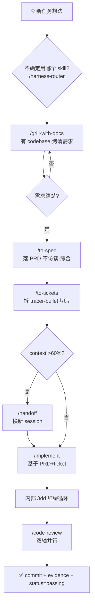

# 任务管理工作流

> 这份文档定义本项目的「开发任务怎么管理」——从录入一个新任务,到做完验证关闭它。
> 它是 harness 工程的规则说明,配合根目录的 `feature_list.json` / `progress.md` 使用。

---

## 1. 四个文件,各管一件事

开发任务的管理拆成三层 + 一个派生视图,**各司其职,不混淆**:

| 文件 | 位置 | 角色 | 回答什么 | 格式 |
|------|------|------|---------|------|
| `feature_list.json` | 仓库根目录 | **任务清单**(完整真相源,CI/审计用) | 全部任务有哪些?每个到哪了? | 结构化 JSON |
| `feature_list.active.json` | 仓库根目录 | **派生视图**(agent 开工读,自动生成,**禁止手动编辑**) | 当前该关注哪些任务? | 结构化 JSON |
| `harness/docs/plan-<任务id>.md` | harness/docs/ | **实施步骤计划**(单个任务) | 这个任务具体怎么做?分几步? | 可读 markdown |
| `progress.md` | 仓库根目录 | **进度日志**(时间线) | 每轮会话做了什么?卡在哪? | 自由文本 |

**核心原则**:
- `feature_list.json` 是**完整真相源**——保持精简,只存任务的状态和元信息,**不存实施步骤**。
- `feature_list.active.json` 是 `feature_list.json` 的**派生视图**(由 `scripts/sync-active-features.sh` 自动生成):
  只含活跃任务(`not_started`/`in_progress`/`blocked`)+ 最近 5 个 passing(精简字段)+ 1 条里程碑摘要。
  agent 开工读它(~58 行),而不是读完整版(~1500 行,浪费 16.5% 上下文)。
- 实施步骤(详细的"改哪个文件第几行、改完怎么验证")放进**独立的 plan 文档**。
- `feature_list.json` 里的 `plan` 字段只放一个**链接**,指向对应的 plan 文档。
- **同步规则**:feature 状态变化后,跑 `./scripts/sync-active-features.sh` 刷新 active 视图(漏跑代价:token 节省失效,无数据丢失,agent 兜底可读完整版)。
- 历史归档:已 passing 且超出「最近 5 个」的 feature,完整字段保存在 `harness/docs/archive/features-passing-archive.json`(审计用)。

---

## 2. 文件分工的边界(避免混淆)

### 什么放 feature_list.json
- 任务 id / 标题 / 优先级 / 所属模块
- 用户可见行为(一句话)
- **验收标准**(`verification`:做完该是什么样——可执行的检查)
- 当前状态 / 证据(`evidence`:做完才填)
- 指向 plan 文档的链接

### 什么放 plan 文档(plan-<任务id>.md)
- 详细实施步骤(分几步、每步改什么)
- 每步涉及的具体文件:行号:当前值 → 目标值
- 每步执行后的检查点
- 可选批次 / 风险提醒 / 依赖说明
- 方案调研、技术选型理由

### 什么放 progress.md
- 本轮会话做了哪些步骤
- 跑了什么验证、结果如何
- 卡在哪里、有什么风险
- 下一步做什么

> **一句话区分**:feature_list = "任务总表"(看全局);plan 文档 = "操作手册"(照着做);progress.md = "工作日志"(看历史)。

---

## 3. 任务的生命周期

每个任务有四种状态,流转规则如下:

```
                开始做(只能同时一个,WIP=1)
    not_started ──────────────────────────▶ in_progress
         ▲                                       │
         │ 遇到阻塞                               │ 验证全过 + 填证据
         │                                       ▼
      blocked ◀─────────────────────────────── passing
         │ (阻塞解除后回 not_started)              (终态,不可逆)
```

| 状态 | 含义 | 进入条件 |
|------|------|---------|
| `not_started` | 还没开始 | 新建任务默认状态 |
| `in_progress` | 当前唯一进行中 | **同时只能一个**(WIP=1)。想开始新任务,得先把当前的推到 passing 或退回 |
| `blocked` | 被外部依赖卡住 | 在 notes 写清卡在哪 |
| `passing` | 验证通过、证据已记录(**终态,不可逆**) | 验证真跑过 + evidence 已填 |

### WIP=1(一次只做一个)
agent 天然"顺便多改",每个改动稀释注意力。所以钉死:**同时只允许一个 `in_progress`**。
当前任务端到端验证通过前,不开新任务。

### 完成定义(4 条全满足才算完成)
1. 目标行为已实现;
2. 要求的验证真的跑过(`./init.sh` 全过,不是"看起来没问题");
3. 证据已记录到 `feature_list.json` 的 `evidence` 字段;
4. 仓库仍能按标准路径(`./init.sh`)重新开始工作。

---

## 4. 每轮会话的节奏

### 会话开始
1. `./init.sh` —— 跑验证,确认起点干净
2. 读 `progress.md` —— 恢复"做到哪了"
3. 读 `feature_list.active.json` —— 找当前 `in_progress`,或下一个 `not_started`(派生视图,~58 行;完整数据见 `feature_list.json`)

### 开发中
- `feature_list.json` 里当前任务保持 `in_progress`(只一个)
- 照着对应的 `harness/docs/plan-<任务id>.md` 执行步骤

### 会话结束
1. `./init.sh` —— 验证还绿吗?
2. 更新 `progress.md` —— 追加本轮 Session 记录
3. 如果做完了:填 `evidence` + `status` 改 `passing`
4. 跑 `./scripts/sync-active-features.sh` —— 刷新 `feature_list.active.json`(若本期有状态变化)
5. 对照 `harness/clean-state-checklist.md` 收尾

---

## 5. 怎么加一个新任务(操作步骤)

### 第 1 步:写 plan 文档
在 `harness/docs/` 新建 `plan-<任务id>.md`(命名:plan- + 任务id,kebab-case)。
内容至少包含:
- 目标(这个任务要达成什么)
- 前置条件(依赖什么)
- 实施步骤(分步,每步:改什么文件、改完怎么检查)
- 验收标准(做完该是什么样)
- 风险 / 注意事项

> 模板见本文档末尾「附录:plan 文档模板」,也可以参考已有的 `plan-global-rename.md`。

### 第 2 步:在 feature_list.json 录入任务
在 `features` 数组加一条,`plan` 字段填文档路径:
```json
{
  "id": "your-task-id",
  "priority": 12,
  "area": "模块名",
  "title": "一句话标题",
  "user_visible_behavior": "用户能看到的行为",
  "status": "not_started",
  "plan": "harness/docs/plan-your-task-id.md",
  "verification": [
    "验收标准1(可执行的检查)",
    "验收标准2"
  ],
  "evidence": [],
  "notes": "依赖/风险说明"
}
```

### 第 3 步:开始做时
把 `status` 从 `not_started` 改成 `in_progress`(确认当前没有别的 in_progress)。

### 第 4 步:做完时
1. 跑 `verification` 里写的验收命令
2. 全过 → 填 `evidence`(写明命令 + 结果 + 日期)
3. `status` 改 `passing`
4. 更新 `progress.md`

---

## 6. 文档目录结构总览

```
harness/
├── clean-state-checklist.md     ← 收尾清单(每轮会话结束对照)
└── docs/
    ├── task-workflow.md              ← 本文档(任务管理规则说明)
    ├── prd-template.md               ← PRD/切片 Design 强化模板(复杂任务用)
    ├── bug-tracking.md               ← Bug 管理流程(bug 类任务用)
    ├── doc-impact-assessment.md      ← 文档影响评估(每任务完成必填)
    ├── multi-model-voting.md         ← 多模型投票机制(未来态,待试点)
    ├── hook-setup-guide.md           ← Skill 计数器 Hook 安装指南
    ├── plan-<任务id>.md              ← 任务的实施步骤计划(每个任务一份)
    └── review-<任务id>.md            ← 复杂任务的对抗式审查报告(可选)
```

---

## 7. 自动触发规则(task → skill 路由表)

agent 不再凭自觉用 skill,按任务状态变化硬触发(双保险:本表 + `harness-router` skill):

| 任务状态变化 | 必调 skill |
|---|---|
| feature_list.json 新增任务 | `/grill-with-docs`(有 codebase)/ `/grill-me`(无 codebase) |
| 需求沟通清楚,要落 PRD | `/to-spec`(参考 [prd-template.md](./prd-template.md)) |
| PRD 完成,要拆切片 | `/to-tickets`(tracer-bullet 垂直切片) |
| 切片开始实施 | `/implement`(内部驱动 `/tdd`) |
| 实施完成 | `/code-review`(双轴 Standards + Spec) |
| 复杂任务评审 | `/code-review`(多模型投票为未来态,见 [multi-model-voting.md](./multi-model-voting.md)) |
| bug 出现 | `/diagnosing-bugs`(参考 [bug-tracking.md](./bug-tracking.md)) |
| context 接近 60% | `/handoff` |

**不确定用哪个?** 输入 `/harness-router` 让路由器推荐(阶段 3 后可用)。

### 自动触发流程图



---

## 8. Skill 使用统计

启用 Hook 计数器(见 [hook-setup-guide.md](./hook-setup-guide.md))后,每次 Skill 调用自动 +1 到 `.skill-counters.json`。可定期查看哪些 skill 用得多 / 哪些从没用过,优化工作流。

```bash
cat .skill-counters.json   # 查看本机的 skill 使用统计
```

---

## 9. 代码健康度巡检(Stage 5)

任务级评审用 `/code-review`(评单个 diff);**项目级**找重构机会用 `/improve-codebase-architecture`(找 deepening opportunities)。

**何时跑**(定期提醒 + 人工决定):
- 每 **10 个 feature** 完成后(从 60 起算:70 / 80 ...),在 `progress.md` 加「建议巡检」提示
- 重构前 / 大版本发布前 / 主观感觉代码变乱时
- 判定清单详见 [`codebase-health-check.md`](./codebase-health-check.md) §1.2

**怎么跑**(3 步,详见 [`codebase-health-check.md`](./codebase-health-check.md)):
1. Step 0(首次):`/domain-modeling` lazy 创建 `CONTEXT.md`
2. Step 1:Explore 找 hot spots → 5-8 候选(主 agent,Read/Grep/Bash)
3. Step 2:HTML 报告(产 `$TMPDIR`,不入库)→ 用户选 1 个
4. Step 3:`/grilling` 细化 → 产 `plan-<重构>.md`(独立后续任务)

**产物**:
- HTML 归档:`~/.cache/ai-agent-platform-architecture-reviews/<date>.html`(本地,不入库)
- 巡检日志:[`codebase-health-log.md`](./codebase-health-log.md)(入库,每次追加一行)

**不越界**:不替代 `/code-review`,不自动跑(skill 是 user-invoked),不在 repo 落 HTML,不实施 grill 产出的 plan。

---

## 附录 A:简单 plan 文档模板(小改动用)

新建**小改动**(1-2 文件,无 schema 变化)的 plan 文档时,复制以下结构:

```markdown
# 计划:<任务标题>

> 对应 feature_list.json 的 `id`: <任务id>
> 状态: not_started / in_progress / passing

## 目标
<这个任务要达成什么,一两句话>

## 前置条件
- <依赖什么其他任务 / 什么信息 / 什么环境>
- <或写"无">

## 实施步骤

### Step 1:<步骤名>
- **改什么**:
  - `文件路径:行号` 当前值 → 目标值
  - `文件路径:行号` ...
- **检查**:<这一步做完怎么确认对了>

### Step 2:<步骤名>
- **改什么**:...
- **检查**:...

### Step N:<验证>
- **命令**:
  - `./init.sh`
  - `<其他验证命令>`
- **通过标准**:...

## 验收标准(feature_list.json 的 verification 同步)
1. ...
2. ...

## 风险 / 注意事项
- ...
```

> **复杂任务**(改动文件 >5 / 涉及鉴权/权限/迁移)请用 [`prd-template.md`](./prd-template.md) 的完整 PRD 模板。
> **bug 修复**请用 [`bug-tracking.md`](./bug-tracking.md) 的简化 bug 模板。
