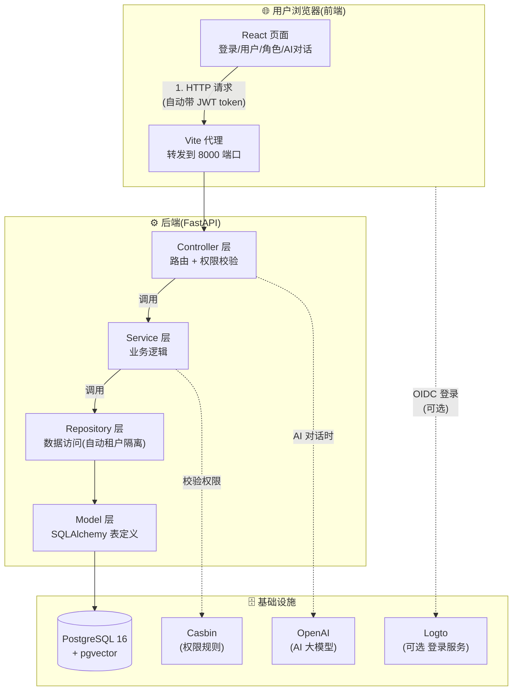
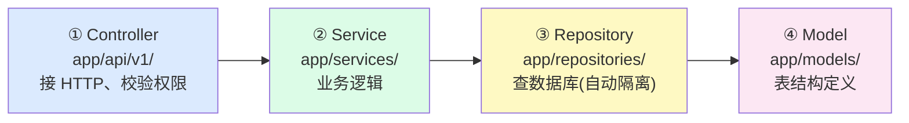
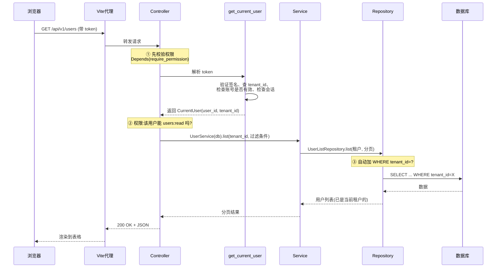
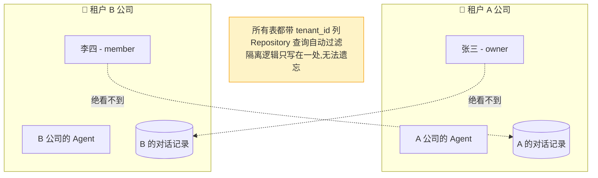
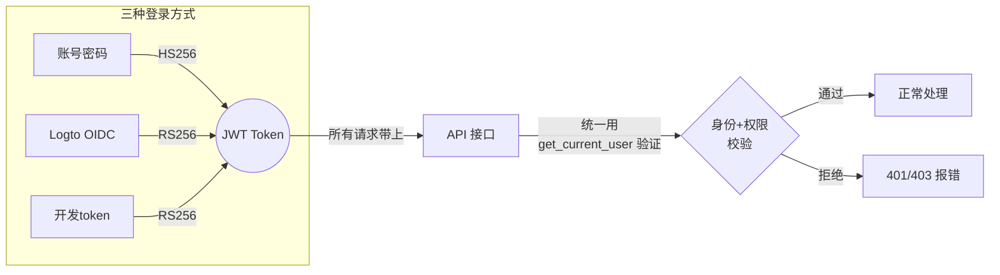

# 02 - 架构全景图

📍 相关文档:[01-项目是什么](01-项目是什么.md) · [关系图(更详细)](../附录/关系图.md)

> 这一篇用图帮你建立「整个系统长什么样」的印象。重点不是细节,而是**数据怎么流动**。

---

## 整体架构图

系统分前端、后端、基础设施三大块。下面这张图展示它们怎么协作:



**怎么读这张图**:
- **实线** = 主要的数据/调用流(从前端到数据库)。
- **虚线** = 辅助调用(权限校验、AI 调用、第三方登录)。

---

## 后端的四层分层(核心)

后端代码严格分四层,这是理解一切的钥匙:



| 层 | 在哪个目录 | 干什么 | 类比 |
|----|-----------|--------|------|
| ① Controller | `app/api/v1/` | 接收 HTTP 请求,做权限校验,转交给 Service | 餐厅**服务员**:接单、核对身份 |
| ② Service | `app/services/` | 业务逻辑:组合多个数据操作、记日志、管事务 | 餐厅**厨师**:实际做菜 |
| ③ Repository | `app/repositories/` | 只管读写数据库,自动加租户过滤 | 餐厅**仓库管理员**:取食材 |
| ④ Model | `app/models/` | 定义数据库表长什么样 | 食材的**清单** |

> ⚠️ **铁律**:依赖只能从上往下。Controller 可以调 Service,但 Service **绝不能**调
> Controller。这样改一层不会搞乱别的层。详见
> [01-分层架构与依赖方向](../02-后端架构/01-分层架构与依赖方向.md)。

---

## 一次请求的完整旅程

以「用户在前端点击查看用户列表」为例,追踪一个请求从头到尾经历了什么:



**记住这三个关键关卡**(图中标注的 ①②③):
1. **身份认证**(`get_current_user`):你是谁?token 有效吗?
2. **权限校验**(`require_permission`):你被允许做这件事吗?
3. **租户隔离**(Repository 基类):只给你看你自己租户的数据。

---

## 数据是怎么隔离的?(核心机制速览)

这是项目最精华的设计之一。先看图,细节在后:



> 详见 [04-多租户隔离](../02-后端架构/04-多租户隔离.md)。

---

## 认证与权限(两张脸)



**重点**:三种登录殊途同归——都拿到一个 JWT,后端用**同一套**逻辑验证。这就是为什么
开发者不用关心用户是哪种方式登录的。

> 详见 [05-认证体系](../02-后端架构/05-认证体系.md)。

---

## 项目的目录结构(鸟瞰)

```
ai-agent-platform/
├── app/                    ← 后端所有代码
│   ├── api/v1/            ← Controller 层(HTTP 路由)
│   ├── services/          ← Service 层(业务逻辑)
│   ├── repositories/      ← Repository 层(数据访问)
│   ├── models/            ← Model 层(表定义)
│   ├── schemas/           ← Pydantic 入参/出参校验
│   ├── core/              ← 基础设施(配置/数据库/安全/casbin)
│   ├── agents/            ← AI 智能体(LangGraph)
│   └── main.py            ← 后端入口
├── frontend/src/           ← 前端所有代码
│   ├── api/               ← 请求层(axios)
│   ├── components/        ← 组件(含 ui/ 组件库)
│   ├── hooks/             ← TanStack Query hooks
│   ├── pages/             ← 页面
│   └── App.tsx            ← 前端入口
├── alembic/                ← 数据库迁移文件
├── tests/                  ← 测试
├── docs/                   ← 其他文档(LOGTO/db-schema)
└── 项目指南/               ← 你正在读的这套文档
```

---

## 接下来

- 想立刻动手跑起来 → [01-环境准备](../01-快速开始/01-环境准备.md)
- 想深入某一层 → 从 [02-后端架构/01-分层架构](../02-后端架构/01-分层架构与依赖方向.md) 开始
- 想看更详细的关系图(ER图、影响速查)→ [附录/关系图](../附录/关系图.md)

---

**关键文件清单**:
- 后端入口:`app/main.py`
- 前端入口:`frontend/src/App.tsx`、`frontend/src/main.tsx`
- 请求管线核心:`app/api/deps.py` 的 `get_current_user` 和 `require_permission`
- 分层基类:`app/repositories/base.py`
