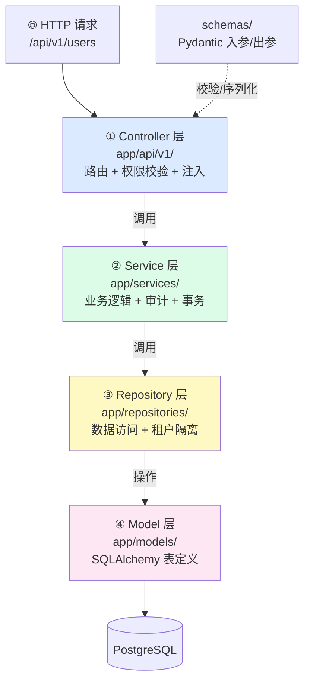
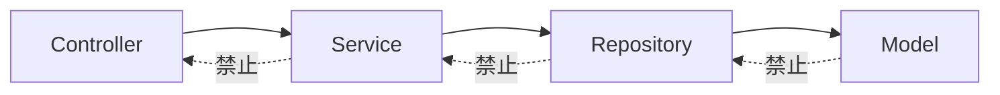
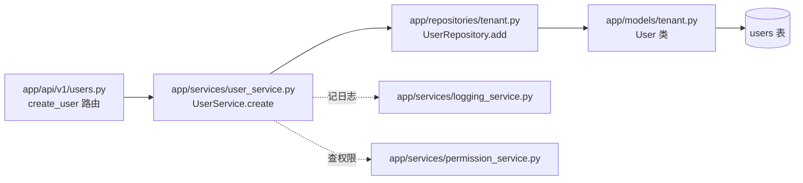
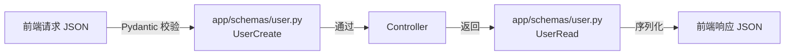

# 01 - 分层架构与依赖方向

📍 相关文档:[02-架构全景图](../00-总览/02-架构全景图.md) · [术语表](../附录/术语表.md)

> 这是理解后端代码的**钥匙**。读完后你会知道:代码为什么这样分、改代码该放哪一层、
> 为什么依赖不能「往回指」。

---

## 四层分层一张图



---

## 每一层干什么?

### ① Controller 层(控制器层)

**在哪**:`app/api/v1/`(如 `users.py`、`agents.py`、`chat.py`)

**职责**(只做三件事):
1. **接 HTTP 请求**:定义路由、路径、HTTP 方法。
2. **校验权限**:用 `Depends(require_permission(...))` 声明需要什么权限。
3. **转交 Service**:拿到 `CurrentUser` 和 `db`,调 `XxxService(db).方法(...)`,
   把结果返回。

**它不做**:不写业务逻辑、不直接碰数据库、不写 SQL。

**类比**:餐厅**服务员**——接单、核对客人身份、把单子传给厨房。

**代码长这样**(摘自 `app/api/v1/users.py`):
```python
@router.get("/", dependencies=[Depends(require_permission("users", "read"))])
async def list_users(
    user: CurrentUser = Depends(get_current_user),  # 谁在请求
    db: AsyncSession = Depends(get_db),              # 数据库连接
):
    return await UserService(db).list(user.tenant_id, filters)  # 交给 Service
```

> 💡 **声明式权限**:注意 `dependencies=[Depends(require_permission(...))]` 这个写法。
> 它像「贴标签」——告诉框架「进这个接口必须有 users:read 权限」。框架自动拦,不用你在
> 业务代码里写 `if 有权限:`。详见 [06-权限模型RBAC](06-权限模型RBAC.md)。

---

### ② Service 层(服务层)

**在哪**:`app/services/`(如 `user_service.py`、`auth_service.py`)

**职责**(装业务逻辑):
1. **编排**:组合多个 Repository 调用,完成一个完整业务动作。
2. **权限二次确认**:写操作开头先 `permission_service.require(...)`。
3. **审计日志**:每次增删改记一条日志。
4. **管事务**:最后 `await self.db.commit()` 提交。

**类比**:餐厅**厨师**——拿食材(调 Repository)、按菜谱做菜(业务逻辑)、出菜。

**代码长这样**(摘自 `app/services/user_service.py` 的写操作套路):
```python
async def create(self, actor_id, tenant_id, payload):
    # 1. 权限校验
    await permission_service.require(actor_id, tenant_id, self.OBJECT, "create")
    # 2. 业务逻辑(查重 + 创建 + 关联租户 + 同步 casbin)
    ...
    # 3. 审计日志
    await self.logs.record(action="create", ...)
    # 4. 提交事务
    await self.db.commit()
    return user
```

> 💡 **重要约定**:Service 负责 `commit()`,Controller **不提交**。这样事务边界清晰。

---

### ③ Repository 层(仓库层)

**在哪**:`app/repositories/`(如 `user.py`、`tenant.py`、`base.py`)

**职责**(只管读写数据库):
1. 提供增删改查方法。
2. **强制多租户隔离**:查询自动加 `WHERE tenant_id = 当前租户`。

**类比**:餐厅**仓库管理员**——只管按单取食材,不关心菜怎么做。

**关键**:`TenantScopedRepository` 基类(`app/repositories/base.py`)是**全项目唯一**的
隔离强制点。详见 [04-多租户隔离](04-多租户隔离.md)。

> 💡 **为什么单独抽一层?** 把「怎么查数据库」和「业务逻辑」分开。业务逻辑变了不用动
> SQL;换数据库只改这层。最关键的是——**隔离逻辑集中在这层,不可能被遗忘**。

---

### ④ Model 层(模型层)

**在哪**:`app/models/`(如 `tenant.py` 定义 `User`、`Tenant`)

**职责**:用 Python 类描述数据库表长什么样(列、类型、索引、关系)。用 SQLAlchemy ORM。

**类比**:食材的**清单/规格表**——说明「鸡蛋有保质期字段、有数量字段」。

---

## 依赖方向:必须单向!(铁律)



**规则**:依赖只能**从上往下**。Controller 调 Service ✓,但 Service 调 Controller ✗。

### 为什么这么严格?

| 如果违反 | 会发生什么 |
|---------|-----------|
| Service 调 Controller | 业务逻辑被绑死在 HTTP 上,无法复用、无法测试 |
| Repository 调 Service | 数据访问层依赖业务层,循环依赖、无法独立测试 |
| Model 里写业务逻辑 | 表定义和业务混在一起,改一处全乱 |

**一句话**:单向依赖让每层能独立修改、独立测试,「改一层不崩全栈」。

---

## 一个完整调用链(users 模块为例)

「创建一个用户」从前端到数据库,经过这些文件:



| 步骤 | 文件 | 做什么 |
|------|------|--------|
| 1 | `app/api/v1/users.py` | 接 POST,声明权限,注入 user/db |
| 2 | `app/services/user_service.py` | 校验权限、查重、建 user、关联租户、同步 casbin、记日志、提交 |
| 3 | `app/repositories/tenant.py` | `UserRepository.add(user)` 写入数据库 |
| 4 | `app/models/tenant.py` | `User` 类描述 users 表结构 |

---

## 还有一组「横向」文件:schemas

`schemas/`(如 `app/schemas/user.py`)是**横切**的:Controller 用它校验入参、序列化出参。
它不属于四层中的任何一层,而是「数据形状定义」。



> 💡 **Model vs Schema 区别**:Model(`app/models/`)对应**数据库表**;Schema(`app/schemas/`)
> 对应**接口数据**。一个 User 在数据库里可能有 20 个字段,但接口只返回 10 个(隐藏密码
> 等敏感字段),这「隐藏」就靠 Schema 控制。

---

## 改代码该放哪一层?(决策表)

| 你要做的事 | 改哪层 | 例子 |
|-----------|--------|------|
| 加/改一个 HTTP 接口 | Controller | 新增 `DELETE /users/{id}` |
| 改业务规则、加校验 | Service | 「创建用户前检查邮箱是否已存在」 |
| 改查询方式、加过滤 | Repository | 「按手机号查用户」 |
| 加/改数据库字段 | Model + 迁移 | 「给 user 加 avatar 字段」 |
| 改接口入参/出参结构 | Schema | 「响应里多返回一个 role 字段」 |

---

## 记住三句话

1. **四层分层**:Controller → Service → Repository → Model,职责清晰。
2. **依赖单向**:绝不能回头,否则测试和复用都崩。
3. **隔离集中**:多租户过滤只在 Repository 层,无法遗忘。

---

**关键文件清单**:
- 分层目录:`app/api/v1/`、`app/services/`、`app/repositories/`、`app/models/`、`app/schemas/`
- 公共依赖(注入 user/db):`app/api/deps.py`
- Repository 基类:`app/repositories/base.py`
- 全局异常处理:`app/main.py` 的 `_permission_handler`(把 PermissionError 转 403)

**相关文档**:
- [04-多租户隔离](04-多租户隔离.md) — Repository 层的核心机制
- [06-权限模型RBAC](06-权限模型RBAC.md) — Controller 层的权限声明
- [04-二开/02-新增后端模块](../04-二开脚手架/02-新增后端模块.md) — 实操:加一个完整模块
