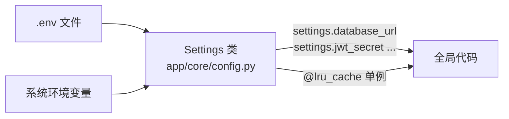

# 02 - 配置与环境

📍 相关文档:[01-环境准备](../01-快速开始/01-环境准备.md) · [05-认证体系](05-认证体系.md)

> 这一篇讲后端「设置」是怎么读取和管理的。读完后你会知道:配置从哪来、三种环境有啥
> 区别、为什么 JWT 密钥在生产环境不改会直接拒绝启动。

---

## 配置从哪来?

后端所有配置集中在**一个类**:`app/core/config.py` 的 `Settings`。



**读取顺序**:`Settings` 继承自 Pydantic 的 `BaseSettings`,它会:
1. 先读**系统环境变量**(优先级高)
2. 再读**项目根目录的 `.env` 文件**
3. 都没有就用**代码里的默认值**

> 💡 **关键细节**:`.env` 的路径是**写死的绝对路径**(`config.py` 顶部算出来),不是相对
> 当前工作目录。这样无论你用 `uvicorn`、`alembic`、`pytest` 哪个命令跑,都能找到同一个
> `.env`。见 `config.py` 的 `_ENV_FILE`。

### 全局单例

```python
@lru_cache
def get_settings() -> Settings:
    return Settings()

settings = get_settings()  # 模块级单例,全项目共享
```

用 `@lru_cache` 保证整个进程只创建一次 `Settings` 实例(读一次 `.env`)。代码里用
`from app.core.config import settings` 拿配置。

---

## 三种环境(APP_ENV)

`Settings` 里有个关键字段 `app_env`,取值影响很多行为:

| `APP_ENV` | 用途 | 特殊行为 |
|-----------|------|---------|
| **`development`** | 本地开发 | 开 `/dev/token`、`/dev/bootstrap`、`/oidc/jwks` 等开发接口 |
| **`testing`** | 跑测试 | 同样允许开发接口;测试里会注入测试专用配置 |
| **`production`** | 上线 | **拒绝**用默认 JWT 密钥启动;**关闭**所有 `/dev/*` 接口(返回 404) |

> 💡 怎么判断「是否开发模式」?代码里常见 `if settings.app_env != "development":`。
> 比如 `app/main.py` 的开发接口都这样挡着,生产环境访问就 404。

---

## ⚠️ JWT 密钥保护机制(重点)

这是项目里很巧妙的一个安全设计。看 `config.py` 的 `_jwt_secret_not_default`:

```python
@model_validator(mode="after")
def _jwt_secret_not_default(self):
    if (
        self.jwt_secret == "change-me-in-production"
        and self.app_env not in ("development", "testing")
    ):
        raise ValueError("JWT_SECRET must be changed from its default in non-dev environments")
    return self
```

**做了什么**:如果 `JWT_SECRET` 还是默认的 `change-me-in-production`,且环境**不是**
development/testing,启动就**直接报错**。

**为什么重要**:JWT 密钥用来给本地登录的 token 签名。如果生产环境用默认密钥,等于
公开了签名密钥——**任何人都能伪造一个管理员 token 登录**!这个保护让「忘记改密钥」
这种致命错误无法悄悄发生。

> 💡 **给新人的提醒**:本地开发保持默认没问题;上线前**一定**把 `JWT_SECRET` 改成一段
> 随机长字符串(比如 `openssl rand -hex 32` 生成)。

---

## CORS(跨域)配置

前端(3000 端口)和后端(8000 端口)不同源,浏览器默认会拦截跨域请求。要后端明确放行:

```python
# app/main.py
app.add_middleware(
    CORSMiddleware,
    allow_origins=settings.cors_origins_list,  # 允许哪些前端地址
    allow_credentials=True,
    allow_methods=["*"],
    allow_headers=["*"],
)
```

`cors_origins` 字段设计得灵活——能接受 **JSON 数组**或**逗号分隔**两种写法:

```ini
# 写法一:JSON 数组
CORS_ORIGINS=["http://localhost:3000","http://localhost:3001"]

# 写法二:逗号分隔
CORS_ORIGINS=http://localhost:3000,http://localhost:3001
```

代码用 `cors_origins_list` 属性统一解析成列表(见 `config.py` 的 `cors_origins_list`)。
**为什么这么设计?** 因为 pydantic-settings 对带方括号的值处理容易出错,这里做了兼容。

---

## 配置项一览(按类别)

| 类别 | 关键字段 | 默认值 | 说明 |
|------|---------|--------|------|
| **应用** | `app_name` | agenthub | 应用名 |
| | `app_env` | development | 环境(dev/test/prod) |
| | `api_v1_prefix` | /api/v1 | 接口前缀 |
| **数据库** | `database_url` | (必填) | SQLAlchemy 连接串;测试环境由 `conftest.py` 注入 `sqlite+aiosqlite://`(内存库) |
| **认证** | `jwt_secret` | change-me... | ⚠️ 生产必改 |
| | `jwt_algorithm` | HS256 | 本地 token 算法 |
| | `salt_rounds` | 12 | bcrypt 强度 |
| | `access_token_ttl_minutes` | 60 | token 有效期 |
| | `session_ttl_hours` | 168 | 会话有效期(7天) |
| **Logto** | `logto_endpoint` | localhost:3001 | OIDC 服务地址 |
| | `logto_issuer` | .../oidc | 签发者 |
| | `logto_audience` | .../api | token 受众 |
| **AI** | `openai_api_key` | sk-replace-me | ⚠️ 用 AI 必改 |
| | `openai_model` | gpt-4o-mini | 用哪个模型 |

> 各字段含义的「大白话」解释见 [01-环境准备](../01-快速开始/01-环境准备.md) 的 `.env`
> 逐项解释。

---

## 二开时怎么加配置?

如果你的新功能需要新配置(比如「短信服务 key」),三步:

1. **在 `Settings` 类加字段**(带默认值和注释):
```python
# app/core/config.py
sms_api_key: str = ""  # 短信服务 key,默认空
```

2. **在 `.env.example` 加一行**(让别人知道有这个配置):
```ini
SMS_API_KEY=
```

3. **代码里用** `settings.sms_api_key` 读取。

> 💡 Pydantic 会自动做类型校验。比如你写 `port: int`,传进来个字符串会报错。省心。

---

## 常见问题

**Q: 改了 `.env` 不生效?**
A: `settings` 是单例,进程启动时读一次。改完 `.env` 要**重启**后端。

**Q: 测试时怎么覆盖配置?**
A: 测试通过**环境变量**注入(优先级高于 `.env`)。比如 `tests/conftest.py` 会设
   `APP_ENV=testing`、`DATABASE_URL=sqlite+aiosqlite://`。详见 [08-测试体系](08-测试体系.md)。

---

**关键文件清单**:
- 配置定义:`app/core/config.py` 的 `Settings` 类
- JWT 密钥保护:`config.py` 的 `_jwt_secret_not_default`
- CORS 用法:`app/main.py` 的 `create_app`
- 配置模板:`.env.example`

**相关文档**:
- [05-认证体系](05-认证体系.md) — JWT 密钥怎么用
- [08-测试体系](08-测试体系.md) — 测试如何覆盖配置
