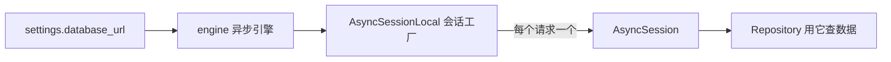
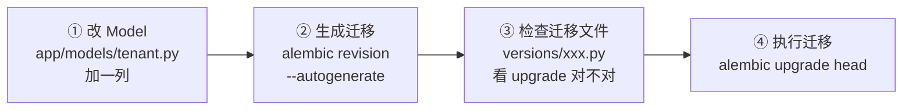

# 03 - 数据库与 ORM

📍 相关文档:[04-多租户隔离](04-多租户隔离.md) · [01-分层架构](01-分层架构与依赖方向.md)

> 这一篇讲后端怎么和数据库打交道。读完后你会知道:ORM 怎么用、软删除怎么回事、
> 怎么改数据库表结构(迁移)。

---

## 用 ORM 操作数据库

项目用 **SQLAlchemy 2.0(异步版)**。简单说:用 Python 类描述表,用 Python 对象操作数据,
不用手写 SQL。

### 定义一张表(Model 层)

在 `app/models/` 里定义。以 `User` 表为例(`app/models/tenant.py`):

```python
class User(Base):                          # 继承 Base
    __tablename__ = "users"                # 对应数据库表名

    id: Mapped[str] = mapped_column(String(128), primary_key=True)
    email: Mapped[str | None] = mapped_column(String(255), nullable=True)
    username: Mapped[str | None] = mapped_column(String(50), nullable=True)
    status: Mapped[str] = mapped_column(String(20), default="active")
    is_deleted: Mapped[bool] = mapped_column(Boolean, default=False, index=True)
    created_at: Mapped[datetime] = mapped_column(
        DateTime(timezone=True), server_default=func.now()
    )
    # ... 更多字段
```

**读法**:
- `Mapped[str]` = 这列是字符串类型(`| None` 表示可空)。
- `mapped_column(...)` = 具体的列定义(类型、是否可空、默认值、索引)。
- `server_default=func.now()` = 数据库层面的默认值(插入时自动填当前时间)。

> 💡 **所有 Model 都继承 `Base`**(`app/core/database.py` 的 `Base`)。`Base` 是所有表的
> 「祖宗」,Alembic 靠 `Base.metadata` 知道有哪些表。

### 数据库连接(engine + session)

`app/core/database.py` 管连接,**懒加载**(第一次用到才建):



- **engine**:管理数据库连接池。
- **AsyncSession**:一次数据库会话(类似一个「工作单元」)。
- **`get_db()`**(`database.py`):FastAPI 依赖,**每个请求分一个 session**,请求结束自动关;
  出错自动 `rollback()`。

> 💡 **为什么懒加载?** Alembic 迁移时会 import `Base`,但迁移用的是**同步**连接,而 app
> 用的是**异步**连接。如果一上来就建异步引擎,迁移会报错。懒加载让引擎在「真正需要异步」
> 时才建。详见 `database.py` 文件头的注释。

---

## 软删除(Soft Delete)—— 项目的重要约定

**普通删除**:从数据库真删掉(`DELETE FROM ...`)。
**软删除**:不真删,只是打标记(`is_deleted = True`)。

项目里 `User` 表用软删除:

```python
is_deleted: Mapped[bool] = mapped_column(Boolean, default=False, index=True)
deleted_at: Mapped[datetime | None] = mapped_column(...)  # 删除时间
```

### 为什么用软删除?

| 好处 | 说明 |
|------|------|
| **能恢复** | 误删了可以「复活」 |
| **能审计** | 记录保留着,审计日志有意义 |
| **不破坏关联** | 不会因外键约束导致删不掉 |

### 配套:查询要过滤已删的

所有查询都要带 `WHERE is_deleted = False`。比如 `UserRepository.get_by_username`:

```python
stmt = select(User).where(
    User.username == username,
    User.is_deleted.is_(False),   # ← 关键,过滤掉已删的
)
```

### 配套:部分唯一索引(巧妙的点)

看 `User` 的 `__table_args__`:

```python
Index(
    "uq_users_username_active",
    "username",
    unique=True,
    postgresql_where=text("is_deleted = false"),   # 只对未删的行生效
    sqlite_where=text("is_deleted = 0"),
),
```

**这是什么?** 一个「**部分唯一索引**」——只要求「**未删除的**用户名唯一」。

**为什么需要?** 想象这个场景:
1. 用户名 "zhangsan" 已被软删除(张三离职了)
2. 现在新来个也叫 zhangsan 的人,想注册

如果用普通唯一索引,第 2 步会失败(被已删的占用)。部分唯一索引**只对未删的行生效**,
所以已删的 zhangsan 不挡路,新的能注册成功。

> 💡 这是项目里「软删除 + 可复用标识符」的标配组合,迁移文件 `ce505ae8a1bd` 专门加了它。

---

## 数据库迁移(Alembic)

数据库表结构会变(加字段、改类型、建新表)。**迁移**就是给表结构做版本管理,像 Git 但管的是表。

### 目录结构

```
alembic/
├── env.py              ← 配置:从哪读 URL、怎么对比差异
├── script.py.mako      ← 迁移文件模板
└── versions/           ← 所有迁移文件(按时间顺序)
    ├── 7043d564e936_initial_schema.py
    ├── ab8c310529f6_add_created_at_to_user_tenants.py
    ├── c1d2e3f4a5b6_extend_user_rbac_orgs_sessions_logs.py
    └── ce505ae8a1bd_add_partial_unique_index_on_users_.py
```

### env.py 的两个关键点

**1. URL 来源**:不从 `alembic.ini` 读,而是从 `app.core.config.settings` 读(见
`env.py` 顶部)。这样 `.env` 一处控制所有。

**2. 异步转同步**:app 用异步驱动(`postgresql+psycopg`),但 Alembic 迁移用**同步**连接。
`env.py` 做了转换(`env.py` 的 `sync_url`):
- `sqlite+aiosqlite://` → `sqlite://`
- `postgresql://` → `postgresql+psycopg://`

**3. 排除外部表**:casbin 自己管 `casbin_rule` 表,我们的迁移要忽略它(`env.py` 的
`_EXCLUDED_TABLES`),否则 autogenerate 每次都想删它。

> ⚠️ **必须 import 所有 model 模块**(`env.py` 顶部那一串 `from app.models import ...`),
> 否则 `--autogenerate` 发现不了表。加新 model 文件记得在这里加一行。

### 改数据库表结构的标准流程

以「给 User 加一个 `avatar` 字段」为例:



**命令**:
```bash
# 改完 model 后,生成迁移(自动对比 model 和数据库的差异)
alembic revision --autogenerate -m "add avatar to users"

# 检查生成的 alembic/versions/xxxxx_add_avatar_to_users.py
# 看 def upgrade() 里是不是真的加了 avatar 列

# 执行
alembic upgrade head
```

> ⚠️ **一定要检查生成的迁移文件!** autogenerate 不是万能的,有时会漏(比如部分唯一索引
> 它可能识别不准),要人工核对 `upgrade()` 和 `downgrade()` 是否正确。

### 常用 Alembic 命令

| 命令 | 作用 |
|------|------|
| `alembic upgrade head` | 执行所有未执行的迁移(建/改表) |
| `alembic downgrade -1` | 回退一个迁移 |
| `alembic current` | 看当前在哪个版本 |
| `alembic history` | 看所有迁移历史 |
| `alembic revision --autogenerate -m "..."` | 自动生成迁移(改完 model 后) |

---

## 数据类型小贴士

| 场景 | 用什么 | 项目例子 |
|------|--------|---------|
| 主键 | `String(32)` 或 `String(128)` | UUID hex 字符串,不用自增 int |
| 时间 | `DateTime(timezone=True)` | 带时区 |
| 布尔 | `Boolean` | `is_deleted` |
| JSON | `JSONB().with_variant(JSON, "sqlite")` | `info_json`(Postgres 用 JSONB,测试的 SQLite 用 JSON) |
| 软删除标记 | `Boolean, index=True` | `is_deleted`(加索引,查询快) |

> 💡 **`JSONB().with_variant(JSON, "sqlite")`** 这个写法很巧妙:生产用 Postgres 的高级
> JSONB(支持索引、查询),测试用 SQLite 的普通 JSON。一份代码兼容两个数据库。

---

## 记住三句话

1. **ORM**:用 Python 类描述表,继承 `Base`。
2. **软删除 + 部分唯一索引**:不真删,查询过滤 `is_deleted=False`,标识符可复用。
3. **迁移流程**:改 model → `alembic revision --autogenerate` → 检查 → `upgrade head`。

---

**关键文件清单**:
- 数据库连接:`app/core/database.py`(`engine`、`AsyncSessionLocal`、`get_db`)
- Model 定义:`app/models/`(`tenant.py` 含 `User`/`Tenant`/`UserTenant`)
- 迁移配置:`alembic/env.py`
- 迁移文件:`alembic/versions/`
- 数据库服务:`docker-compose.yml`(PostgreSQL 16 + pgvector)

**相关文档**:
- [04-多租户隔离](04-多租户隔离.md) — 隔离就靠 Model 上的 `tenant_id` 列
- [04-二开/02-新增后端模块](../04-二开脚手架/02-新增后端模块.md) — 加新表的完整流程
