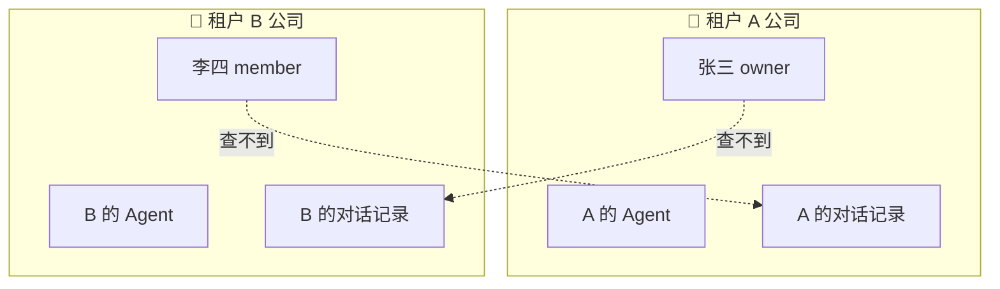
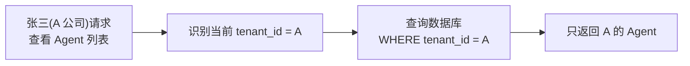
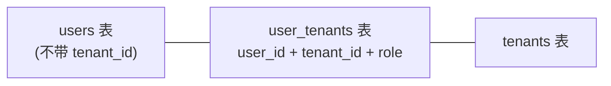
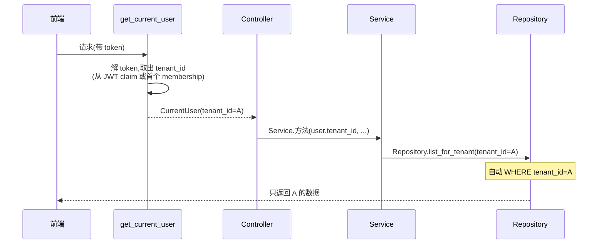

# 04 - 多租户隔离

📍 相关文档:[01-分层架构](01-分层架构与依赖方向.md) · [03-数据库与ORM](03-数据库与ORM.md)

> 这是项目最精华的设计之一。读完后你会彻底明白:怎么保证 A 公司绝对看不到 B 公司的数据,
> 以及为什么这套机制「不可能被开发者遗忘」。

---

## 先理解:什么是多租户隔离?



**目标**:多家公司共用一套系统,但数据严格隔离。A 公司的人**绝对**查不到 B 公司的任何
数据,就像 B 公司的数据不存在一样。

> 💡 什么是[租户](../附录/术语表.md)?一个独立的客户/组织,比如一家注册的公司。

---

## 怎么实现的?核心思路

所有「租户私有」的表都带一个 **`tenant_id` 列**,标记「这条数据属于哪个租户」。查询时
**自动**加上 `WHERE tenant_id = 当前用户的租户`。



**关键不在「加 where」本身,而在于「自动加」** —— 把这个逻辑集中在一处,开发者写业务
代码时根本不用手动加,所以**不可能忘记**。

---

## 隔离机制:两种模式

项目里有**两种**隔离写法,因为数据归属有两种情况:

### 模式一:实体直接带 `tenant_id`(用 `TenantScopedRepository`)

适用:**Agent**、**Conversation** 这类「自己就有 tenant_id 列」的表。

```python
# app/models/agent.py 里,Agent 表自带 tenant_id 列
class Agent(TenantScopedRepository 能处理的):
    tenant_id: ...   # ← 直接在自己身上
    name: ...
```

隔离在 `app/repositories/base.py` 的 `TenantScopedRepository` 里实现:

```python
class TenantScopedRepository(BaseRepository):
    async def get_for_tenant(self, obj_id, tenant_id):
        stmt = select(self.model).where(
            self.model.id == obj_id,
            self.model.tenant_id == tenant_id,   # ← 隔离就在这里!唯一一处
        )
        ...

    async def list_for_tenant(self, tenant_id, limit, offset):
        stmt = select(self.model).where(
            self.model.tenant_id == tenant_id,   # ← 自动加过滤
        )...
```

> 💡 **这就是「单一隔离点」**。文件头注释明说:这是全项目唯一强制过滤的地方,所以
> 「忘记加过滤导致数据泄露」这种事故**几乎不可能发生**。

### 模式二:租户关系在关联表(自己 join 过滤)

适用:**User** 这种特殊情况。

**为什么 User 特殊?** 因为一个 User 可以属于**多个**租户(张三可能同时是 A 公司员工
和 B 公司顾问)。所以「用户属于哪个租户」不能直接写在 user 表上,而是放在关联表
`user_tenants` 里:



所以查「某租户的用户列表」要 **join 关联表**过滤。看 `app/repositories/user.py` 的
`UserListRepository._base`:

```python
def _base(self, tenant_id):
    return (
        select(User)
        .join(UserTenant, UserTenant.user_id == User.id)   # join 关联表
        .where(
            UserTenant.tenant_id == tenant_id,             # ← 隔离在这里
            User.is_deleted.is_(False),                    # + 软删除过滤
        )
    )
```

> ⚠️ **重要**:User 的**列表/统计**查询用 `UserListRepository`(join 关联表),
> **不能**依赖 Service 层「记得加 where」。注意区分两个 Repository,它们职责不同:

**`UserRepository` vs `UserListRepository` 分工**(都和 User 相关,但定位不同):

| | `UserRepository` | `UserListRepository` |
|---|---|---|
| 在哪 | `app/repositories/tenant.py` | `app/repositories/user.py` |
| 继承 | `BaseRepository`(通用,不带租户过滤) | 独立类,自己 join |
| 用途 | **单点查询**:登录、查重、按 id/username/email 找单个用户 | **列表/统计**:某租户的用户列表、分页搜索、用户统计 |
| 隔离方式 | 各方法**独立**写 `is_deleted=False`(如 `get_by_username`);`get(id)` 不过滤,靠调用方手动判 | `_base()` 里 join `user_tenants` 过滤 `tenant_id` |
| 典型调用方 | `auth_service`(登录)、`deps.py` 的 `get_current_user` | `user_service`(用户管理页) |

> 💡 **别被名字误导**:`UserRepository` 在 `tenant.py` 文件里(历史命名),不是租户隔离的;
> 它面向「按账号找用户」的登录/查重场景,和「按租户列用户」的 `UserListRepository` 互补。
> 二开加 User 相关查询时,先想清楚是单点查还是按租户列,选对的 Repository。

---

## 一次请求中,tenant_id 怎么来?



**关键**:`tenant_id` 在认证阶段(`get_current_user`)就解析好了,放进 `CurrentUser`
值对象,一路传到 Repository。Controller 和 Service 只是「搬运工」,不自己造 tenant_id。

> 详见 [05-认证体系](05-认证体系.md) 的 `get_current_user` 部分。

---

## 新建实体时,tenant_id 怎么写?

查询是自动过滤,那**创建**数据时呢?Service 必须手动把 `tenant_id` 塞进去:

```python
# app/services/agent_service.py 创建 Agent 时
agent = Agent(
    tenant_id=current_tenant_id,   # ← 手动塞当前租户
    name=payload.name,
    ...
)
```

> ⚠️ 这一步**不能忘**。好在通常 Service 拿到的就是 `user.tenant_id`,顺手赋值即可。
> 二开加新实体时,记得建表带 `tenant_id` 列 + 创建时填值。

---

## 常见错误 & 怎么避免

| 错误 | 后果 | 正确做法 |
|------|------|---------|
| 写新查询忘了加 `tenant_id` 过滤 | 数据泄露!跨租户可见 | 用 `TenantScopedRepository` 的方法,别自己裸写 select |
| User **列表**查询用了 `TenantScopedRepository` | 报错(User 表本身没有 tenant_id 列) | 用户列表用 `UserListRepository`(join `user_tenants` 关联表) |
| 用 `UserRepository.get` 查登录态用户却没补软删除判断 | 能查到已删用户 | `UserRepository` 继承的是 `BaseRepository`,`get()` 不带 `is_deleted` 过滤;调用方需手动判(参考 `deps.py` 的 `get_current_user`) |
| 创建实体忘填 `tenant_id` | 数据「无主」,查询找不到 | 创建时显式赋值 `tenant_id=current` |
| 在 Service 层手动加 where | 能用但易遗漏,违背「集中隔离」原则 | 隔离放 Repository 层 |

---

## 怎么测试隔离生效?

测试里有专门的「跨租户隔离」用例:建两个租户各放数据,用一个租户的身份查,断言看不到
另一个租户的数据。详见 [08-测试体系](08-测试体系.md)。

---

## 记住三句话

1. **所有租户私有表带 `tenant_id` 列**。
2. **普通实体用 `TenantScopedRepository`**(隔离自动加,唯一一处)。
3. **User 这种租户关系在关联表的,要自己 join 过滤**(`UserListRepository._base`)。

---

**关键文件清单**:
- 隔离基类:`app/repositories/base.py` 的 `TenantScopedRepository`
- Agent 的隔离范例:`app/repositories/agent.py`(继承 `TenantScopedRepository`)
- User 的特殊隔离:`app/repositories/user.py` 的 `UserListRepository._base`
- tenant_id 解析:`app/api/deps.py` 的 `get_current_user`
- 关联表定义:`app/models/tenant.py` 的 `UserTenant`

**相关文档**:
- [05-认证体系](05-认证体系.md) — `CurrentUser` 里的 `tenant_id` 怎么来的
- [04-二开/02-新增后端模块](../04-二开脚手架/02-新增后端模块.md) — 加新租户实体怎么做
