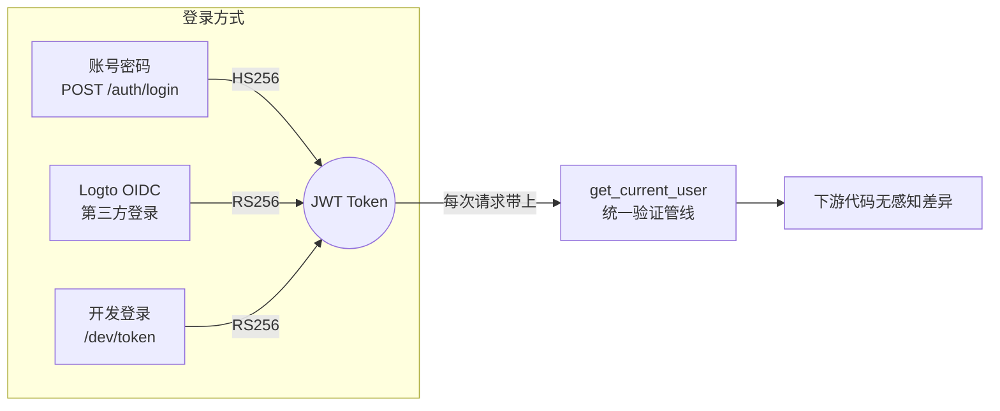
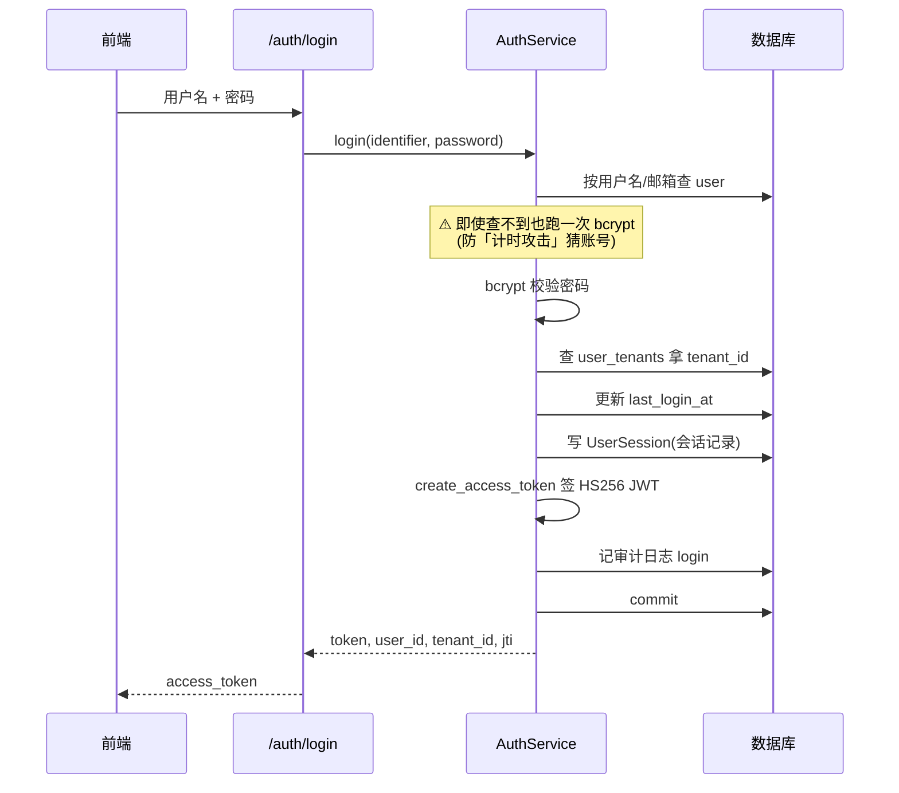
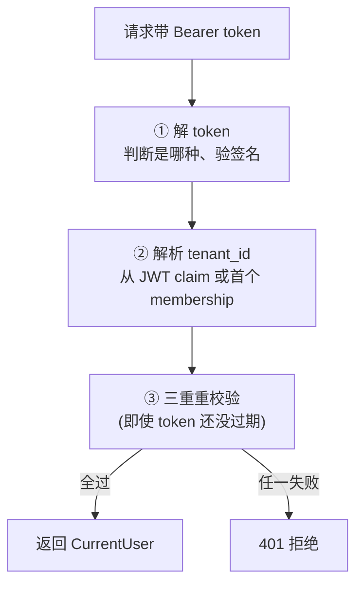

# 05 - 认证体系

📍 相关文档:[06-权限模型RBAC](06-权限模型RBAC.md) · [02-配置与环境](02-配置与环境.md)

> 这一篇讲「怎么登录、怎么验证身份」。读完后你会知道:三种 token 有啥区别、为什么殊途同归、
> 每次请求都做了哪些校验。

---

## 核心设计:三种登录,一条管线

项目支持**三种**登录方式,但巧妙之处在于:**无论哪种,后端都用同一条逻辑验证**。
下层代码完全感觉不到用户是怎么登录的。



| 登录方式 | 算法 | 谁签名 | 用在哪 |
|---------|------|--------|--------|
| **本地账号密码** | HS256 | 后端自己签(用 `JWT_SECRET`) | 快速开发、自建账号 |
| **Logto OIDC** | RS256 | Logto 服务签 | 企业级、单点登录 |
| **开发 token** | RS256 | 后端用内存 RSA 密钥签(仅 dev) | 本地免登录调试 |

> ⚠️ **分清「token 来源」和「前端登录入口」**:上表是**后端能验证的 3 种 token 来源**。
> 前端登录页(`login-page.tsx`)目前提供 **3 个入口**:账号密码、一键开发登录、粘贴 token;
> **Logto 跳转登录前端尚未接入**(代码里留了 TODO 接入点),需要手动配置后启用。所以
> "三种登录"指的是后端 token 验证管线,别误以为登录页上已经能点 Logto 登录。

> 💡 **HS256 vs RS256**:HS256 用同一个密钥既签名又验证(对称);RS256 用私钥签名、公钥
> 验证(非对称)。本地签发用 HS256 简单;Logto 这种第三方签发用 RS256,后端只存公钥更安全。

---

## 登录流程(本地账号密码)

`POST /api/v1/auth/login` 走这条路。完整流程在 `app/services/auth_service.py` 的 `login`:



### 两个安全亮点(值得学习)

**1. 防账号枚举(计时攻击)**

如果「账号不存在」立刻返回、「密码错误」慢返回,攻击者通过响应时间能猜出哪些账号存在。
项目用 `_DUMMY_HASH`(`auth_service.py`)保证:**无论账号存不存在,都跑一次 bcrypt**
(bcrypt 故意很慢),让响应时间差不多。

**2. 统一错误信息**

所有登录失败都返回「invalid credentials」(账号/密码错),不告诉用户具体是哪个错了——
除了「账号锁定」会明确说(因为用户需要知道为啥登不进去)。

---

## token 长什么样?

本地登录签的 token(在 `app/core/local_auth.py` 的 `create_access_token`)包含这些 claim:

```python
claims = {
    "iss": "local",          # 签发者:local(本地签)
    "sub": user_id,          # 主体:用户 id
    "tenant_id": tenant_id,  # 自定义:当前租户
    "email": email,
    "iat": 签发时间,
    "exp": 过期时间,          # 默认 60 分钟
    "jti": 唯一id,           # ← token 的身份证号,用于注销
}
```

> 💡 **`jti` 很重要**:它是每个 token 的唯一编号,登录时存进 `UserSession` 表。注销时
> 靠它找到对应会话记录并标记失效。这就是「主动登出」能立即生效的关键。

---

## 每次请求的验证:`get_current_user`(重点)

每个需要登录的接口,都会经过 `app/api/deps.py` 的 `get_current_user`。它做**三件事**:



> 💡 **认证头怎么取(标准 HTTPBearer)**:`get_current_user` 用 FastAPI 的
> [`HTTPBearer`](https://fastapi.tiangolo.com/tutorial/security/get-current-user/)
> 依赖取 `Authorization: Bearer <token>` 头,而不是裸 `Header` 参数。
> 好处是 **OpenAPI 自动生成 `securitySchemes.HTTPBearer`**,这样 Apifox / Swagger UI /
> 生成的 SDK 都能从统一的「鉴权」入口填 token,而不会导出一个空的 `authorization` 头参数跟
> 手动填的冲突。`auto_error=False` + 函数内手动抛 **401**(不是 HTTPBearer 默认的 403),
> 因为「无凭证」的 HTTP 语义就是 401,响应头还带 `WWW-Authenticate: Bearer` 提示客户端。

### ① 解 token

`decode_token`(`app/core/security.py`)先偷看 token 的 `iss` 字段(不验签先看)来分流:
- `iss == "local"` → 用 `JWT_SECRET` 验(HS256)
- 否则 → 用 JWKS 公钥验(Logto 的),或开发模式用内存 RSA 密钥验(RS256)

> 💡 **巧妙的开发模式**:当 `LOGTO_ISSUER` 指向自己的后端(`localhost:8000/oidc`),
> 后端会提供 `/oidc/jwks` 接口。这样开发 token 走的是**和 Logto 完全一样**的验证代码路径,
> 调试更真实。

### ② 解析 tenant_id

从 JWT 的 `tenant_id` claim 拿;如果没有,查用户的**第一个** membership 回填。
**找不到任何租户归属 → 403 拒绝**(每个请求必须属于一个租户)。

### ③ 三重重校验(安全精华!)

JWT 本身是无状态的——理论上没过期就该认。但项目**每次请求都再查一次数据库**,确保
「账号被禁/被踢出租户/被登出」能**立即生效**,不用等 token 过期:

| 校验 | 失败原因 | 为什么需要 |
|------|---------|-----------|
| 账号存在且未删且 active | 被删/被锁定 | 禁用账号要立刻失效 |
| 仍是该租户成员 | 被移出租户 | 被踢出的人不该再用旧 token |
| token 的 jti 对应会话仍 active | 已登出 | 主动登出要立即生效 |

> 💡 这就是为什么「改状态/改角色/登出」能立即生效的根源。代价是每次请求多查几次库,
> 换来的是**安全状态实时生效**。值得。

---

## 会话管理

每次登录会在 `user_sessions` 表写一条记录,存:设备类型、IP、user-agent、过期时间、
`token_hash`(token 的 SHA-256,不存原 token)。

相关接口(在 `app/api/v1/auth.py`):
- `GET /auth/sessions` — 看自己的活跃会话(在哪些设备登录过)
- `DELETE /auth/sessions/{id}` — 踢掉某个会话(比如「在别处登录了,这里下线」)
- `POST /auth/logout` — 注销当前会话

> 💡 **`token_hash` 不存原 token**:存 SHA-256 哈希。这样即使数据库泄露,也无法还原出
> 可用的 token。安全惯例。

---

## 注销怎么生效的?


**这就是「立即生效」的实现**:注销只是把会话标记失效,下次请求第 ③ 步重校验就会发现
并拒绝。不用等 token 自然过期。

---

## 三种登录的体验差异

| 操作 | 账号密码登录 | 开发登录 | Logto 登录 |
|------|------------|---------|-----------|
| 怎么进 | 输用户名密码 | 点「一键登录」按钮 | 跳转 Logto 页面 |
| token 怎么拿 | `POST /auth/login` 返回 | `/dev/token` 返回 | Logto 授权后返回 |
| 需要建账号吗 | 需要(`init_admin.py`) | 不用(自动建 dev 租户) | 需要在 Logto 注册 |
| 生产能用吗 | 能 | **不能**(仅 dev) | 能 |

> 详细的登录体验见 [01-快速开始/02-启动项目](../01-快速开始/02-启动项目.md)。

---

## 记住三句话

1. **三种登录殊途同归**:都拿一个 JWT,走同一条 `get_current_user` 管线。
2. **每次请求三重重校验**:账号状态 + 租户成员 + 会话 active,保证状态变更立即生效。
3. **注销靠 jti**:登出标记会话失效,下次请求第 ③ 步拦住。

---

**关键文件清单**:
- 验证管线:`app/api/deps.py` 的 `get_current_user`
- token 解析:`app/core/security.py` 的 `decode_token`
- 本地签发:`app/core/local_auth.py` 的 `create_access_token`
- 密码哈希:`app/core/password.py` 的 `hash_password` / `verify_password`
- 登录业务:`app/services/auth_service.py` 的 `login` / `logout`
- 登录接口:`app/api/v1/auth.py`
- 开发 token:`app/main.py` 的 `dev_token` / `dev_bootstrap`

**相关文档**:
- [06-权限模型RBAC](06-权限模型RBAC.md) — 认证(你是谁)之后,还有授权(你能干啥)
- [02-配置与环境](02-配置与环境.md) — JWT_SECRET 保护机制
- `docs/LOGTO_SETUP.md` — 如何配置真实 Logto
