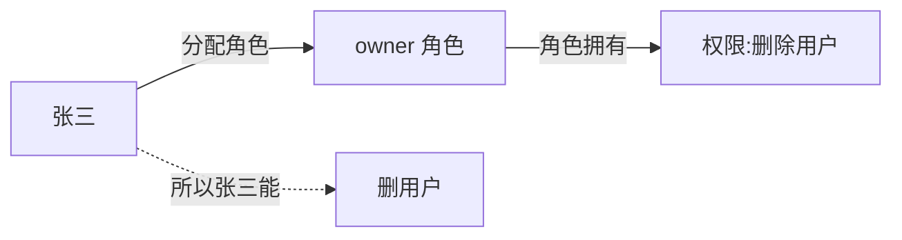
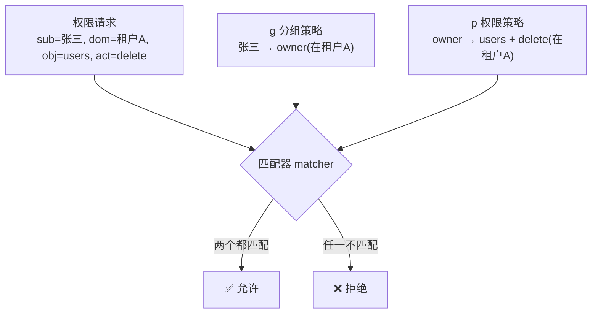

# 06 - 权限模型 RBAC

📍 相关文档:[05-认证体系](05-认证体系.md) · [01-分层架构](01-分层架构与依赖方向.md)

> 这一篇讲「谁能做什么」。读完后你会知道:RBAC 是什么、casbin 怎么工作、三档默认角色、
> 为什么权限校验有两处(声明式 + 工具内)。

---

## 先分清:认证 vs 授权

这是两个容易混的概念:

| | 认证(Authentication) | 授权(Authorization) |
|---|---|---|
| 问的是 | **你是谁?** | **你能干这个吗?** |
| 举例 | 张三登录成功,拿到 token | 张三想删用户 →「你是 owner 吗?是 → 允许」 |
| 在哪做 | [05-认证体系](05-认证体系.md) | 这一篇 |

**顺序**:先认证(确认身份),再授权(检查权限)。两者都在 `get_current_user` 之后。

---

## RBAC 是什么?

**R**ole-**B**ased **A**ccess **C**ontrol(基于角色的访问控制)。

核心思路:**不直接**给每个人配权限,而是「人 → 角色 → 权限」三层:



**为什么这样?** 因为给每个人一个个配权限太累。给「角色」配好权限,新人来了分个角色就行。
张三离职、李四接班,把 owner 角色从张三转给李四,权限立刻跟着转。

---

## 项目里的三档默认角色

每个租户创建时,系统自动「种」(seed)好三个角色(在 `app/services/permission_service.py`
的 `seed_tenant_defaults`):

| 角色 | 能做什么(权限矩阵) |
|------|-------------------|
| **owner**(所有者) | 一切:agents 读写删 + conversations + users 全权 + roles 全权 + organizations 全权 |
| **admin**(管理员) | 大部分:agents 读改 + conversations + users 读改 + roles 读 + organizations 读(不能删 agent、不能管角色) |
| **member**(普通成员) | 基础:agents 只读 + conversations 读/建/对话 + roles 读 + organizations 读 |

> 💡 这三个角色同时存在**两套**记录:
> - **casbin 的策略**(真正生效的权限判断)
> - **`roles` 表的显示记录**(给管理员界面看的,有名字/描述/排序)
>
> 两套的 `code`(owner/admin/member)是对应的。`roles` 表是「显示层」,真正管事的是 casbin。

---

## casbin 怎么工作?(权限引擎)

项目用 **pycasbin** 做权限判断。规则定义在 `casbin_model.conf`:

```ini
[request_definition]
r = sub, dom, obj, act          # 一次权限请求:谁(sub)在哪个租户(dom)对什么资源(obj)做什么动作(act)

[matchers]
# 允许的条件:sub 在 dom 里继承了某角色,且该角色有对应的 (obj, act) 策略
m = g(r.sub, p.sub, r.dom) && r.dom == p.dom && keyMatch(r.obj, p.obj) && r.act == p.act
```

**通俗翻译**:当张三想「在租户 A 里删除用户」,casbin 检查:
1. 张三在租户 A 里是不是有某个角色?(通过 `g` 分组关系)
2. 那个角色在租户 A 里,有没有「users + delete」这条策略?
3. 两个都满足 → 允许;否则 → 拒绝

### 四个关键概念



| 概念 | 含义 | 例子 |
|------|------|------|
| **sub**(主体) | 谁在请求 | 张三的 user_id |
| **dom**(域) | 在哪个租户 | 租户 A 的 tenant_id |
| **obj**(对象) | 操作什么资源 | `users` / `agents` / `conversations` |
| **act**(动作) | 具体操作 | `read` / `create` / `update` / `delete` / `chat` |

> 💡 **dom(域)是多租户的关键**:同一个「owner」角色名,在租户 A 和租户 B 是独立的。
> 张三是 A 的 owner,不代表他是 B 的 owner。casbin 的 domain 模式天然支持这种隔离。

---

## 怎么用?(声明式校验)

权限校验在 **Controller 层**「声明」,像贴标签一样简单。看 `app/api/v1/users.py`:

```python
@router.get("/", dependencies=[Depends(require_permission("users", "read"))])
async def list_users(...):
    ...
```

`require_permission("users", "read")` 就是「贴标签」:告诉框架「进这个接口必须有
users:read 权限」。框架自动调 casbin 判断,不通过就 403。

### require_permission 怎么实现的?

`app/api/deps.py` 的 `require_permission` 是个**闭包工厂**:

```python
def require_permission(obj, act):
    async def _guard(user: CurrentUser = Depends(get_current_user)):
        allowed = await permission_service.check(user.user_id, user.tenant_id, obj, act)
        if not allowed:
            raise HTTPException(403, f"forbidden: cannot {act} {obj}")
        return user
    return _guard
```

它内部:① 先过 `get_current_user`(认证,拿到 user);② 调 `permission_service.check`
(授权);③ 不通过抛 403。

### permission_service:casbin 的唯一封装

所有 casbin 操作都集中在 `app/services/permission_service.py`,这是**唯一**碰 casbin 的地方:

```python
class PermissionService:
    async def check(self, user_id, tenant_id, obj, act) -> bool:
        # 用 run_in_threadpool 桥接同步的 pycasbin 到异步层
        ...
    def require(self, user_id, tenant_id, obj, act):
        # 不通过抛 PermissionError(被 main.py 转成 403)
        ...
```

> 💡 **为什么集中一处?** casbin 的 API 是同步的,而我们的 Service 是异步的,要包一层
> `run_in_threadpool`。集中封装让这个桥接逻辑只写一次,好测试、好替换。

---

## 双重校验(重要!)

权限不止在 Controller 校验一次。**AI 工具被调用时,工具内部会再校验一次**。

为什么?因为 AI 是不可控的——大模型可能「决定」调用某个工具,即使接口层没拦。看
`app/agents/graph.py` 的工具:

```python
@tool
async def get_my_agents():
    # 工具内部自己查权限!不是依赖接口层
    allowed = await permission_service.check(user_id, tenant_id, "agents", "read")
    if not allowed:
        return "ERROR: permission denied"
    ...
```

**这就是「双重校验」**:
1. **Controller 层**:声明式校验接口权限。
2. **工具内部**:再次校验,防止 AI 绕过。

> 💡 **改权限时两处都要想到**。详见 [07-Agent与LLM集成](07-Agent与LLM集成.md)。

---

## 改角色时怎么立即生效?

管理员改了某用户的角色(比如 member → admin),casbin 的策略要**同步更新**,否则还是
旧权限。看 `permission_service.py` 的 `set_role_for_user_in_domain`:

```python
async def set_role_for_user_in_domain(self, user_id, role, tenant_id):
    # 1. 删掉旧角色
    for old in e.get_roles_for_user_in_domain(user_id, tenant_id):
        e.delete_roles_for_user_in_domain(user_id, old, tenant_id)
    # 2. 加上新角色
    e.add_role_for_user_in_domain(user_id, role, tenant_id)
```

`UserService` 改用户角色时会调它,所以**改完立刻生效**,不用重新登录。

---

## 权限变更的历史回溯(SCD2)

> 📋 状态:**按需项(现阶段不实施)**。仅当业务出现「任意时间点还原」合规需求时才做,
> 是[表设计原则第 6 条](03-数据库与ORM.md)的具体展开。完整施工图见
> [`docs/auth-history-scd2-plan.md`](../../docs/auth-history-scd2-plan.md)。

上面讲的都是「现在」——casbin 只回答「现在能不能做」。但合规场景常要回答**「过去某时刻」**:

- 场景 i:「张三在 3 月 1 日是什么角色?」(单成员还原)
- 场景 ii:「admin 角色当时的权限集是什么?」(单角色还原)

casbin 帮不上——它不存历史。所以给**授权链**两张表加上时间维度,用 **SCD2**(缓慢变化维 Type 2 / 时态表)模式。

### 双层职责「宪法」(改权限前必读)

> **历史回溯看 SCD2 表;实时鉴权看 casbin;SCD2 当前态是 casbin 的同步源。**

```
管理员改权限
   ↓
写 SCD2 表(关旧行 valid_to=now + 插新行 valid_to=NULL)   ← 历史在这里
   ↓
用 SCD2 当前态同步 casbin                                 ← 实时鉴权用这个
   ↓
写 system_logs(谁、何时、从 X 改成 Y)                    ← 审计底座
```

这条宪法顺手治好了「双层 RBAC 谁为准」:`role_permissions` 不再是死表,而是**角色权限历史还原的唯一数据源**,它的当前态同步给 casbin。

### 只在两张表上做,别全局铺

| 表 | 加 SCD2? | 为什么 |
|---|---|---|
| `user_tenants`(成员↔角色) | ✅ | 场景 i 的数据源 |
| `role_permissions`(角色↔权限) | ✅ | 场景 ii 的数据源 |
| `users`、`agents`、会话/消息 | ❌ | 用主表 + `system_logs` 日志即可,还原价值低 |

**为什么不全局铺?** SCD2 会让每次 update 变成「关旧行 + 插新行」,查询都要带 `WHERE valid_to IS NULL`,全局铺会成倍增加复杂度和踩坑面。只在「有合规还原价值」的两张表上做,是唯一理性选择。

### 两张表的形态

加 `valid_from`(生效时间,非空)和 `valid_to`(失效时间,可空,`NULL` = 当前生效):

- **当前态查询**:`WHERE valid_to IS NULL`
- **时间点还原**:`WHERE valid_from <= ts AND (valid_to IS NULL OR valid_to > ts)`
- **「移除成员」**:从物理删行 → 改成 `valid_to = now()`(历史保留)

> ⚠️ **写路径必须封装**:`UserTenantRepository` / `RolePermissionRepository` 提供 `assign_role` / `grant` 等方法,**业务代码绝不直接碰 `valid_from/valid_to`**。漏关旧行 = 脏数据。这是 SCD2 能 hold 住的命脉。
>
> ⚠️ **新牵连点**:所有读这两张表当前态的查询都要带 `WHERE valid_to IS NULL`,漏了会读到历史脏数据。靠 Repository 封装 + 「当前态数量 = 期望值」的回归测试兜底。

### casbin 侧几乎不动

`assign_role` 写完 SCD2 行后,照旧调 `set_role_for_user_in_domain` 同步 casbin。casbin 永远只管「现在」,不碰历史——两者解耦。

详见 [`docs/auth-history-scd2-plan.md`](../../docs/auth-history-scd2-plan.md)。

---

## casbin 的策略存哪?

存数据库的 `casbin_rule` 表(由 `casbin-sqlalchemy-adapter` 自动管理)。

> ⚠️ **重要**:这张表是 casbin 自己管的,**我们的 Alembic 迁移要排除它**(`alembic/env.py`
> 的 `_EXCLUDED_TABLES`)。否则 autogenerate 每次都想删它。详见
> [03-数据库与ORM](03-数据库与ORM.md)。

---

## 记住三句话

1. **RBAC = 人 → 角色 → 权限**,不直接给人配权限。
2. **声明式校验**:接口上贴 `require_permission` 标签,框架自动拦。
3. **双重校验**:Controller 校验 + AI 工具内部再校验,防绕过。

---

**关键文件清单**:
- 权限模型定义:`casbin_model.conf`
- casbin 封装(唯一入口):`app/services/permission_service.py`
- casbin enforcer:`app/core/casbin_enforcer.py`
- 声明式校验:`app/api/deps.py` 的 `require_permission`
- 默认角色 seed:`permission_service.py` 的 `seed_tenant_defaults`
- 角色 CRUD(显示层):`app/services/rbac_service.py`、`app/models/rbac.py`

**相关文档**:
- [05-认证体系](05-认证体系.md) — 认证在前,授权在后
- [07-Agent与LLM集成](07-Agent与LLM集成.md) — AI 工具的二次权限校验
- [01-分层架构](01-分层架构与依赖方向.md) — 权限声明在 Controller 层
