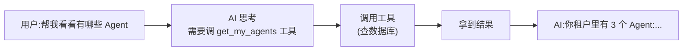
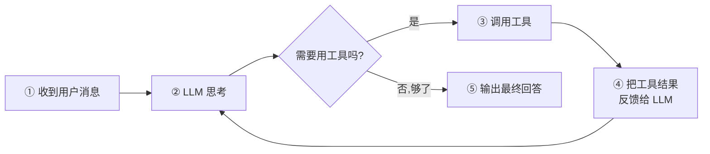
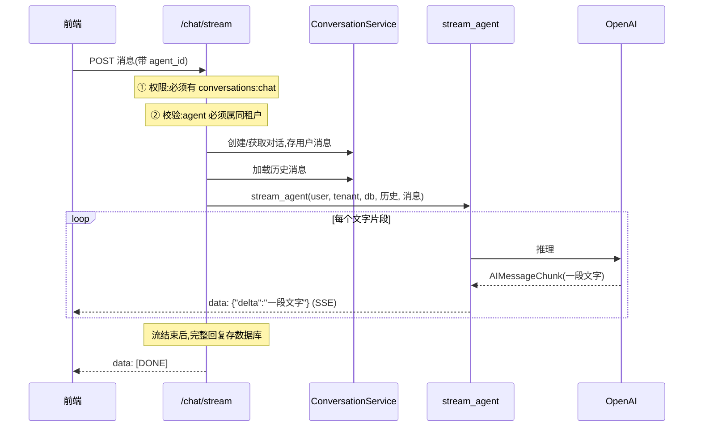
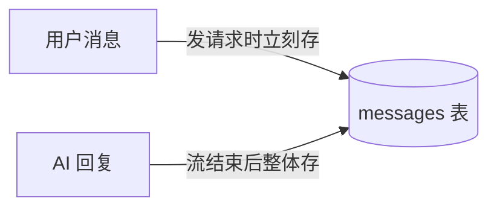

# 07 - Agent 与 LLM 集成

📍 相关文档:[06-权限模型RBAC](06-权限模型RBAC.md) · [02-架构全景图](../00-总览/02-架构全景图.md)

> 这一篇讲项目里的 AI 智能体(Agent)怎么工作。读完后你会知道:ReAct 是什么、工具怎么
> 受权限约束、SSE 流式对话怎么实现。

---

## 什么是 Agent?

普通 AI 对话:用户问 → AI 直接答(纯文本,不能干活)。
**Agent(智能体)**:用户问 → AI **能调用工具**(查数据库、调 API)→ 拿到结果再答。



项目用 **LangGraph** 框架构建 Agent,模式是 **ReAct**(Reason + Act:思考 + 行动)。

---

## ReAct 循环

ReAct Agent 的工作循环:



**通俗讲**:AI 像个人一样——遇到问题先想(Reason),该查资料就查(Act),查完再想,直到
能回答为止。项目用 LangGraph 的 `create_react_agent` 一行构建这个循环(见
`app/agents/graph.py` 的 `build_agent` / `stream_agent`)。

---

## 工具:Agent 能干什么?

项目目前内置一个工具(在 `app/agents/graph.py` 的 `_build_tenant_tools`):

| 工具 | 作用 |
|------|------|
| `get_my_agents` | 列出当前租户里有哪些 Agent(名字、模型) |

> 💡 这是「示范工具」。二开时你会加自己的工具,比如「查订单」「发邮件」。每个工具就是
> 一个带 `@tool` 装饰器的函数。

### 工具的精髓:自带权限校验

看这个工具的代码——它**第一件事就是查权限**:

```python
@tool
async def get_my_agents() -> str:
    allowed = await permission_service.check(user_id, tenant_id, "agents", "read")
    if not allowed:
        return "ERROR: permission denied"      # ← 没权限直接拒绝
    repo = AgentRepository(db)
    agents = await repo.list_for_tenant(tenant_id)
    return "\n".join(f"- {a.name} (model={a.model})" for a in agents)
```

**为什么工具内部要查权限?** 因为大模型是不可控的——它可能「决定」调用某工具,即使接口层
没拦。工具自己再查一次,就**保证 AI 无论怎么折腾,都越不过权限边界**。

> 这就是 [06-权限模型RBAC](06-权限模型RBAC.md) 说的「双重校验」第二处。改权限时,工具
> 内的校验逻辑也要同步想到。

### 工具是「按请求重建」的

注意 `_build_tenant_tools(user_id, tenant_id, db)` 是个**工厂函数**——每次请求都新建一组
工具,把当前请求的 `user_id`、`tenant_id`、`db` **绑定**进闭包里。

**为什么?** 因为不同请求是不同用户、不同租户。如果工具是全局共享的,就可能用错租户的
数据。每次重建,保证工具用的永远是「当前这次请求」的上下文。

---

## 完整对话流程(SSE 流式)

用户发一句话,到看到回复,经历了什么?看 `app/api/v1/chat.py` 的 `chat_stream`:



### 三个关键关卡

1. **权限**:接口声明 `require_permission("conversations", "chat")`(Controller 层)
2. **租户校验**:目标 agent 必须**属于当前租户**(`_load_agent` 用 `get_for_tenant` 查,
   跨租户的 agent 直接 404)。详见 [04-多租户隔离](04-多租户隔离.md)。
3. **工具内校验**:agent 调工具时,工具内部再查权限。

---

## SSE 是什么?怎么实现?

**SSE(Server-Sent Events)**:服务器**主动**往浏览器推数据的技术。AI 对话时「字一个一个
冒出来」就靠它。

### 和普通请求的区别

| | 普通接口 | SSE |
|---|---|---|
| 响应方式 | 一次性返回完整 JSON | **一段一段**推数据,直到结束 |
| 连接 | 短连接(返回就关) | 长连接(一直开着,持续推) |
| 适合 | 普通数据查询 | 流式输出(打字机效果、实时日志) |

### 实现方式

后端用 FastAPI 的 `StreamingResponse` + 异步生成器:

```python
async def event_source():                # 异步生成器
    async for chunk in stream_agent(...): # 每个文字片段
        yield f"data: {json.dumps({'delta': chunk})}\n\n"  # SSE 格式
    yield "data: [DONE]\n\n"             # 结束标记

return StreamingResponse(event_source(), media_type="text/event-stream")
```

**SSE 数据格式**:每条消息是 `data: 内容\n\n`(注意两个换行结尾)。

### 流式过滤:只转发文字

`stream_agent`(`app/agents/graph.py`)订阅 LangGraph 的事件流,但**只转发文字**:

```python
async for event in agent.astream_events(inputs, version="v2"):
    if event["event"] == "on_chat_model_stream":        # 大模型输出事件
        chunk = event["data"].get("chunk")
        if isinstance(chunk, AIMessageChunk) and chunk.content:
            yield chunk.content                          # 只 yield 文字内容
```

**工具调用事件不转发**给前端(工具是后台静默执行的),用户只看到最终文字。

### 出错怎么处理?

```python
except Exception as e:
    yield f"data: {json.dumps({'error': str(e)})}\n\n"  # 推一条错误
    return                                              # 然后关闭流
```

前端收到 `{"error": ...}` 就知道出问题了。常见的错误:`OPENAI_API_KEY` 没配、网络问题。

---

## 对话历史怎么存的?

每次对话,用户消息和 AI 回复都**持久化**到数据库:



下次对话时,`ConversationService` 会把历史消息加载成 LangChain 的 `HumanMessage` /
`AIMessage`,喂给 agent,这样 AI 就「记得」之前聊过什么(上下文)。

> 💡 目前用**数据库存历史**实现记忆。README 提到后续会做 Agent 持久化记忆
> (Postgres Checkpointer)。现阶段是「对话级」记忆,不是「跨对话长期记忆」。

---

## 给 Agent 配置(system_prompt)

每个 Agent 在 `agents` 表里有个 `system_prompt` 字段——这是「人设指令」。比如:
- 客服 Agent 的 system_prompt:「你是某公司的客服,礼貌专业...」
- 编程 Agent 的 system_prompt:「你是一个资深程序员...」

`stream_agent` 会把它作为 agent 的 prompt 传入,塑造 AI 的回答风格。

---

## 记住三句话

1. **ReAct**:AI 边想边用工具,循环直到能回答。
2. **工具自带权限校验**:双重保障,AI 越不过权限边界。
3. **SSE 流式**:一段段推文字,实现打字机效果。

---

**关键文件清单**:
- Agent 构建:`app/agents/graph.py`(`build_agent`、`stream_agent`、`_build_tenant_tools`)
- 对话接口:`app/api/v1/chat.py`(`chat_stream`、`_load_agent`)
- 对话历史:`app/services/conversation_service.py`、`app/repositories/conversation.py`
- LLM 配置:`app/core/config.py` 的 `openai_*` 字段
- Agent 表:`app/models/agent.py`

**相关文档**:
- [06-权限模型RBAC](06-权限模型RBAC.md) — 工具的二次权限校验
- [04-多租户隔离](04-多租户隔离.md) — agent 必须属同租户
- [03-前端架构](../03-前端架构/01-技术栈与目录.md) — 前端怎么消费 SSE
