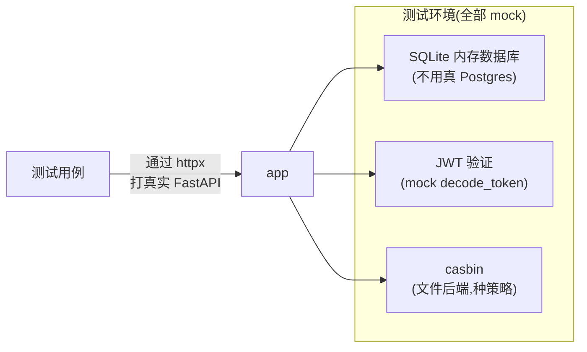
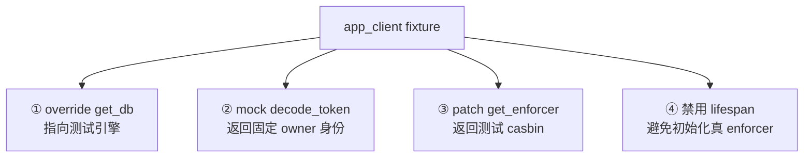

# 08 - 测试体系

📍 相关文档:[03-数据库与ORM](03-数据库与ORM.md) · [05-认证体系](05-认证体系.md)

> 这一篇讲后端测试怎么写。读完后你会知道:测试怎么跑、用了什么 trick 模拟多租户和认证、
> 一个典型测试长什么样。

---

## 先跑起来:测试怎么执行

```bash
pytest                 # 跑全部测试
pytest --cov=app       # 带覆盖率
pytest tests/test_users_crud.py   # 只跑某个文件
pytest -k "search"     # 只跑名字含 search 的测试
```

> 💡 **测试不需要外部服务!** 不用起 PostgreSQL、Logto、OpenAI。测试用**内存 SQLite** 数据库,
> JWT 和 casbin 都被 mock 掉。所以 `pytest` 直接就能跑,又快又独立。

---

## 测试的核心 trick:全部 mock,完全隔离

测试要验证的是**业务逻辑**,不是真实的外部依赖。所以 `tests/conftest.py` 把外部的东西全 mock:



| 真实环境 | 测试环境(替代) |
|---------|---------------|
| PostgreSQL | **SQLite 内存库**(快、免安装) |
| 真实 JWT 验签 | **mock `decode_token`**(返回固定身份) |
| casbin + Postgres adapter | **casbin + 文件后端**(每测试种策略) |
| OpenAI | 测试不涉及(或 mock) |
| Logto | mock 掉 |

> ⚠️ **SQLite vs PostgreSQL 有差异**:比如部分唯一索引的语法不同(代码里 `postgresql_where`
> 和 `sqlite_where` 都写了来兼容)。极少数边界行为可能不一致,但大部分逻辑测试是够的。

---

## 关键 fixture(conftest.py)

测试用 pytest 的 **fixture**(测试夹具)来准备环境。`conftest.py` 提供了几个核心 fixture:

### `test_env` —— 整套测试环境

每个测试**独立**建一套环境(互不污染):
- 新建一个**内存 SQLite 引擎** + 建所有表
- 种好一个 owner 用户 + 租户 + UserTenant 关联
- 建一个**文件后端 casbin**,种好 owner/admin/member 三档策略

> 💡 **为什么每测试新建?** 测试要**隔离**——A 测试的数据不能影响 B 测试。用 StaticPool
> 让「断言用的 session」和「请求用的 session」共享同一个连接,这样能看到彼此的数据变更。

### `db_session` —— 直接查数据库(做断言)

```python
async def test_xxx(db_session):
    # 用 db_session 直接插数据/查数据,绕过 API
    ...
```

适合「验证数据库层约束」(比如唯一索引)。

### `tenant_owner` —— 当前身份

```python
{"user_id": "user-xxx", "tenant_id": "tnt-xxx"}
```

### `app_client` —— HTTP 测试客户端(最常用)

这是写 API 测试的主力。它把 FastAPI app 起起来,用 httpx 模拟真实 HTTP 请求:

```python
async def test_list_users(app_client):
    resp = await app_client.get("/api/v1/users/", headers={"Authorization": "Bearer fake"})
    assert resp.status_code == 200
```

**注意**:header 里写 `Bearer fake`——token 内容无所谓,因为 `decode_token` 被 mock 成
「永远返回 owner 身份」了。重点是测**业务逻辑**,不是 token 本身。

### `app_client_real_auth` —— 真实验证(测登录链路)

少数测试(如登录往返)需要**真的**走 JWT 验签,用这个 fixture(不 mock `decode_token`)。
适合测「从登录到 /me 的完整链路」。

---

## 三个关键 mock(在 app_client 里)



**为什么要这四个?**
1. **`get_db`**:让请求用测试的 SQLite,不是真 Postgres。
2. **`decode_token`**:跳过真实验签,直接假装是 owner(测业务逻辑,不测 token)。
3. **`get_enforcer`**:用测试种好的 casbin,不是连真数据库的那个。
4. **禁用 lifespan**:`lifespan` 会调真 `get_enforcer`(连真 DB),测试里要避开。

---

## 一个典型测试长什么样

看 `tests/test_users_crud.py` 的结构(创建用户 + 列表):

```python
async def test_create_and_list_user(app_client, tenant_owner):
    # ① 准备:要创建的数据
    payload = {"username": "newuser", "email": "new@x.com", "password": "Pass123"}

    # ② 调接口(带 fake token,因为 decode 被 mock)
    resp = await app_client.post(
        "/api/v1/users/",
        json=payload,
        headers={"Authorization": "Bearer fake"},
    )

    # ③ 断言结果
    assert resp.status_code == 201
    created = resp.json()
    assert created["username"] == "newuser"

    # ④ 验证能查到(列表接口)
    resp = await app_client.get("/api/v1/users/", headers={"Authorization": "Bearer fake"})
    assert resp.status_code == 200
    usernames = [u["username"] for u in resp.json()["items"]]
    assert "newuser" in usernames
```

**套路**:准备数据 → 调接口 → 断言响应 → (可选)再查验证。

---

## 测试矩阵(测了什么)

项目目前 40+ 个测试,覆盖:

| 模块 | 测的内容 |
|------|---------|
| **认证** | 缺/错 token、/me、账号密码登录成功/失败/锁定、会话/注销 |
| **多租户隔离** | 跨租户不可见、无权限拒绝、member 不能删 |
| **用户 CRUD** | 分页/搜索/筛选/排序、创建/更新/删除/改状态/重置密码/统计/重复校验 |
| **角色 CRUD** | 创建/列表/重复校验/系统角色保护(不能删 owner 等) |
| **组织树** | 父子关系、重父级报错、删除 |
| **租户成员** | 成员 CRUD |
| **Chat** | SSE 流式、消息持久化、跨租户 Agent 拒绝 |

---

## 怎么模拟「不同角色/不同租户」?

测试默认是 **owner** 身份。要测 member、admin 怎么办?要测跨租户怎么办?

**思路**:在 casbin 里**加**对应的策略,或者在数据库里**建**对应的用户/租户,然后 mock
`decode_token` 返回那个身份。看 `test_permission.py` 这类测试的写法,核心是:

```python
# 种一个 member 身份的策略
e.add_role_for_user_in_domain("member-user", "member", tenant_id)
# mock decode 返回 member-user
```

> 💡 具体写法参考现有测试。关键是:**身份是 mock 出来的,权限是 casbin 种出来的**。

---

## 二开时怎么加测试?

加一个新功能(比如「商品」模块),测试套路:

1. **新建** `tests/test_products_api.py`
2. 用 `app_client` fixture(自动有 owner 身份)
3. 按「准备 → 调接口 → 断言」套路写
4. 重点测:**正常流程 + 边界 + 权限 + 隔离**

> 💡 **先写测试再写代码**(TDD)是好习惯。先把期望的接口行为写成测试,再写实现让测试通过。

---

## 记住三句话

1. **测试全 mock**:内存 SQLite + mock JWT + 文件 casbin,无需外部服务。
2. **`app_client` 是主力**:模拟 HTTP 请求,bearer 写啥都行(decode 被 mock)。
3. **每测试独立环境**:互不污染,可并行。

---

**关键文件清单**:
- 测试配置:`tests/conftest.py`(所有 fixture)
- 测试用例:`tests/test_*.py`
- 开发依赖:`requirements-dev.txt`(pytest、pytest-asyncio、httpx)
- 代码风格:`pyproject.toml`(ruff 配置)

**相关文档**:
- [03-数据库与ORM](03-数据库与ORM.md) — SQLite 和 Postgres 的兼容写法
- [04-多租户隔离](04-多租户隔离.md) — 隔离测试怎么写
- [05-认证体系](05-认证体系.md) — JWT mock 的原理
- [04-二开/02-新增后端模块](../04-二开脚手架/02-新增后端模块.md) — 给新模块加测试
