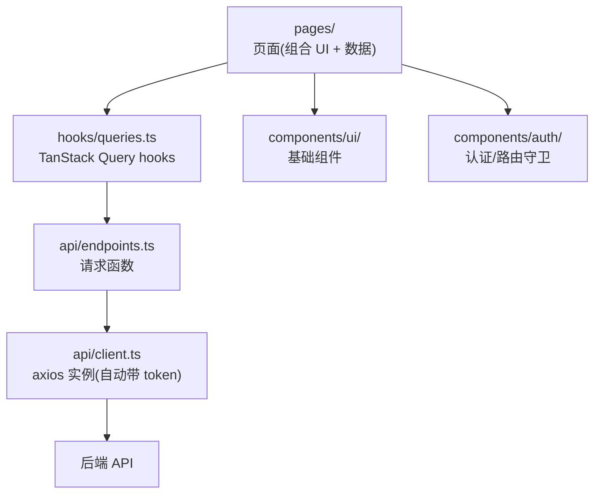
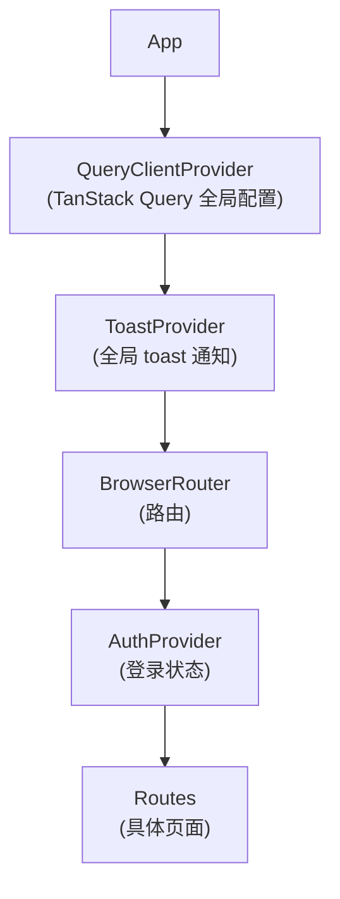

# 01 - 技术栈与目录

📍 相关文档:[02-架构全景图](../00-总览/02-架构全景图.md) · [术语表](../附录/术语表.md)

> 这一篇帮你建立前端的全局印象。读完后你会知道:用了什么技术、目录怎么组织、
> 那些 Provider 怎么嵌套。

---

## 技术栈一览

| 类别 | 选型 | 干什么用的 |
|------|------|-----------|
| **框架** | React 19 + TypeScript | 用户界面 |
| **构建** | Vite | 开发服务器(秒级热更新)+ 打包 |
| **路由** | React Router v6 | 页面跳转、路由守卫 |
| **数据** | TanStack Query v5 | 自动管理「请求数据、缓存、刷新」 |
| **表格** | TanStack Table v8 | 表格(列表页用) |
| **表单** | react-hook-form + zod | 表单状态管理 + 数据校验 |
| **HTTP** | axios | 发请求 |
| **样式** | Tailwind CSS | 写样式(用工具类) |
| **UI 组件** | shadcn 风格组件 | 一套可自由改的基础组件(基于 Radix UI) |
| **图标** | lucide-react | 图标库 |
| **代码检查** | oxlint | 替代 ESLint,更快 |

> 💡 卡在名词上?查 [术语表](../附录/术语表.md)。

---

## 目录结构

```
frontend/src/
├── api/              ← 请求层(怎么发请求)
│   ├── client.ts     ← axios 实例 + 拦截器(token 注入、401 处理)
│   ├── endpoints.ts  ← 按资源分组的请求函数(login、fetchUsers...)
│   └── types.ts      ← 和后端对齐的 TS 类型
├── components/        ← 组件
│   ├── auth/         ← 认证相关(AuthProvider、路由守卫)
│   ├── layout/       ← 布局(后台整体框架)
│   └── ui/           ← shadcn 风格基础组件(button、card、input...)
├── hooks/
│   └── queries.ts    ← TanStack Query hooks(useUsers、useCreateUser...)
├── pages/            ← 页面(login、users、agents、roles...)
├── lib/
│   └── utils.ts      ← cn() 工具函数(合并 class)
├── App.tsx           ← 根组件(路由 + Provider 嵌套)
└── main.tsx          ← 入口(挂载 App 到 DOM)
```

### 代码怎么分层的?

前端也是分层的(类似后端,但层数少):



| 层 | 在哪 | 职责 |
|----|------|------|
| **页面** | `pages/` | 把组件和数据拼成一个完整页面 |
| **数据 hooks** | `hooks/queries.ts` | 用 TanStack Query 封装「请求 + 缓存 + 失效」 |
| **请求层** | `api/` | 定义怎么发请求(axios + endpoints) |
| **UI 组件** | `components/ui/` | 可复用的基础组件(button、input) |

---

## App.tsx:Provider 嵌套(根组件)

`App.tsx` 是前端入口,最外层套了一堆 **Provider**(提供全局能力的组件)。嵌套顺序:



**为什么这个顺序?**
- `QueryClientProvider` 最外层:所有组件都能用 Query。
- `ToastProvider` 在路由外:任何地方都能弹通知。
- `BrowserRouter` 包路由:路由能正常工作。
- `AuthProvider` 在路由里:认证状态能驱动路由守卫。

> 💡 **Provider 嵌套顺序很重要**。AuthProvider 里要用 QueryClient,所以 QueryClientProvider
> 必须在 AuthProvider 外面。这种依赖关系决定了顺序。

### QueryClient 全局配置

```tsx
const queryClient = new QueryClient({
  defaultOptions: {
    queries: {
      retry: 1,                    // 失败重试 1 次
      refetchOnWindowFocus: false, // 切回窗口不自动刷新
      staleTime: 30_000,           // 数据 30 秒内算"新鲜",不重查
    },
  },
});
```

> 💡 **`staleTime: 30_000`** 很关键:30 秒内切换页面再回来,不会重新请求(用缓存),
> 既快又省流量。详见 [04-数据获取](04-数据获取TanStackQuery.md)。

---

## 路由表一览

`App.tsx` 里定义了所有路由:

| 路径 | 页面 | 是否需登录 |
|------|------|-----------|
| `/login` | LoginPage | ❌ 公开 |
| `/` | DashboardPage(概览) | ✅ 受保护 |
| `/agents` | AgentsPage(智能体) | ✅ 受保护 |
| `/users` | UsersPage(用户) | ✅ 受保护 |
| `/roles` | RolesPage(角色) | ✅ 受保护 |
| `/permissions` | PermissionsPage(权限) | ✅ 受保护 |
| `*` / `/404` | NotFoundPage | ❌ 公开 |

**受保护路由**用一个「布局路由」包起来:外层 `ProtectedRoute`(路由守卫)+ `DashboardLayout`
(侧边栏布局),里面的页面通过 `<Outlet />` 渲染。

> 详见 [03-认证与路由守卫](03-认证与路由守卫.md)。

---

## Vite 代理:前端怎么连后端?

前端在 3000 端口,后端在 8000 端口。直接调会跨域。`vite.config.ts` 配了**代理**:

```ts
server: {
  port: 3000,
  proxy: {
    "/api":   { target: "http://localhost:8000", changeOrigin: true },  // 接口
    "/dev":   { target: "http://localhost:8000", changeOrigin: true },  // 开发接口
    "/oidc":  { target: "http://localhost:8000", changeOrigin: true },  // 认证
    "/health":{ target: "http://localhost:8000", changeOrigin: true },  // 健康检查
  },
}
```

**效果**:前端用相对路径 `/api/v1/users` 发请求,Vite 自动转发到 `localhost:8000/api/v1/users`。
对前端代码来说,就像「同源」,不用管跨域。

> 💡 这就是为什么 `api/client.ts` 里 `baseURL: "/api/v1"`(相对路径)能连上后端。
> 生产环境通常用 nginx 做同样的转发。

### 路径别名 `@`

`vite.config.ts` 还配了别名:`"@" → src/`。所以代码里能写:
```ts
import { Button } from "@/components/ui/button";   // 等价于 src/components/ui/button
```
不用算 `../../` 相对路径,清晰多了。

---

## 构建脚本

```bash
npm run dev      # 开发:启动 Vite(热更新)
npm run build    # 打包:tsc 类型检查 + vite build
npm run lint     # 检查代码:oxlint
npm run preview  # 预览打包结果
```

> 💡 用的是 **oxlint**(不是 ESLint),更快。配置在 `.oxlintrc.json`。

---

## 记住三句话

1. **前端分三层**:页面(pages)→ 数据 hooks(hooks)→ 请求层(api)。
2. **Provider 嵌套有顺序**:QueryClient → Toast → Router → Auth → Routes。
3. **Vite 代理解决跨域**:前端用相对路径 `/api/v1`,Vite 转发到 8000。

---

**关键文件清单**:
- 入口:`frontend/src/main.tsx`、`frontend/src/App.tsx`
- 构建配置:`frontend/vite.config.ts`、`frontend/tsconfig.json`
- 依赖:`frontend/package.json`
- 样式:`frontend/src/index.css`、`frontend/tailwind.config.js`

**相关文档**:
- [02-API层与请求拦截](02-API层与请求拦截.md) — 怎么发请求
- [03-认证与路由守卫](03-认证与路由守卫.md) — 路由和登录状态
- [04-数据获取TanStackQuery](04-数据获取TanStackQuery.md) — 数据缓存
