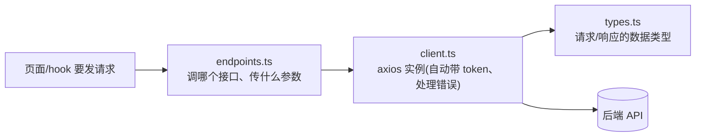

# 02 - API 层与请求拦截

📍 相关文档:[01-技术栈与目录](01-技术栈与目录.md) · [03-认证与路由守卫](03-认证与路由守卫.md)

> 这一篇讲前端怎么和后端通信。读完后你会知道:三个文件怎么分工、token 怎么自动带上、
> 出错怎么统一处理。

---

## 三个文件,各管一摊

`frontend/src/api/` 下三个文件,职责清晰:



| 文件 | 管什么 | 通俗说 |
|------|--------|--------|
| **`client.ts`** | 「怎么发请求」:axios 实例、拦截器、token、错误处理 | 通信管道 |
| **`endpoints.ts`** | 「发哪个请求」:每个接口对应一个函数 | 接口清单 |
| **`types.ts`** | 「数据长什么样」:TS 类型定义 | 数据规格表 |

---

## client.ts:axios 实例 + 两大拦截器

### 创建实例

```ts
export const api = axios.create({
  baseURL: "/api/v1",   // 所有请求自动加这个前缀
  timeout: 30000,        // 30 秒超时
});
```

> 💡 `baseURL: "/api/v1"` + Vite 代理 = 调 `/users` 实际发到 `localhost:8000/api/v1/users`。

### 拦截器一:自动注入 token(请求拦截)

每次发请求前,自动从 localStorage 读 token,加到请求头:

```ts
api.interceptors.request.use((config) => {
  const token = getStoredToken();           // 从 localStorage 读
  if (token) {
    config.headers.Authorization = `Bearer ${token}`;
  }
  return config;
});
```

**好处**:写业务代码时**完全不用管 token**——只要登录过,每个请求自动带上。

> 💡 token 存在 localStorage,key 是 `aap.access_token`(见 `client.ts` 的 `TOKEN_KEY`)。
> `getStoredToken` / `setStoredToken` 是读写它的工具函数。

### 拦截器二:401 自动登出(响应拦截)

后端返回 401(token 过期/失效)时,自动清理并通知:

```ts
export const AUTH_EXPIRED_EVENT = "aap:auth-expired";

api.interceptors.response.use(
  (response) => response,
  (error) => {
    if (error.response?.status === 401) {
      setStoredToken(null);                                  // 清掉 token
      window.dispatchEvent(new CustomEvent(AUTH_EXPIRED_EVENT)); // 发事件
    }
    return Promise.reject(error);
  }
);
```

**为什么发事件?** 因为拦截器自己不该管 UI(职责单一)。它发个「认证过期」事件,
`AuthProvider` 监听这个事件来做登出 + 跳登录页。详见 [03-认证与路由守卫](03-认证与路由守卫.md)。

> ⚠️ **401 和 403 的区别**(代码注释特别强调):
> - **401**(未认证):token 失效 → 当会话过期处理 → 自动登出。
> - **403**(无权限):登录着,但没权限 → **不**登出,只显示错误提示。

### 错误信息翻译

后端错误格式有两种,`apiErrorMessage` 统一翻译成人话:

```ts
export function apiErrorMessage(err) {
  if (err 是 AxiosError 且有响应) {
    if (detail 是字符串) return detail;           // 普通错误:"user not found"
    if (detail 是数组) return detail[0].msg;       // 422 校验错误:取第一条
  }
  return err.message;                              // 兜底
}
```

**用法**(页面里常见):
```ts
catch (err) {
  toast.error("操作失败", apiErrorMessage(err));   // 把后端错误转成可读提示
}
```

---

## endpoints.ts:接口清单

每个后端接口对应一个函数,按资源分组。**只管调接口,不存状态**:

```ts
// 认证
export async function fetchMe() { ... }
export async function login(payload) { ... }

// 用户(完整 CRUD)
export async function fetchUsers(filters) { ... }
export async function createUser(payload) { ... }
export async function updateUser(id, payload) { ... }
export async function deleteUser(id) { ... }

// Agent
export async function fetchAgents() { ... }
// ... 等等
```

### 典型写法

```ts
export async function fetchUsers(filters: UserFilters = {}): Promise<UserListResponse> {
  const { data } = await api.get<UserListResponse>("/users/", {
    params: {                        // 查询参数自动拼到 URL
      search: filters.search || undefined,
      status: ...,
      page: filters.page ?? 1,
    },
  });
  return data;
}
```

**套路**:`api.get/post/...` → 解构 `data` → 返回。每个函数一个接口,类型明确。

### 开发登录的特殊处理

`endpoints.ts` 里有一组 dev 辅助函数(`devBootstrap`、`devToken`、`devLogin`),它们
**不用** `api` 实例,而是用单独的 `devHttp`(baseURL 为空),因为它们打到 `/dev/*`
(不在 `/api/v1` 下)。

```ts
const devHttp = axios.create({ baseURL: "", timeout: 15000 });

export async function devLogin(): Promise<string> {
  const boot = await devBootstrap({ sub: "dev-user", ... });  // 建租户
  const tok = await devToken({ ... });                         // 拿 token
  return tok.access_token;
}
```

> 💡 这就是「一键开发登录」的实现:先 bootstrap 建租户/用户,再 mint token。
> 仅在 `APP_ENV=development` 后端可用。详见 [01-快速开始](../01-快速开始/02-启动项目.md)。

---

## types.ts:和后端对齐的类型

`types.ts` 定义所有 TS 接口,和后端 Pydantic schema 一一对应:

```ts
export interface UserFull {
  id: string;
  username: string | null;
  email: string | null;
  status: "active" | "inactive" | "locked";
  role: RoleBrief | null;
  // ...
}

export interface UserListResponse {
  items: UserFull[];
  total: number;
  page: number;
  limit: number;
}
```

> ⚠️ **手动维护**:目前是手写的,不是自动生成的。`types.ts` 顶部注释提到「未来考虑用
> openapi-typescript 自动生成」。所以**后端 schema 改了,这里要同步改**,否则类型对不上。

---

## 二开时怎么加接口?

新增一个后端接口(比如「商品」),前端三步:

**1. `types.ts` 加类型**:
```ts
export interface Product { id: string; name: string; price: number; }
```

**2. `endpoints.ts` 加函数**:
```ts
export async function fetchProducts(): Promise<Product[]> {
  const { data } = await api.get<Product[]>("/products/");
  return data;
}
```

**3. `hooks/queries.ts` 加 hook**(见 [04-数据获取](04-数据获取TanStackQuery.md))。

> 💡 加完后,页面里用 hook 就能拿到数据,token 自动带、错误自动处理,不用操心。

---

## 记住三句话

1. **三个文件分工**:`client.ts` 管管道,`endpoints.ts` 管接口清单,`types.ts` 管类型。
2. **token 自动注入**:请求拦截器从 localStorage 读,业务代码无感。
3. **401 自动登出**:响应拦截器发事件,AuthProvider 监听后清状态。

---

**关键文件清单**:
- axios 实例:`frontend/src/api/client.ts`(`api`、`getStoredToken`、`apiErrorMessage`、`AUTH_EXPIRED_EVENT`)
- 接口函数:`frontend/src/api/endpoints.ts`
- 类型定义:`frontend/src/api/types.ts`

**相关文档**:
- [03-认证与路由守卫](03-认证与路由守卫.md) — 401 事件怎么被消费
- [04-数据获取TanStackQuery](04-数据获取TanStackQuery.md) — endpoints 怎么被 hook 包装
