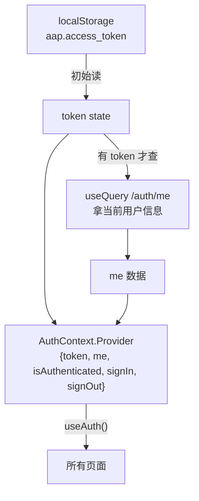
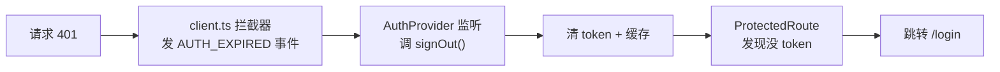
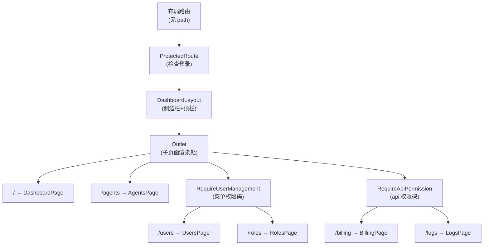
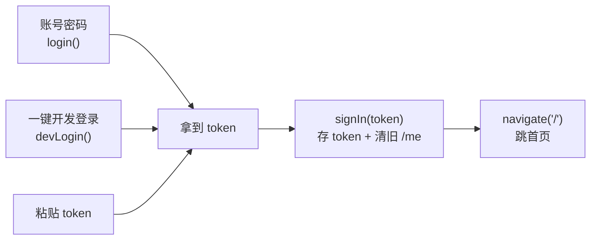

# 03 - 认证与路由守卫

📍 相关文档:[02-API层与请求拦截](02-API层与请求拦截.md) · [05-认证体系(后端)](../02-后端架构/05-认证体系.md)

> 这一篇讲前端的登录状态怎么管理、未登录怎么挡住。读完后你会知道:token 存哪、
> AuthProvider 怎么工作、401 怎么形成「拦截器→事件→登出→跳转」的闭环。

---

## 认证状态:AuthProvider

登录状态用 **React Context** 全局管理,核心在 `components/auth/auth-context.tsx`。



### 暴露的状态

```ts
interface AuthState {
  token: string | null;            // 当前 token(localStorage 同步)
  me: MeResponse | undefined;      // 当前用户信息(从 /auth/me 拿)
  isLoading: boolean;              // 正在加载?(有 token 且 /me 在跑)
  isAuthenticated: boolean;        // 是否已认证?(有 token 且 /me 成功)
  meError: boolean;                // /me 失败了?(有 token 且 /me 出错)
  signIn: (token) => void;         // 登录(存 token)
  signOut: () => void;             // 登出(清 token)
}
```

> 💡 **`meError` 的用途**:光有 token 但 `/me` 失败时,`isLoading=false` 且 `me=undefined`。
> 路由守卫要靠 `meError` 区分「还在加载」和「加载失败」——后者必须重定向到登录页,否则会
> 卡在永久白屏(见下方守卫章节)。`meError` 在有 token 但 `/me` 出错(非 401,如 500)时为 `true`;
> 401 走的是另一条路(拦截器事件 → signOut,见下)。

### context value 已 memo 化

```ts
const value = React.useMemo<AuthState>(() => ({
  token, me: meQuery.data,
  isLoading: !!token && meQuery.isLoading,
  isAuthenticated: !!token && meQuery.isSuccess,
  meError: !!token && meQuery.isError,
  signIn, signOut,
}), [token, meQuery.data, meQuery.isLoading, meQuery.isSuccess, meQuery.isError, signIn, signOut]);
```

`AuthProvider` 每次 render 都会重新创建对象字面量,所有 `useAuth()` 消费者(几乎每个页面 + 布局)
都会重渲染。用 `useMemo` 包住后,只有依赖里的值真正变化时才产生新对象——`/me` 在
loading↔success 之间切换时不再触发全量重渲染。

### 几个关键设计

**1. 初始 token 来自 localStorage**:
```ts
const [token, setToken] = React.useState<string | null>(getStoredToken());
```
刷新页面后,token 还在(从 localStorage 读回),不用重新登录。

**2. 只在有 token 时查 /me**:
```ts
const meQuery = useQuery({
  queryKey: ["auth", "me", token],
  queryFn: fetchMe,
  enabled: !!token,        // ← 没 token 不发请求
  retry: false,            // 失败不重试(避免循环)
});
```

**3. 认证成立的条件**:
```ts
isAuthenticated: !!token && meQuery.isSuccess
```
**既要 token 存在,又要 /me 成功**。光有 token 但 /me 失败(token 失效)不算认证。

### signIn / signOut

```ts
const signIn = (newToken) => {
  setStoredToken(newToken);              // 存 localStorage
  setToken(newToken);                     // 更新 state
  qc.removeQueries({ queryKey: ["auth", "me"] });  // 清旧 /me,触发重查
};

const signOut = () => {
  setStoredToken(null);                   // 清 localStorage
  setToken(null);                         // 清 state
  qc.clear();                             // 清所有缓存(避免脏数据)
};
```

> 💡 **`signOut` 清所有缓存**很关键:登出后,之前用户的数据不能残留在缓存里,否则
> 切账号会看到上个用户的数据。

### 监听 401 事件(闭环的关键)

```ts
React.useEffect(() => {
  const handler = () => signOut();
  window.addEventListener(AUTH_EXPIRED_EVENT, handler);
  return () => window.removeEventListener(AUTH_EXPIRED_EVENT, handler);
}, [signOut]);
```

`AUTH_EXPIRED_EVENT` 就是 `client.ts` 在 401 时发的那个事件。这里监听它 → 调 `signOut`。
**这样就形成了闭环**:



> 没有 B→C 这一步,401 只是每个查询各自失败、弹一堆错误 toast,但 UI 还显示着旧数据。
> 有了这个闭环,token 失效能**干净地跳回登录页**。

---

## 路由守卫:ProtectedRoute

`components/auth/protected-route.tsx` 把需要登录的页面包起来:

```tsx
export function ProtectedRoute({ children }) {
  const { token, isLoading } = useAuth();
  const location = useLocation();

  if (!token) {
    return <Navigate to="/login" state={{ from: location }} replace />;
  }

  if (isLoading) {
    return <Skeleton />;   // 加载中显示骨架屏
  }

  return <>{children}</>;  // 有 token 就放行
}
```

**逻辑**:
1. **没 token** → 直接跳 `/login`(记住从哪来的,登录后能跳回)。
2. **加载中** → 显示骨架屏(避免闪一下登录页又跳走)。
3. **有 token** → 放行,渲染子页面。

> 💡 注意 `ProtectedRoute` **只检查 token 是否存在**,不强制 `isAuthenticated`、不读
> `meError`。如果 token 失效,/me 会失败——这时分两种情况:401 由拦截器事件触发 `signOut`
> (清 token → 下次渲染这里 `!token` 就跳登录);非 401 错误由**内层授权守卫**的 `meError`
> 兜底重定向(见下)。对 `/me` 失败的统一处理故意没放在 `ProtectedRoute`,而是下沉到内层
> 守卫,这样公开路由(登录页)不受影响。

---

## 权限路由守卫:两层授权守卫

`ProtectedRoute` 只挡「未登录」,**不挡「已登录但无权限」**。管理类页面还需要一道**授权**
守卫,否则普通成员直接输 URL 就能进页面——进去后列表请求被后端 403 挡掉,页面会显示
误导性的「暂无数据」空状态。

项目有**两个**授权守卫(都在 `components/auth/require-permission.tsx`),分别按不同粒度
的权限码判定:

### RequireUserManagement(菜单权限码)

管 `/users`、`/roles`、`/permissions`、`/members`、`/settings` 五个页面,按**菜单权限码**
(`menu:xxx`)判定。是一个**布局路由**(渲染 `<Outlet />`):

```tsx
const PATH_MENU: Record<string, string> = {
  "/users": "menu:users",
  "/roles": "menu:roles",
  "/permissions": "menu:permissions",
  "/members": "menu:members",
  "/settings": "menu:settings",
};

export function RequireUserManagement() {
  const { me, isLoading, meError } = useAuth();
  const location = useLocation();

  if (isLoading) return null;             // /me 还没回来,先不渲染(避免误闪)
  if (meError || !me)                     // /me 出错(非 401,如 500)→ 跳登录
    return <Navigate to="/login" state={{ from: location }} replace />;

  const menuCode = PATH_MENU[location.pathname];
  if (!menuCode || !canViewMenu(me, menuCode)) {
    return <Navigate to="/" state={{ from: location }} replace />;  // 无权限 → 首页
  }
  return <Outlet />;                      // 有权限 → 放行子路由
}
```

**`meError` 重定向的意义**:`/me` 失败分两种——401 由拦截器事件触发 `signOut`(清 token →
守卫重定向,见上);**非 401**(如后端 500)不会触发拦截器,token 还在,但 `me` 永远
`undefined`。没有 `meError` 时守卫会 `return null` → 永久白屏。加了 `meError` 后,这种
情况也干净地跳回登录页。

判定逻辑抽在 `lib/permission.ts` 的 `canViewMenu(me, menuCode)`:

```ts
// super_admin 绕过;否则检查 me.permissions 是否包含该菜单码
export function canViewMenu(me, menuCode: string) {
  if (!me) return false;
  if (me.platform_role === "super_admin") return true;
  return me.permissions.includes(menuCode);
}
```

> 💡 **按菜单码而非角色判定**:`/auth/me` 返回的 `permissions` 是当前生效的权限码聚合列表
> (既有 `api` 单元如 `customers:read`,也有 `menu` UX 码如 `menu:agents`)。守卫按菜单码
> 判定,让「有 `menu:roles` 但没 `menu:users` 的角色能进 `/roles` 但进不了 `/users`」这种
> 细粒度授权成为可能——这是角色配置驱动的,不是写死的。

### RequireApiPermission(API 权限码)

管 `/billing`、`/logs` 这类「有 api 权限码但无菜单码」的页面,按 **api 权限码**(`obj:act`)
判定:

```tsx
const PATH_API_PERM: Record<string, { obj: string; act: string }> = {
  "/billing": { obj: "wallet", act: "read" },
  "/logs": { obj: "logs", act: "read" },
};

export function RequireApiPermission() {
  const { me, isLoading, meError } = useAuth();
  const location = useLocation();
  if (isLoading) return null;
  if (meError || !me) return <Navigate to="/login" ... />;
  const perm = PATH_API_PERM[location.pathname];
  if (!perm || !hasPermission(me, perm.obj, perm.act)) {
    return <Navigate to="/" ... />;
  }
  return <Outlet />;
}
```

`hasPermission(me, obj, act)` 同样在 `lib/permission.ts`,逻辑和 `canViewMenu` 一样(super_admin
绕过,否则检查 `permissions` 是否包含 `${obj}:${act}`)。

> ⚠️ **这两个守卫都是 UX 层,不是安全边界**。只决定「菜单看不看得到、路由让不让进」,真正
> 的越权拦截仍由后端 `require_permission` 返回 403 兜底。前端这层只是避免普通用户看到一堆
> 无意义的空页面和报错 toast。

### 菜单也要同步过滤

光拦路由不够——侧边栏菜单也得隐藏。在 `dashboard-layout.tsx`,菜单项标了 `menuCode`,
渲染前用 `canViewMenu(me, item.menuCode)` 过滤:

```tsx
const NAV_ITEMS = [
  { to: "/", label: "概览", icon: LayoutDashboard },
  { to: "/agents", label: "智能体", icon: Bot, menuCode: "menu:agents" },
  { to: "/users", label: "用户", icon: Users, menuCode: "menu:users" },
  { to: "/roles", label: "角色", icon: Shield, menuCode: "menu:roles" },
  // ...
];

// 渲染前过滤:无菜单权限的项直接不渲染(super_admin 全显示)
{NAV_ITEMS.filter((item) => !item.menuCode || canViewMenu(me, item.menuCode))
  .map((item) => <NavLink ... />)}
```

---

## 路由怎么组织的(App.tsx)

```tsx
<Routes>
  {/* 公开路由 */}
  <Route path="/login" element={<LoginPage />} />

  {/* 受保护路由(布局路由) */}
  <Route element={
    <ProtectedRoute>
      <DashboardLayout />
    </ProtectedRoute>
  }>
    <Route path="/" element={<DashboardPage />} />
    <Route path="/agents" element={<AgentsPage />} />

    {/* 菜单权限码守卫:users/roles/permissions/members/settings */}
    <Route element={<RequireUserManagement />}>
      <Route path="/users" element={<UsersPage />} />
      <Route path="/roles" element={<RolesPage />} />
      <Route path="/permissions" element={<PermissionsPage />} />
    </Route>

    {/* api 权限码守卫:billing/logs */}
    <Route element={<RequireApiPermission />}>
      <Route path="/billing" element={<BillingPage />} />
      <Route path="/logs" element={<LogsPage />} />
    </Route>
  </Route>

  {/* 兜底 */}
  <Route path="*" element={<NotFoundPage />} />
</Routes>
```

**巧妙之处**:用**没有 path 的布局路由**层层嵌套:
- 外层把 `ProtectedRoute + DashboardLayout` 作为 element → 子路由自动要登录 + 套布局。
- 内层再用 `RequireUserManagement` / `RequireApiPermission` 布局路由 → 包住的子路由自动要对应授权。

子路由通过 `<Outlet />` 渲染(守卫和布局各有一个 `<Outlet />`,逐层透传)。

**效果**:
- 所有子路由自动被 `ProtectedRoute` 保护(要登录)。
- `/users`、`/roles` 等 5 页额外被 `RequireUserManagement` 保护(要菜单权限码)。
- `/billing`、`/logs` 额外被 `RequireApiPermission` 保护(要 api 权限码)。
- 自动套上 `DashboardLayout`(侧边栏 + 顶栏)。
- 不用在每个路由上重复写守卫。

> 💡 **页面用 `React.lazy` 按路由懒加载**:`App.tsx` 里大部分页面是 `const XPage = lazy(() =>
> import("@/pages/x-page").then(m => ({ default: m.XPage })))`,外面包一层 `<Suspense>`。
> 守卫渲染 `<Outlet />`,React Router 在 lazy resolve 后才渲染子页面,守卫逻辑完全兼容。



---

## 登录页的三种登录

`pages/login-page.tsx` 支持三种登录,都是拿到 token 后调 `signIn(token)`:



| 方式 | 流程 |
|------|------|
| **账号密码** | 调 `login({username/password})` → 后端返回 token |
| **开发登录** | 调 `devLogin()`(bootstrap + mint token)→ 返回 token |
| **粘贴 token** | 直接拿用户输入的 token |

> 💡 **登录页留了 Logto OIDC 的接入点**(`login-page.tsx` 底部 TODO 注释)。需要接 Logto 时,
> 在那里替换成 `<LogtoProvider>` 即可。目前是手动流程。

---

## 登出怎么做的

在 `DashboardLayout` 的登出按钮:

```ts
const handleSignOut = async () => {
  try {
    await logout();          // 调后端注销会话(best-effort)
  } catch {
    // token 已过期会 401,忽略
  }
  signOut();                 // 清前端状态
  navigate("/login");        // 跳登录页
};
```

**要点**:
- 后端 `logout()` 是 **best-effort**(尽力而为)——网络失败也不卡住用户,照样清前端状态。
- 这样即使断网也能登出(只是后端会话可能没注销,等它自然过期)。

---

## 记住三句话

1. **AuthProvider 管登录状态**:token 存 localStorage,有 token 才查 /me;value 已 memo 化避免全量重渲染。
2. **401 闭环 + meError 兜底**:401 走拦截器事件 → signOut → 守卫跳登录;非 401 的 /me 失败靠 `meError` 字段让守卫重定向(否则永久白屏)。
3. **三层守卫**:`ProtectedRoute` 挡未登录(要 token),`RequireUserManagement` 挡无菜单权限(要 `menu:xxx`),`RequireApiPermission` 挡无 api 权限(要 `obj:act`);菜单同步按 `canViewMenu` 过滤。后端 403 才是硬边界。

---

**关键文件清单**:
- 认证上下文:`frontend/src/components/auth/auth-context.tsx`(`AuthProvider`、`useAuth`、`meError`)
- 登录守卫:`frontend/src/components/auth/protected-route.tsx`(`ProtectedRoute`)
- 权限守卫:`frontend/src/components/auth/require-permission.tsx`(`RequireUserManagement`、`RequireApiPermission`)
- super_admin 守卫:`frontend/src/components/auth/require-super-admin.tsx`(`RequireSuperAdmin`)
- 权限工具:`frontend/src/lib/permission.ts`(`hasPermission`、`canViewMenu`、`isSuperAdmin`)
- 路由配置:`frontend/src/App.tsx`(布局路由嵌套 + `React.lazy` 懒加载)
- 登录页:`frontend/src/pages/login-page.tsx`
- 后台布局:`frontend/src/components/layout/dashboard-layout.tsx`(菜单过滤)

**相关文档**:
- [02-API层与请求拦截](02-API层与请求拦截.md) — 401 事件的源头
- [05-认证体系(后端)](../02-后端架构/05-认证体系.md) — token 后端怎么签发和验证
