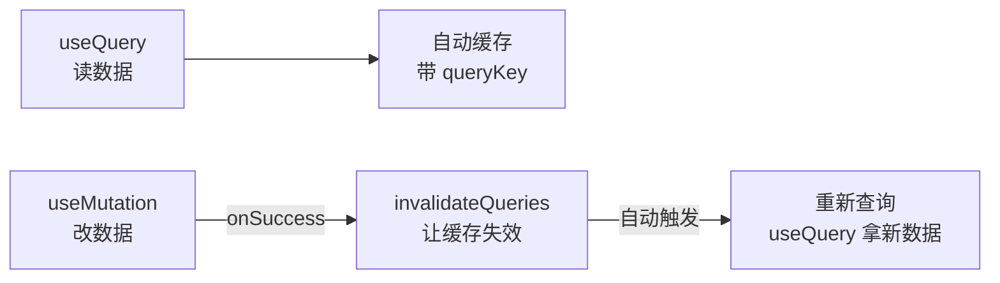

# 04 - 数据获取 TanStack Query

📍 相关文档:[02-API层与请求拦截](02-API层与请求拦截.md) · [05-UI组件与页面模式](05-UI组件与页面模式.md)

> 这一篇讲前端怎么管理「请求数据、缓存、刷新」。读完后你会知道:为什么用 TanStack Query、
> query key 工厂是什么、改完数据怎么自动刷新。

---

## 不用 TanStack Query 会怎样?

如果用原始方式(`useEffect + fetch`),会有这些痛点:
- 每个数据都要写一堆 loading/error 状态样板代码。
- 没有缓存:切页面再回来,重新请求。
- 改了数据(比如新建用户),要**手动**重新拉列表。
- 多个组件用同一数据,重复请求。

---

## TanStack Query 解决什么?

**TanStack Query**(原名 React Query)帮你管理「服务端数据的获取、缓存、同步」。你只管
声明「我要什么数据」,剩下的它来:

| 它管的事 | 说明 |
|---------|------|
| **缓存** | 同样的请求,短时间内用缓存(不重复发) |
| **loading/error 状态** | 自动给你 `isLoading`、`error` |
| **失效刷新** | 数据变了,告诉它「这个缓存过期了」,它自动重查 |
| **后台刷新** | 可配置窗口聚焦时自动刷新 |
| **请求去重** | 多个组件同时要同一数据,只发一个请求 |

```tsx
// ✅ 用 TanStack Query
const { data: users, isLoading, error } = useUsers(filters);
// 自动管 loading/error/缓存,代码干净多了
```

---

## 两种 hook:读和写

项目里每个资源都暴露两种 hook:

| 类型 | 用什么 | 例子 |
|------|--------|------|
| **读数据**(查询) | `useQuery` | `useUsers()`、`useAgents()` |
| **改数据**(增删改) | `useMutation` | `useCreateUser()`、`useDeleteUser()` |



**关键**:改完数据后,让相关查询的缓存**失效**,TanStack Query 自动重新请求,UI 自动更新。
这就是「改完不用手动刷新列表」的秘密。

---

## query key 工厂(qk)—— 核心约定

`hooks/queries.ts` 开头有个 **query key 工厂**,集中管理所有查询的 key:

```ts
export const qk = {
  tenants: ["tenants"] as const,
  allTenants: ["tenants", "all"] as const,          // GET /tenants/all(平台级)
  agents: ["agents"] as const,
  users: (filters) => ["users", filters] as const,   // 带参数
  userStats: ["users", "statistics"] as const,
  roles: ["roles"] as const,
  roleLabels: ["roles", "labels"] as const,
  permissionMatrix: ["permissions", "matrix"] as const,
  // ... 每个资源一个 key(只列代表性的)
};
```

**为什么集中管理?** query key 是缓存的「身份证」。失效时要靠 key 精确匹配。集中管理能:
- 保证 key 一致(不会有人写 `["users"]`、有人写 `["user"]`)。
- 失效时方便:`invalidateQueries({ queryKey: qk.users(filters) })`。

### key 的层级设计

key 是数组,有层级:
- `["users"]` — 所有用户查询
- `["users", filters]` — 特定筛选的用户列表
- `["users", "statistics"]` — 用户统计

**好处**:失效 `["users"]` 会失效所有以它开头的查询(列表 + 统计一起刷新)。

### /me 的 key 特殊处理(注意!)

```ts
// 注意:这里故意不放 qk!
// queryKey: ["auth", "me", token]  ← 在 auth-context.tsx 里,带 token
```

**为什么 /me 不放进 `qk`?** 因为它的 key 带 `token`,由 `auth-context.tsx` 独占管理。
放进 `qk` 容易造成「两个地方用不同 key 查同一数据」(split-brain)。注释里特意说明了。

---

## 读数据:useQuery 模式

```ts
export function useUsers(filters: UserFilters) {
  return useQuery({
    queryKey: qk.users(filters),           // key(含筛选条件)
    queryFn: () => fetchUsers(filters),    // 怎么拿数据
  });
}

export function useUserStatistics() {
  return useQuery({
    queryKey: qk.userStats,
    queryFn: fetchUserStatistics,
  });
}
```

**用法**(页面里):
```tsx
const { data, isLoading, error } = useUsers(filters);
if (isLoading) return <Skeleton />;
if (error) return <ErrorMessage />;
return <Table data={data.items} />;
```

> 💡 **筛选条件变了,自动重查**:`useUsers({search:"张"})` 和 `useUsers({search:"李"})`
> 是不同的 key,切换筛选会自动请求新数据。不用手动 `useEffect`。

---

## 改数据:useApiMutation helper + 失效

项目里大多数写操作(mutation)是同一份 5 行骨架:`const qc = useQueryClient();
return useMutation({ mutationFn, onSuccess: () => qc.invalidateQueries(...) })`。
`queries.ts` 把它抽成了 `useApiMutation` helper,一行搞定:

```ts
function useApiMutation<TVars, TData>(
  mutationFn: (vars: TVars) => Promise<TData>,
  invalidate: QueryKey[],                           // 成功后失效这些 key
  onSuccess?: (data: TData, vars: TVars) => void,   // 可选额外回调
) {
  const qc = useQueryClient();
  return useMutation({
    mutationFn,
    onSuccess: (data, vars) => {
      for (const key of invalidate) qc.invalidateQueries({ queryKey: key });
      onSuccess?.(data, vars);
    },
  });
}
```

### 简单场景:一个 invalidate 数组

```ts
export function useCreateUser() {
  return useApiMutation(
    (payload: UserCreate) => createUser(payload),
    [qk.users, qk.userStats],     // 成功后失效用户列表 + 统计
  );
}
```

`TVars`/`TData` 从 `mutationFn` 的签名自动推断,调用方不用手写泛型。

### 需要读 vars 的场景:onSuccess 回调

有些 mutation 要 invalidate 一个**依赖入参**的 key(比如更新某个 group 后失效该 group
的权限):

```ts
export function useGrantRolePermission() {
  const qc = useQueryClient();
  return useApiMutation(
    ({ roleId, payload }) => grantRolePermission(roleId, payload),
    [qk.permissionMatrix],                          // 固定 key
    (_data, { roleId }) =>                           // 额外回调:失效该角色的权限
      qc.invalidateQueries({ queryKey: qk.rolePermissions(roleId) }),
  );
}
```

### 哪些 mutation 不套 helper(保留手写)

不是所有 mutation 都适合套 helper。两种保留手写 `useMutation`:
- **改密码**(`useChangePassword`):不涉及任何缓存失效,传空数组没意义。
- **导出 CSV**(`useExportCsv`):是只读副作用(下载文件),无缓存可 invalidate,且 mutationFn
  里要做 lazy import + 触发下载,逻辑特殊。

> 💡 **判断标准**:只要「发请求 + 成功后失效若干缓存」这个模式成立,就用 `useApiMutation`;
> 有额外副作用、乐观更新、条件失效等复杂逻辑,保留手写。

**完整流程**(以新建用户为例):
1. 页面调 `useCreateUser().mutateAsync(payload)` → 发请求创建用户。
2. 成功 → helper 的 onSuccess 触发 → 失效 `qk.users` + `qk.userStats`。
3. TanStack Query 发现缓存失效 → 自动重新请求用户列表 + 统计。
4. 新数据回来 → 表格自动显示新用户。

**这就是「新建用户后表格自动刷新」的完整机制**。

### invalidateQueries 是前缀匹配

`invalidateQueries({ queryKey: qk.users })` 失效的是 `["users"]` 前缀——能匹配
`["users", filters]`(列表)和 `["users", "statistics"]`(统计),一次性全刷新。不用一个个
失效。`useApiMutation` 的 `invalidate` 数组里传前缀 key 就能批量刷新整个资源族。

---

## 刻意没有 useLogin/useLogout(设计取舍)

注意 `queries.ts` 里**没有** `useLogin` / `useLogout`。注释解释了原因:

```ts
// NOTE: there is no useLogin/useLogout hook by design.
// login-page.tsx 直接调 login() 然后 signIn(token)
// dashboard-layout.tsx 直接调 logout() 然后清状态
// 包成 mutation 只是重复接线,没必要
```

**为什么不统一包成 hook?** 因为登录/登出涉及 `auth-context` 的 `signIn/signOut`(要清缓存、
更新状态),逻辑和普通增删改不一样。直接在页面调 endpoint 再交给 context 更清晰,避免
「为统一而统一」的过度封装。

> 💡 这是一个值得学习的判断:**不是所有东西都要套同一套模式**。当某类操作和主流模式差异大,
> 单独处理反而更好。

---

## 二开时怎么加数据 hook?

新增「商品」模块,套路:

**1. 在 `qk` 加 key**:
```ts
products: ["products"] as const,
product: (id) => ["products", id] as const,
```

**2. 加读 hook**:
```ts
export function useProducts() {
  return useQuery({ queryKey: qk.products, queryFn: fetchProducts });
}
```

**3. 加写 hook(用 `useApiMutation`)**:
```ts
export function useCreateProduct() {
  return useApiMutation(
    (payload: ProductCreate) => createProduct(payload),
    [qk.products],     // 成功后失效产品缓存
  );
}

// 需要失效入参相关 key时,加 onSuccess 回调:
export function useUpdateProduct() {
  return useApiMutation(
    ({ id, payload }) => updateProduct(id, payload),
    [qk.products],
  );
}
```

完成后,页面里用 `useProducts()` 读、`useCreateProduct().mutateAsync()` 写,缓存/刷新全自动。

---

## 记住三句话

1. **读用 useQuery,改用 useApiMutation**:改完在 `invalidate` 数组里列要失效的 key,缓存自动刷新。
2. **query key 集中管理**(qk 工厂):保证 key 一致,失效方便。
3. **invalidateQueries 前缀匹配**:失效 `["users"]` 能刷新所有用户相关查询(列表 + 统计)。

---

**关键文件清单**:
- 所有数据 hook:`frontend/src/hooks/queries.ts`(`qk` 工厂、`useApiMutation` helper、`useUsers`、`useCreateUser`...)
- 全局配置:`frontend/src/App.tsx` 的 `QueryClient`(`staleTime: 30_000`、`refetchOnWindowFocus: false`)
- /me 的特殊 key:`frontend/src/components/auth/auth-context.tsx`

**相关文档**:
- [02-API层与请求拦截](02-API层与请求拦截.md) — hook 里调的 endpoints
- [05-UI组件与页面模式](05-UI组件与页面模式.md) — 页面怎么用这些 hook
