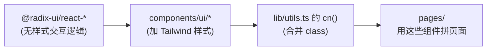
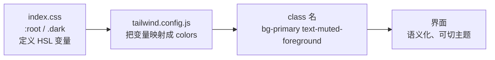
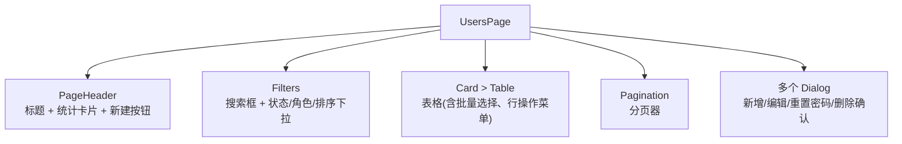
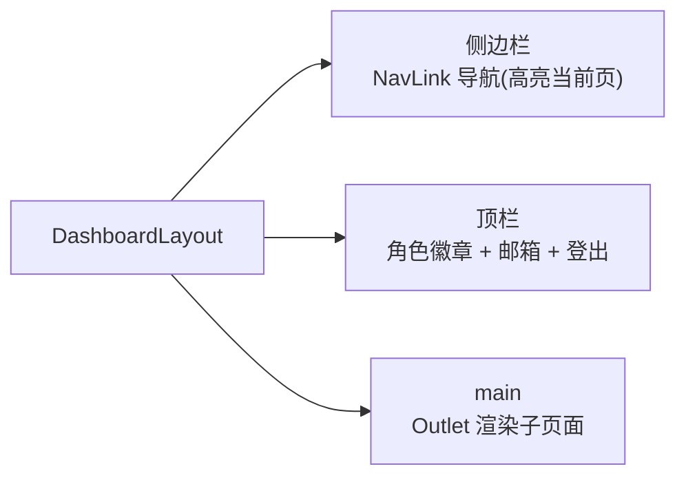

# 05 - UI 组件与页面模式

📍 相关文档:[04-数据获取TanStackQuery](04-数据获取TanStackQuery.md) · [01-技术栈与目录](01-技术栈与目录.md)

> 这一篇讲界面的「积木」和「拼法」。读完后你会知道:shadcn 组件怎么用、主题怎么配、
> 一个标准列表页长什么样、表单怎么写。

---

## shadcn 风格组件(不是 npm 装,是源码内置)

`components/ui/` 下是一套 **shadcn/ui 风格**的组件。重点:**不是**通过 npm 装的,而是把
源码**复制**进了项目,可以随意改。



### 证据(为什么说是 shadcn 风格)

- `lib/utils.ts` 的 `cn()` 就是 shadcn 标准助手:`twMerge(clsx(...))`,合并 class。
- `button.tsx` 用 `class-variance-authority`(cva)定义 variant/size,和 shadcn 生成代码一致。
- 依赖里是全套 `@radix-ui/react-*`(无样式交互)+ cva + tailwind-merge,正是 shadcn 配方。

### 现有组件

button、card、dialog、input、label、select、table、badge、avatar、checkbox、dropdown-menu、
pagination、skeleton、separator、switch、toast、tabs 等(18 个 shadcn 风格)。

### 两个自研组件(非 shadcn 原版)

- **`toast.tsx`** — 轻量自实现 Context(不依赖 Radix),`success/error`,4 秒消失。
- **`pagination.tsx`** — 紧凑分页器(« ‹ x/y › »)。

### 共享业务组件(抽自跨功能审查,消除重复)

除了 shadcn 基础件,`components/ui/` 下还有几个**业务级**共享组件,是跨功能审查时从
十几个页面里抽出来的重复模式。新页面直接复用,不要再手写:

| 组件 | 干什么 | 替代了什么 |
|------|--------|-----------|
| **`form-field.tsx`** | `FormField`(label + input + 可选 hint/error),用 `useId` 自动关联 `<label htmlFor>`,支持 children 或 `(id)=>ReactNode` render-prop | 7 处本地 `<div className="space-y-1.5"><Label/>...<Input/></div>` |
| **`list-state.tsx`** | `ListState` 统一列表 loading/empty/error 三态,带重试按钮。判断顺序 error → loading → empty → children | 15+ 处 `isLoading ? <加载中> : list.length===0 ? <空> : <表格>` 三元 JSX |
| **`stat-card.tsx`** | `StatCard`(标题 + 数值 + 可选图标),仪表盘/计费页的统计卡片 | 各页重复的 `CounterCard`/`SummaryCard`/`Metric` |
| **`export-csv-button.tsx`** | `ExportCsvButton`(entity + 可选 params),自持 `useExportCsv` mutation + 文件名生成 + toast | 3 处逐字重复的导出按钮 + handler |

```tsx
// FormField:label 自动关联 input
<FormField label="用户名" error={errors.username?.message}>
  <input id={...} {...register("username")} />
</FormField>

// ListState:三态一气呵成
<ListState
  isLoading={isLoading}
  isEmpty={list.length === 0}
  isError={isError} error={error} onRetry={refetch}
  emptyContent={<div><Contact/> 暂无客户</div>}
>
  <Table>{...}</Table>
</ListState>
```

---

## cn() 工具函数:合并 class 的关键

```ts
// lib/utils.ts
export function cn(...inputs: ClassValue[]) {
  return twMerge(clsx(inputs));
}
```

**作用**:安全地合并 Tailwind class,有冲突时后者胜。

```tsx
// 用法:组件内部有默认 class,外部可覆盖
<Button className="w-full" />   // 外部传 w-full,和内部 class 合并

// cn() 内部:
<Button className={cn("默认样式", "w-full", isActive && "bg-primary")} />
```

**为什么用 `twMerge`?** 因为 Tailwind class 可能有冲突(比如 `px-4` 和 `px-2`),`twMerge`
会让后写的覆盖先写的,而不是两个都生效导致样式错乱。

## 格式化 helper:lib/format.ts

日期/数字格式化集中在 `lib/format.ts`,**别在页面里写 `const fmt = ...`**。Locale 统一
zh-CN,空值返回 `"-"`:

```ts
import { formatDateTime as fmt, formatTokens, formatCurrency } from "@/lib/format";

fmt(item.created_at)        // "2026/7/15 11:30:00",null/undefined → "-"
formatTokens(12345)         // "12,345"(en-US 千分位)
formatCurrency(0.0001)      // "¥0.0001"(4 位小数,Token 计费用)
```

| 函数 | 作用 |
|------|------|
| `formatDateTime(s?)` | 完整日期时间,null → `"-"` |
| `formatDate(s?)` | 仅日期 |
| `formatRelative(iso?)` | 相对时间("3 分钟前"),通知铃铛用 |
| `formatTokens(n)` | Token 数千分位 |
| `formatCurrency(n)` | 人民币 4 位小数 |

---

## 主题:CSS 变量 + Tailwind 映射

项目用「CSS 变量 + Tailwind 语义色」的方式做主题,支持 dark mode。



### 怎么定义的

**1. `index.css` 定义 CSS 变量**(HSL 值,分亮/暗):
```css
:root {
  --primary: 222.2 47.4% 11.2%;
  --background: 0 0% 100%;
  /* ... 一堆语义色 */
}
.dark {
  --primary: 210 40% 98%;
  --background: 222.2 84% 4.9%;
  /* ... 暗色值 */
}
```

**2. `tailwind.config.js` 把变量映射成语义色**:
```js
colors: {
  primary: { DEFAULT: "hsl(var(--primary))", ... },
  background: "hsl(var(--background))",
  // ...
}
```

**3. 代码里用语义 class**:`bg-primary`、`text-muted-foreground`、`border-border`。

**好处**:换主题只改变量值,代码不用动。`darkMode: ["class"]` 表示通过加 `.dark` 类切换。

> 💡 这套机制让你写样式时**用语义名**(`primary`、`muted`)而不是具体颜色,自动适配
> 主题。详见 shadcn/ui 的主题文档。

---

## Button 组件:学习 shadcn 的范例

`button.tsx` 是典型的 shadcn 组件,值得学习它的结构:

```tsx
const buttonVariants = cva(
  "基础 class...",                        // 所有按钮共享的样式
  {
    variants: {
      variant: {                          // 变体:不同视觉风格
        default: "bg-primary ...",
        destructive: "bg-destructive ...",
        outline: "border ...",
        ghost: "hover:bg-accent ...",
      },
      size: {                             // 尺寸
        default: "h-10 px-4 py-2",
        sm: "h-9 ...",
        icon: "h-10 w-10",
      },
    },
  }
);
```

**用法**:
```tsx
<Button variant="destructive" size="sm">删除</Button>
<Button variant="ghost" size="icon">...</Button>
<Button asChild><Link to="/">跳转</Link></Button>   // asChild:样式套到子元素
```

> 💡 **`asChild`**(用 `@radix-ui/react-slot`)是巧妙设计:让 Button 的样式套到**子元素**(比如 `<Link>`),而非渲染嵌套 button,避免 `<button><a>` 非法 HTML。

---

## 标准列表页的结构(以 users-page 为范例)

`pages/users-page.tsx` 是最完整的范例,列表页统一这样组织:



### 各部分套路

| 部分 | 怎么实现 | 关键点 |
|------|---------|--------|
| **统计卡片** | `useUserStatistics()` + `<StatCard>` | 顶部显示总数/活跃/锁定等 |
| **搜索框** | 独立 `searchInput` state,回车触发 | 无防抖(按需加) |
| **筛选下拉** | `<Select>`,改动 `setFilters({...,page:1})` | 改筛选回到第 1 页 |
| **表格三态** | `<ListState>` 包住 `<Table>` | loading/empty/error 统一处理,带重试按钮 |
| **表格** | `<Table>`,表头全选 checkbox,行 dropdown 操作 | 状态/角色用 `<Badge>` 着色 |
| **分页** | 自封装 `<Pagination>` | 和后端分页对齐 |
| **CRUD 弹窗** | 多个 `<Dialog>`,新增/编辑共用一个表单,字段用 `<FormField>` | `editing` state 区分新增/编辑 |
| **导出** | `<ExportCsvButton entity="users">` | 自持 mutation + 文件名 + toast |
| **反馈** | `useToast().success/error` | catch 里用 `apiErrorMessage` |

### 表单:react-hook-form + zod

新增/编辑表单用 `react-hook-form`(管理表单状态)+ `zod`(校验)+ `zodResolver`(桥接):

```tsx
const schema = z.object({
  username: z.string().min(2, "至少 2 个字符"),
  email: z.string().email("邮箱格式不对"),
  password: z.string().min(8, "至少 8 位"),
});

const form = useForm({ resolver: zodResolver(schema) });
```

**好处**:
- `react-hook-form` 管输入状态,不用一个个 `useState`。
- `zod` 定义校验规则,类型自动推导,校验信息友好。
- 提交时 `form.handleSubmit(onSubmit)`,数据自动校验通过才提交。

---

## 后台布局:DashboardLayout

`components/layout/dashboard-layout.tsx` 是后台的整体框架:



- **侧边栏导航**:`NAV_ITEMS` 数组定义,`NavLink` 的 `isActive` 自动高亮当前页。
- **响应式**:桌面侧边栏固定,手机变抽屉(点汉堡按钮开关)。
- **登出按钮**:`logout()`(best-effort)+ `signOut()` + 跳 `/login`。

> 详见 [03-认证与路由守卫](03-认证与路由守卫.md) 的登出部分。

---

## 二开时怎么加页面?

新增「商品管理」页面,套路:

**1. 加路由**(`App.tsx`)——页面用 `React.lazy` 按路由懒加载( named export 要套 shim):
```tsx
const ProductsPage = lazy(() =>
  import("@/pages/products-page").then((m) => ({ default: m.ProductsPage }))
);

// 在 <Routes> 里(<Suspense> 已在外层包好):
<Route path="/products" element={<ProductsPage />} />
```

> 💡 **为什么要懒加载**:`App.tsx` 里十几个页面都这样 lazy 加载,每个路由打成独立 chunk,
> 首屏只加载登录页,按需加载。把 1MB 单 chunk 拆成了 main 318KB + 按路由分包。

**2. 加导航项**(`dashboard-layout.tsx` 的 `NAV_ITEMS`):
```ts
{ to: "/products", label: "商品", icon: Package, menuCode: "menu:products" },
```

**3. 写页面**(`pages/products-page.tsx`),套用 users-page 结构:`PageHeader` + `Filters`
+ `<ListState>` 包 `<Table>` + `Pagination` + `Dialog`(字段用 `<FormField>`),用
`useProducts()` 读、`useCreateProduct()` 写,表单用 `react-hook-form + zod`,日期用
`lib/format.ts` 的 `formatDateTime`。

> 💡 **最快的方式**:复制 `users-page.tsx` 改名,把 user 相关全换成 product。详见
> [04-二开/03-新增前端模块](../04-二开脚手架/03-新增前端模块.md)。

---

## 记住三句话

1. **shadcn 组件源码内置**:可随意改,核心是 `cn()` + cva + Radix;另有 4 个共享业务件(`FormField`/`ListState`/`StatCard`/`ExportCsvButton`)直接复用。
2. **主题用 CSS 变量**:`bg-primary` 这类语义 class,自动适配 dark mode;日期/数字格式化用 `lib/format.ts`。
3. **列表页有固定套路**:Header + `<StatCard>` + Filters + `<ListState>` 包 `<Table>` + Pagination + Dialogs;页面用 `React.lazy` 按路由懒加载。

---

**关键文件清单**:
- UI 组件库:`frontend/src/components/ui/`(shadcn 基础件 + `form-field`/`list-state`/`stat-card`/`export-csv-button` 共享业务件)
- 工具函数:`frontend/src/lib/utils.ts`(`cn`)、`frontend/src/lib/format.ts`(格式化)
- 主题定义:`frontend/src/index.css`(CSS 变量)、`frontend/tailwind.config.js`(映射)
- 列表页范例:`frontend/src/pages/users-page.tsx`
- 后台布局:`frontend/src/components/layout/dashboard-layout.tsx`

**相关文档**:
- [04-数据获取TanStackQuery](04-数据获取TanStackQuery.md) — 页面怎么拿数据
- [04-二开/03-新增前端模块](../04-二开脚手架/03-新增前端模块.md) — 加新页面实操
