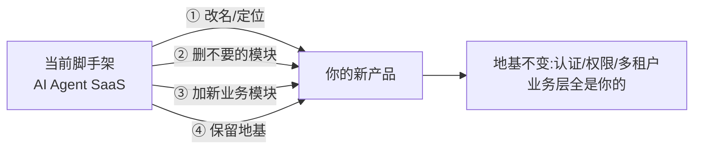
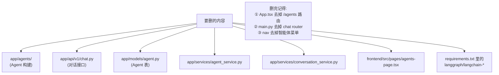
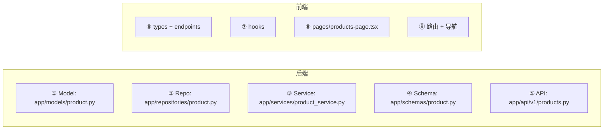

# 01 - 改造清单与命名

📍 相关文档:[02-新增后端模块](02-新增后端模块.md) · [03-新增前端模块](03-新增前端模块.md)

> 这一篇是「二开(二次开发)」的总纲。目标是:把这个 AI Agent SaaS 脚手架,改造成你的
> 新产品。读完后你会有一份清晰的「改什么、删什么、注意什么」清单。

---

## 二开的核心思路

**关键认知**:这个项目的价值在**地基**(认证、权限、多租户、CRUD 套路),不在「Agent」
这个具体业务。二开时:
- **地基原样保留**(除非你明确不需要多租户/权限)。
- **业务层随便改**(Agent 模块可留可删,加你自己的业务模块)。

---

## 第 1 步:全局改名

新 SaaS 有自己的名字。需要改的地方:

| 位置 | 当前值 | 改成 |
|------|--------|------|
| `.env` 的 `APP_NAME` | agenthub | 你的产品名 |
| `app/main.py` 的 `title` | settings.app_name | (跟着 APP_NAME) |
| `frontend/package.json` 的 `name` | frontend | 可改产品名 |
| `frontend/src/components/layout/dashboard-layout.tsx` 的标题 | "智能体云平台" | 你的产品名 |
| `README.md` | 当前内容 | 重写 |
| `项目指南/` | 当前文档 | 按需保留/重写 |

> 💡 **项目文件夹名**(`ai-agent-platform`)本身改不改都行,不影响运行。如果你要重命名,
> 记得改完检查 git remote 等配置。

---

## 第 2 步:决定保留哪些地基

| 地基能力 | 留还是删 | 说明 |
|---------|---------|------|
| **用户认证**(登录/token) | ✅ **强烈建议留** | 任何 SaaS 都要 |
| **多租户隔离** | ✅ 建议留 / 🔲 可删 | 多客户共用才留;单租户内部系统可删 |
| **RBAC 权限** | ✅ 建议留 | 角色权限几乎都要 |
| **审计日志** | ✅ 建议留 | 合规/追溯常用 |
| **AI Agent + 对话** | 看需求 | 做 AI 产品留;纯 CRUD 可删 |
| **组织架构树** | 看需求 | 有组织层级留 |

> ⚠️ **删多租户是大改动**。多租户隔离嵌在 Repository 基类、认证、权限各处,删掉要动很多
> 地方。**不确定就先留着**,反正不影响单租户使用。

---

## 第 3 步:删除/精简不需要的模块

如果不需要 AI 对话,可以删(影响范围可控):

> 💡 **保守做法**:先注释不删。功能停用但代码留着,万一以后要用。确认彻底不要再删。

---

## 第 4 步:加新业务模块(核心)

这是二开的主要工作。假设你的新产品要管理「商品」,需要加一个 products 模块:

**详细步骤见**:
- 后端 → [02-新增后端模块](02-新增后端模块.md)(手把手 6 文件 walkthrough)
- 前端 → [03-新增前端模块](03-新增前端模块.md)(手把手完整 walkthrough)

---

## 命名约定(重要)

遵循现有项目的命名风格,保持一致:

| 类型 | 约定 | 例子 |
|------|------|------|
| **Model 类** | 单数,首字母大写 | `Product`、`Order` |
| **表名** | 复数,蛇形 | `products`、`orders` |
| **文件名** | 蛇形,单数 | `product.py`、`order.py` |
| **Service 类** | `XxxService` | `ProductService` |
| **Repository 类** | `XxxRepository` | `ProductRepository` |
| **Schema 类** | `XxxCreate/Read/Update` | `ProductCreate`、`ProductRead` |
| **路由前缀** | 复数 | `/products`、`/orders` |
| **权限对象** | 复数 | `products:read`、`products:create` |
| **前端页面** | 蛇形-kebab | `products-page.tsx` |
| **前端 hook** | `useXxx` | `useProducts`、`useCreateProduct` |

> 💡 **权限对象命名**(products:read 这种)要和 [RBAC seed](../02-后端架构/06-权限模型RBAC.md)
> 里保持一致。加新模块时,记得在 `permission_service.py` 的 `seed_tenant_defaults` 给
> owner/admin/member 三档角色加上新权限。

---

## 改造检查清单 ✅

二开启动前,过一遍这个清单:

**全局**:
- [ ] 改了产品名(`.env`、前端标题)
- [ ] README 重写了
- [ ] 决定了保留哪些地基

**删减**(如需要):
- [ ] 不需要的模块已注释/删除
- [ ] 路由、导航、依赖已同步清理

**新增**:
- [ ] 后端模块(6 文件)已加,见 [02](02-新增后端模块.md)
- [ ] 数据库迁移已生成并执行
- [ ] RBAC seed 加了新权限
- [ ] 前端模块已加,见 [03](03-新增前端模块.md)
- [ ] 路由和导航已配置

**验证**:
- [ ] 后端测试通过(`pytest`)
- [ ] 前端能编译(`npm run build`)
- [ ] 手动点一遍新功能

---

## 几个二开建议

1. **先跑通原版再改**:确保脚手架本身能跑,再动刀。否则出错不知道是改的还是原本的。
2. **小步快跑**:改一点测一点,别攒一大堆再测。
3. **保留审计和日志**:这些「不起眼」的能力,上线后会很值钱。
4. **先保留 Agent 模块**:即使你不确定要不要 AI,先留着,后面想接 AI 时省事。
5. **文档跟着改**:改了代码记得更新 `项目指南/`,保持文档和代码同步。

---

**关键文件清单**:
- 产品名配置:`.env`(`APP_NAME`)、`app/main.py`
- 前端标题:`frontend/src/components/layout/dashboard-layout.tsx`
- 权限 seed:`app/services/permission_service.py` 的 `seed_tenant_defaults`
- 导航菜单:`frontend/src/components/layout/dashboard-layout.tsx` 的 `NAV_ITEMS`

**相关文档**:
- [02-新增后端模块](02-新增后端模块.md) — 后端 walkthrough
- [03-新增前端模块](03-新增前端模块.md) — 前端 walkthrough
- [附录/常见任务速查](../附录/常见任务速查.md) — 改字段/加接口等小任务
