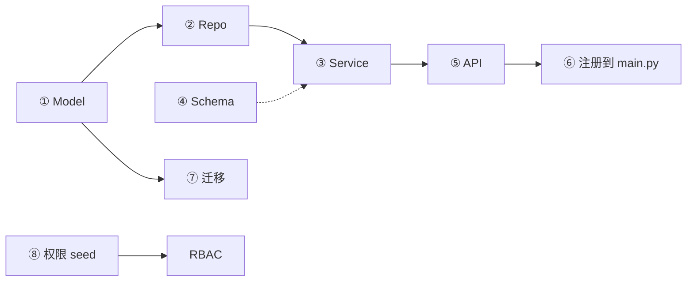

# 02 - 新增后端模块(手把手)

📍 相关文档:[01-改造清单](01-改造清单与命名.md) · [后端架构索引](../02-后端架构/01-分层架构与依赖方向.md)

> 这一篇用一个**虚构的「商品(products)」模块**,手把手走完后端新增模块的全流程。
> 你可以直接照抄改成自己的业务。以 Agent 模块为模板(它是最简洁的租户实体范例)。

---

## 目标

加一个 products 模块:每个租户有自己的商品,支持增删改查。涉及 6 个文件 + 1 处注册 +
1 个迁移 + 权限 seed。



---

## ① Model:`app/models/product.py`

定义 products 表。**关键:必须带 `tenant_id`**(才能用多租户隔离)。

```python
"""ORM model for products."""
import uuid
from datetime import datetime
from sqlalchemy import DateTime, ForeignKey, String, Text, func
from sqlalchemy.orm import Mapped, mapped_column
from app.core.database import Base

def _uuid() -> str:
    return uuid.uuid4().hex

class Product(Base):
    __tablename__ = "products"
    id: Mapped[str] = mapped_column(String(32), primary_key=True, default=_uuid)
    tenant_id: Mapped[str] = mapped_column(   # ← 关键!多租户隔离靠它
        String(32), ForeignKey("tenants.id", ondelete="CASCADE"), index=True
    )
    name: Mapped[str] = mapped_column(String(128), nullable=False)
    description: Mapped[str] = mapped_column(Text, default="")
    price: Mapped[int] = mapped_column(default=0)   # 单位:分
    created_at: Mapped[datetime] = mapped_column(
        DateTime(timezone=True), server_default=func.now()
    )
```

> 💡 参考 `app/models/agent.py` 的 `Agent` 类——它就是标准租户实体的写法。

**别忘了**:去 `alembic/env.py` 顶部加一行 `from app.models import product`(否则
autogenerate 看不到新表)。

---

## ② Repository:`app/repositories/product.py`

**最省事的一步**——继承 `TenantScopedRepository`,隔离自动就有:

```python
"""Product repository (tenant-scoped)."""
from app.models.product import Product
from app.repositories.base import TenantScopedRepository

class ProductRepository(TenantScopedRepository[Product]):
    model = Product
```

**就这两行!** 因为 `Product` 自带 `tenant_id`,基类的 `get_for_tenant` / `list_for_tenant`
自动加 `WHERE tenant_id = ?` 过滤。详见 [04-多租户隔离](../02-后端架构/04-多租户隔离.md)。

> ⚠️ 如果你的实体像 User 那样租户关系在关联表(不在自己身上),不能这样继承,要自己 join
> 过滤(参考 `app/repositories/user.py` 的 `UserListRepository._base`)。

---

## ③ Schema:`app/schemas/product.py`

定义接口的入参/出参(Pydantic):

```python
"""Product schemas."""
from datetime import datetime
from pydantic import BaseModel, Field

class ProductBase(BaseModel):
    name: str = Field(..., min_length=1, max_length=128)
    description: str = ""
    price: int = Field(..., ge=0)   # 单位分,≥0

class ProductCreate(ProductBase):
    pass

class ProductUpdate(BaseModel):     # 更新时字段都可选
    name: str | None = None
    description: str | None = None
    price: int | None = Field(None, ge=0)

class ProductRead(BaseModel):
    id: str
    tenant_id: str
    name: str
    description: str
    price: int
    created_at: datetime
    model_config = {"from_attributes": True}   # 能从 ORM 对象转换
```

> 💡 `from_attributes = True` 让 `ProductRead.model_validate(orm对象)` 能从 SQLAlchemy 对象
> 自动转换。参考 `app/schemas/agent.py`。

---

## ④ Service:`app/services/product_service.py`

装业务逻辑。**完整代码几乎和 `app/services/agent_service.py` 一模一样**,直接复制改名,
把 `Agent`→`Product`、`OBJECT = "agents"`→`"products"` 即可。核心套路:

```python
class ProductService:
    OBJECT = "products"   # ← 权限对象名,和 RBAC seed 对应
    def __init__(self, db):
        self.db = db
        self.repo = ProductRepository(db)

    async def create(self, user_id, tenant_id, payload):
        await permission_service.require(user_id, tenant_id, self.OBJECT, "create")
        p = Product(tenant_id=tenant_id, **payload.model_dump())  # ← 必须填 tenant_id!
        await self.repo.add(p)
        await self.db.commit()                                    # ← Service 提交
        return ProductRead.model_validate(p)
    # list / get / update / delete 套路相同,见 agent_service.py
```

**三个要点**:
1. 每个**写**方法开头 `permission_service.require(...)`。
2. `create` 时**手动填 `tenant_id`**。
3. Service 负责 `commit()`,Controller 不提交。

---

## ⑤ API:`app/api/v1/products.py`

Controller 层。**完整代码参考 `app/api/v1/agents.py`**(结构一致),核心套路:

```python
router = APIRouter(prefix="/products", tags=["products"])

@router.get("/", dependencies=[Depends(require_permission("products", "read"))])
async def list_products(
    user: CurrentUser = Depends(get_current_user),
    db: AsyncSession = Depends(get_db),
):
    return await ProductService(db).list(user.user_id, user.tenant_id)

# create / get / patch / delete 同理,照抄 agents.py 换名即可
```

**三件事**:声明权限(`require_permission`)→ 注入 `user`/`db` → 调 `Service`。

---

## ⑥ 注册:`app/main.py`

在 `create_app()` 里加一行:

```python
from app.api.v1 import ..., products   # ← import
# ...
app.include_router(products.router, prefix=prefix)   # ← 注册
```

---

## ⑦ 数据库迁移

```bash
alembic revision --autogenerate -m "add products table"
# 检查 alembic/versions/xxx_add_products_table.py 的 upgrade()
alembic upgrade head
```

> ⚠️ 一定要检查生成的迁移文件!确认 `upgrade()` 真的建了 products 表(带 tenant_id + 外键)。
> 详见 [03-数据库与ORM](../02-后端架构/03-数据库与ORM.md)。

---

## ⑧ 权限 seed

去 `app/services/permission_service.py` 的 `seed_tenant_defaults`,给三档角色加 products 权限:

```python
# owner 能全管 products
owner_perms = [..., ("products", "read"), ("products", "create"),
               ("products", "update"), ("products", "delete")]
admin_perms = [..., ("products", "read"), ("products", "create")]
member_perms = [..., ("products", "read")]
```

> 这样新建租户时,默认角色就有 products 权限。详见 [06-权限模型RBAC](../02-后端架构/06-权限模型RBAC.md)。

---

## ⑨ 加测试(建议)

`tests/test_products_api.py`,套用现有测试套路。详见 [08-测试体系](../02-后端架构/08-测试体系.md)。

---

## 验证

```bash
pytest tests/test_products_api.py   # 测试通过
# 启动后端,打开 /docs,能看到 /api/v1/products 一组接口
# 用 owner 登录,能增删改查商品;member 只能读
```

---

## 常见坑

| 坑 | 解决 |
|----|------|
| autogenerate 没发现新表 | `alembic/env.py` 没加 `from app.models import product` |
| 创建时 tenant_id 为空 | Service create 忘了填 `tenant_id=tenant_id` |
| 403 无权限 | 忘了在 seed 加 products 权限,或 seed 没重新跑 |
| 跨租户能查到 | 没继承 `TenantScopedRepository`,或用了裸 select |

---

**参考范例(最简洁的租户实体)**:
- Model:`app/models/agent.py` 的 `Agent`
- Repository:`app/repositories/agent.py`(仅 2 行)
- Service:`app/services/agent_service.py`
- Schema:`app/schemas/agent.py`
- API:`app/api/v1/agents.py`

**相关文档**:
- [03-新增前端模块](03-新增前端模块.md) — 后端做完接前端
- [附录/常见任务速查](../附录/常见任务速查.md) — 改字段等小任务
