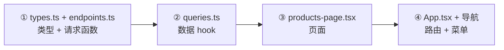
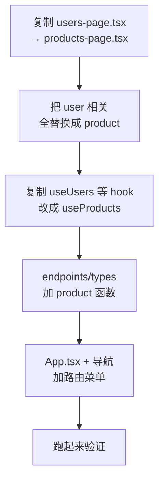

# 03 - 新增前端模块(手把手)

📍 相关文档:[02-新增后端模块](02-新增后端模块.md) · [前端架构索引](../03-前端架构/01-技术栈与目录.md)

> 承接上一篇,后端 products 接口做好后,这篇加一个商品管理页面。手把手走完前端 4 步。
> 最快方式:复制 users-page 改造。

---

## 目标

加一个 `/products` 页面:商品列表(增删改查)。涉及 4 处改动。



> 💡 **前提**:后端 `/api/v1/products` 接口已完成(见 [02-新增后端模块](02-新增后端模块.md))。

---

## ① 类型 + 请求函数

### `frontend/src/api/types.ts` 加类型

```ts
// 和后端 ProductRead 对齐
export interface Product {
  id: string;
  tenant_id: string;
  name: string;
  description: string;
  price: number;        // 单位:分
  created_at: string;
}

export interface ProductCreate {
  name: string;
  description: string;
  price: number;
}

export interface ProductUpdate {
  name?: string;
  description?: string;
  price?: number;
}
```

> ⚠️ **手动维护**,和后端 schema 保持一致。后端改了要同步改这里。

### `frontend/src/api/endpoints.ts` 加请求函数

```ts
import { api } from "./client";
import type { Product, ProductCreate, ProductUpdate } from "./types";

// ---------- products ----------
export async function fetchProducts(): Promise<Product[]> {
  const { data } = await api.get<Product[]>("/products/");
  return data;
}

export async function createProduct(payload: ProductCreate): Promise<Product> {
  const { data } = await api.post<Product>("/products/", payload);
  return data;
}

export async function updateProduct(
  id: string,
  payload: ProductUpdate
): Promise<Product> {
  const { data } = await api.patch<Product>(`/products/${id}`, payload);
  return data;
}

export async function deleteProduct(id: string): Promise<void> {
  await api.delete(`/products/${id}`);
}
```

> 💡 token 自动带、401 自动处理,不用管。详见 [02-API层](../03-前端架构/02-API层与请求拦截.md)。

---

## ② 数据 hook:`frontend/src/hooks/queries.ts`

先在 `qk` 加 key,再加 hook:

```ts
// qk 工厂里加(保持和其他资源一致的风格)
export const qk = {
  // ...existing...
  products: ["products"] as const,
  product: (id: string) => ["products", id] as const,
};

// 读 hook
export function useProducts() {
  return useQuery({ queryKey: qk.products, queryFn: fetchProducts });
}

// 写 hook(增删改,都带 invalidate)
export function useCreateProduct() {
  const qc = useQueryClient();
  return useMutation({
    mutationFn: (payload: ProductCreate) => createProduct(payload),
    onSuccess: () => qc.invalidateQueries({ queryKey: ["products"] }),
  });
}

export function useUpdateProduct() {
  const qc = useQueryClient();
  return useMutation({
    mutationFn: ({ id, payload }: { id: string; payload: ProductUpdate }) =>
      updateProduct(id, payload),
    onSuccess: () => qc.invalidateQueries({ queryKey: ["products"] }),
  });
}

export function useDeleteProduct() {
  const qc = useQueryClient();
  return useMutation({
    mutationFn: (id: string) => deleteProduct(id),
    onSuccess: () => qc.invalidateQueries({ queryKey: ["products"] }),
  });
}
```

**关键**:`onSuccess` 里 `invalidateQueries({ queryKey: ["products"] })`,这样改完自动刷新。
详见 [04-数据获取](../03-前端架构/04-数据获取TanStackQuery.md)。

---

## ③ 页面:`frontend/src/pages/products-page.tsx`

**最快方式:复制 `users-page.tsx` 改造**(全文 user→product)。核心结构骨架:

```tsx
export function ProductsPage() {
  const { data: products, isLoading } = useProducts();   // 读
  const createMu = useCreateProduct();                    // 写
  const deleteMu = useDeleteProduct();
  const toast = useToast();
  const [open, setOpen] = useState(false);

  if (isLoading) return <Skeleton className="h-64" />;

  return (
    <div className="space-y-4">
      {/* 1. 标题 + 新建按钮 */}
      {/* 2. Card > Table:表头(名称/价格/操作)+ map 渲染行 */}
      {/*    行内「删除」按钮 → deleteMu.mutateAsync(p.id) */}
      {/* 3. 新建 Dialog:表单 → createMu.mutateAsync(payload) */}
    </div>
  );
}
```

**用到这些组件**:`Card`、`Table`(TableHeader/Body/Row/Cell)、`Button`、`Dialog`、`Input`、
`Skeleton`、`useToast`。

**错误处理**:catch 里用 `apiErrorMessage(err)` 把后端错误转成提示。

> 💡 **生产建议**:表单用 `react-hook-form + zod`(校验更完善),直接抄 `users-page.tsx`
> 的表单部分。详见 [05-UI组件](../03-前端架构/05-UI组件与页面模式.md)。

---

## ④ 路由 + 导航

### `frontend/src/App.tsx` 加路由

在受保护路由的子路由里加一行:

```tsx
<Route path="/products" element={<ProductsPage />} />
```

记得顶部 `import { ProductsPage } from "@/pages/products-page";`。

### `dashboard-layout.tsx` 加导航项

在 `NAV_ITEMS` 数组加一项(选个合适图标,从 lucide-react 导入):

```tsx
import { Package } from "lucide-react";

const NAV_ITEMS: NavItem[] = [
  { to: "/", label: "概览", icon: LayoutDashboard },
  { to: "/agents", label: "智能体", icon: Bot },
  { to: "/products", label: "商品", icon: Package },   // ← 加这行
  { to: "/users", label: "用户", icon: Users },
  // ...
];
```

---

## 验证

```bash
cd frontend && npm run dev
# 登录后,左侧菜单出现「商品」,点进去能看到列表、能新建/删除
# 新建后表格自动刷新(感谢 invalidate)
```

---

## 最快流程总结(复制改造法)



1. 复制 `users-page.tsx` → `products-page.tsx`,全文替换 user→product。
2. `queries.ts` 复制 useUsers 段,改 product。
3. `endpoints.ts` / `types.ts` 加 product。
4. `App.tsx` 加路由,`dashboard-layout.tsx` 加菜单。

---

## 常见坑

| 坑 | 解决 |
|----|------|
| 页面空白/报错 | 检查路由是否加、组件是否 import |
| 菜单没出现 | `NAV_ITEMS` 没加,或图标没 import |
| 改完不刷新 | `onSuccess` 忘了 `invalidateQueries` |
| 类型对不上 | `types.ts` 和后端 schema 不一致 |

---

**参考范例(最完整的列表页)**:
- 页面:`frontend/src/pages/users-page.tsx`(分页/搜索/筛选/排序/CRUD 全有)
- hooks:`frontend/src/hooks/queries.ts` 的 users 段
- endpoints:`frontend/src/api/endpoints.ts` 的 users 段

**相关文档**:
- [02-新增后端模块](02-新增后端模块.md) — 先做后端
- [05-UI组件与页面模式](../03-前端架构/05-UI组件与页面模式.md) — 页面套路详解
