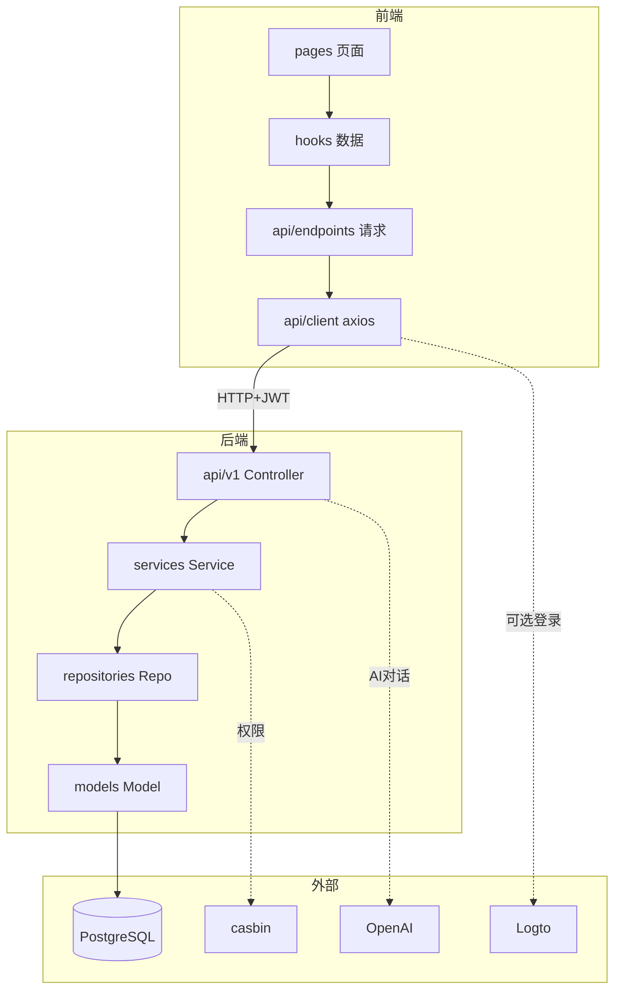
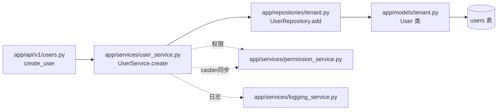
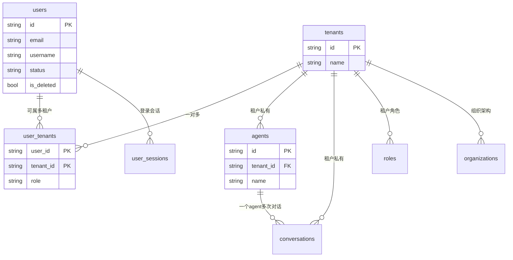
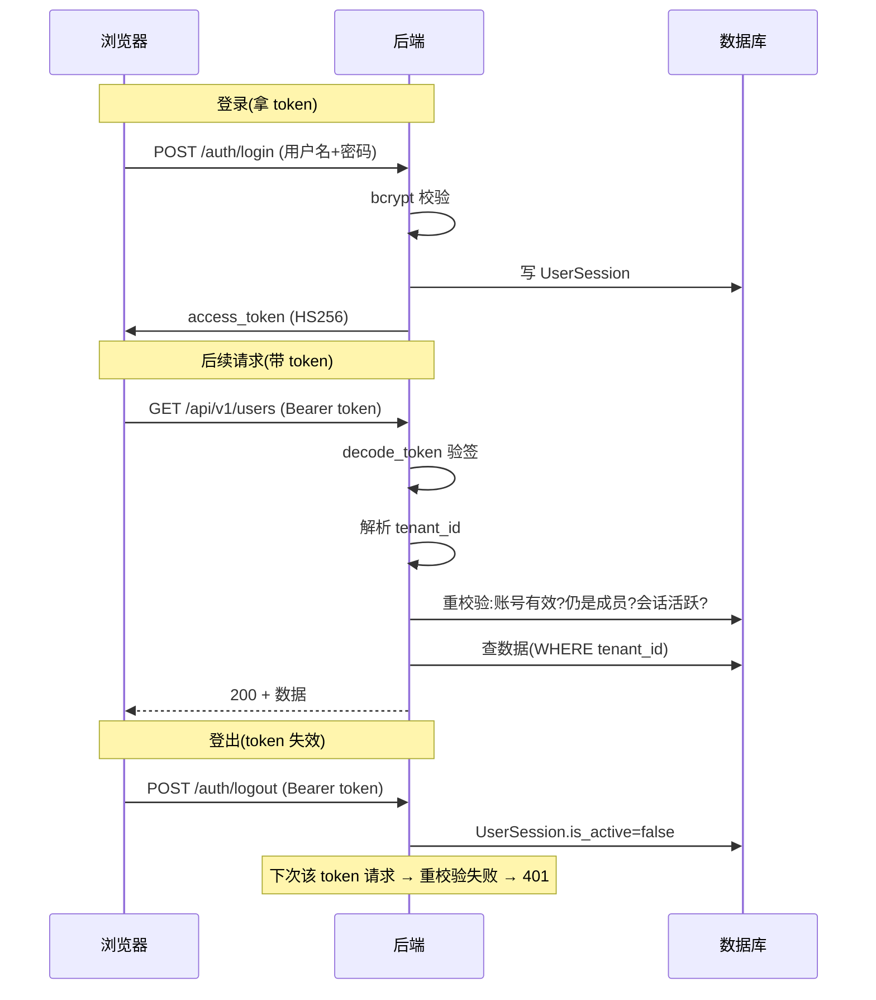
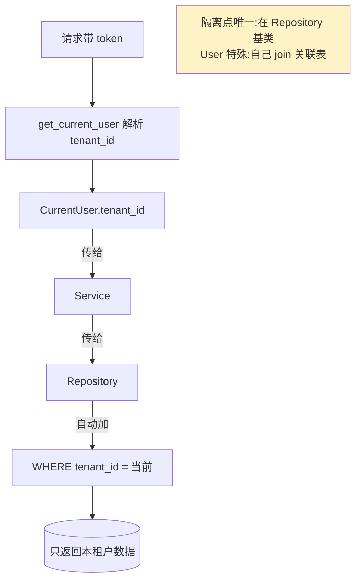
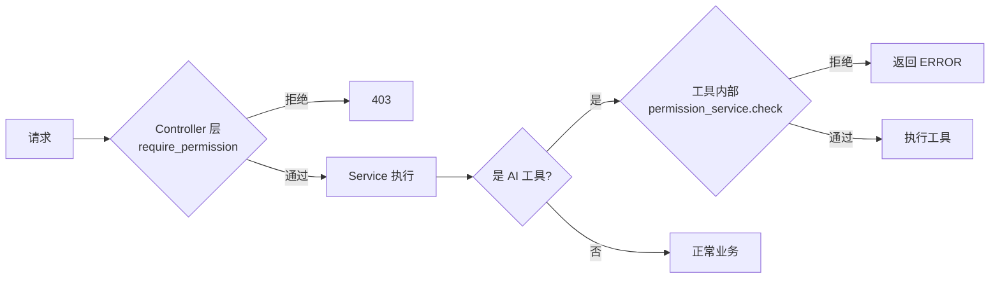
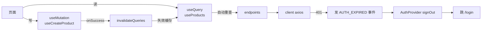

# 关系图

> 这里集中了项目的各类「关系图」。排查问题、理解全局、评估改动影响时来这里。
> 📖 [README](../README.md) · [术语表](术语表.md)

---

## 一、整体模块依赖图

前端三层 ↔ 后端四层 ↔ 外部服务:



---

## 二、后端调用链(文件级)

「创建用户」从前端到库,经过的文件:



**记忆口诀**:Controller(`api/v1/`)→ Service(`services/`)→ Repository(`repositories/`)
→ Model(`models/`)。Schema(`schemas/`)横切校验。

---

## 三、核心数据模型(ER 简图)



> 💡 完整 ER 图见 `docs/db-schema.mmd`(可用 mermaid 渲染)。关键:所有业务表都带 `tenant_id`
> 做隔离;User 特殊(通过 `user_tenants` 关联表归属多租户)。

---

## 四、认证时序图(token 全旅程)



---

## 五、多租户隔离机制



---

## 六、权限校验链



**双重校验**:Controller 声明式 + AI 工具内部再查。改权限两处都要想到。

---

## 七、前端数据流闭环



---

## 八、🔥 改动影响速查表

「我要改 X,会影响谁?」

| 我要改... | 影响范围 | 必看文档 |
|----------|---------|---------|
| **加/改数据库字段** | Model + 迁移 + Schema + 前端 types | [03-数据库](../02-后端架构/03-数据库与ORM.md) |
| **加新接口** | API + Service + Repo(如需)+ 路由注册 + 前端 endpoint + hook | [04-二开/02](../04-二开脚手架/02-新增后端模块.md) |
| **加新页面** | page + 路由 + 导航 + (可能)endpoint/hook | [04-二开/03](../04-二开脚手架/03-新增前端模块.md) |
| **改权限规则** | permission_service seed + casbin_model.conf + AI 工具内校验 | [06-RBAC](../02-后端架构/06-权限模型RBAC.md) |
| **改 token 算法/TTL** | config + local_auth + security + 前端(client 透明) | [05-认证](../02-后端架构/05-认证体系.md) |
| **改多租户隔离** | Repository 基类 + 所有 repo + deps(get_current_user) | [04-隔离](../02-后端架构/04-多租户隔离.md) |
| **加新 AI 工具** | agents/graph.py 的 `_build_tenant_tools` + 工具内加权限 | [07-Agent](../02-后端架构/07-Agent与LLM集成.md) |
| **改默认角色权限** | permission_service.seed_tenant_defaults | [06-RBAC](../02-后端架构/06-权限模型RBAC.md) |
| **改 JWT_SECRET** | config(.env)+ 重启 | [02-配置](../02-后端架构/02-配置与环境.md) |
| **加配置项** | config.py Settings + .env.example + 代码引用 | [02-配置](../02-后端架构/02-配置与环境.md) |
| **改主题/配色** | index.css(CSS 变量)+ tailwind.config.js | [05-UI](../03-前端架构/05-UI组件与页面模式.md) |
| **加 UI 组件** | components/ui/ 下新建 | [05-UI](../03-前端架构/05-UI组件与页面模式.md) |

---

## 九、目录速览

```
ai-agent-platform/
├── app/           后端(四层 + core + agents)
├── frontend/src/  前端(api/components/hooks/pages/lib)
├── alembic/       数据库迁移
├── tests/         后端测试
├── docs/          其他文档(LOGTO/db-schema)
└── 项目指南/       你正在读的这套文档
```

---

**相关文档**:
- [02-架构全景图](../00-总览/02-架构全景图.md) — 更宏观的图(适合第一遍看)
- [常见任务速查](常见任务速查.md) — 具体任务该看哪几篇
