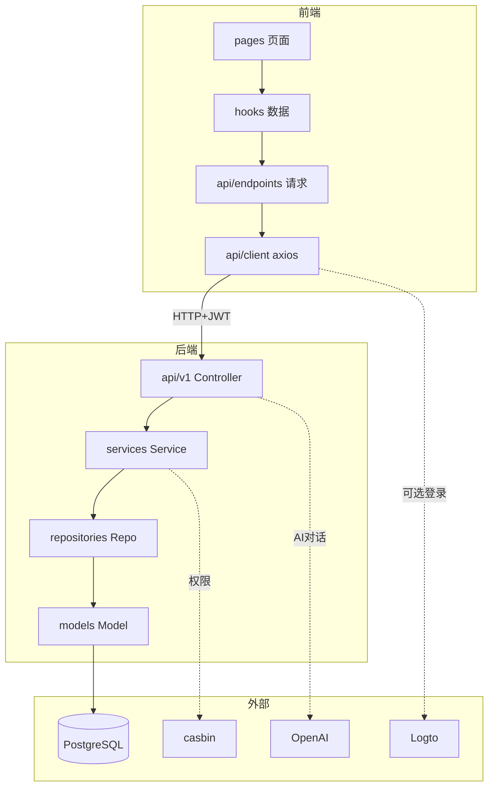
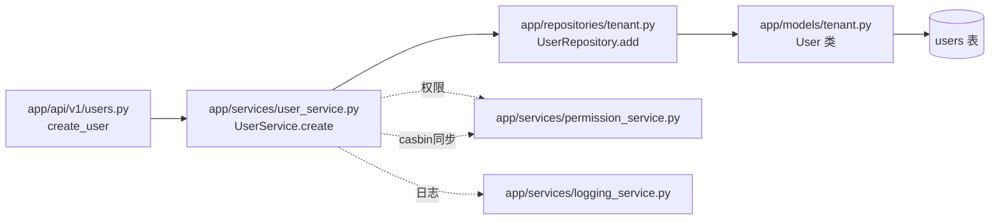
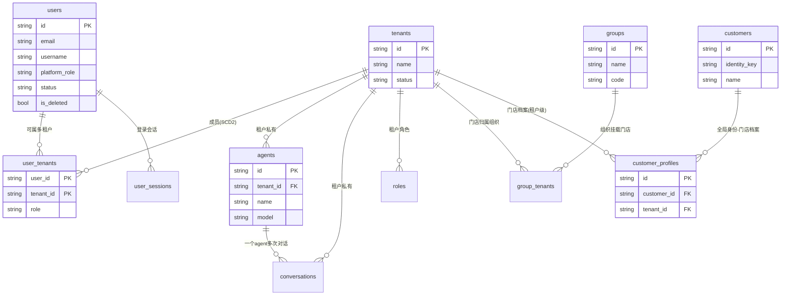
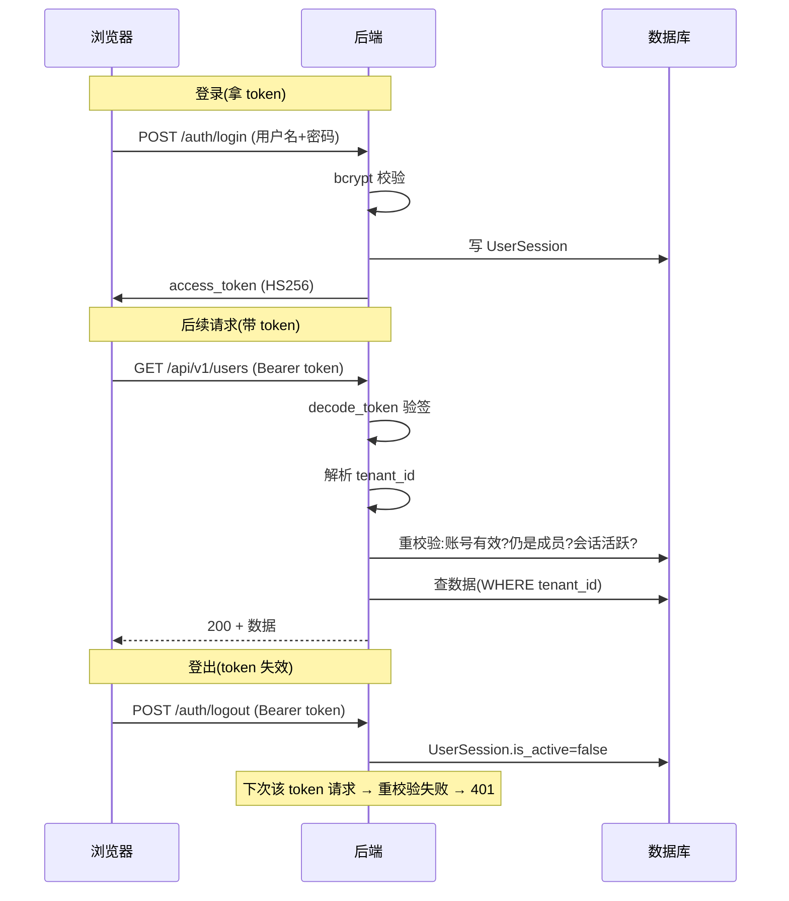
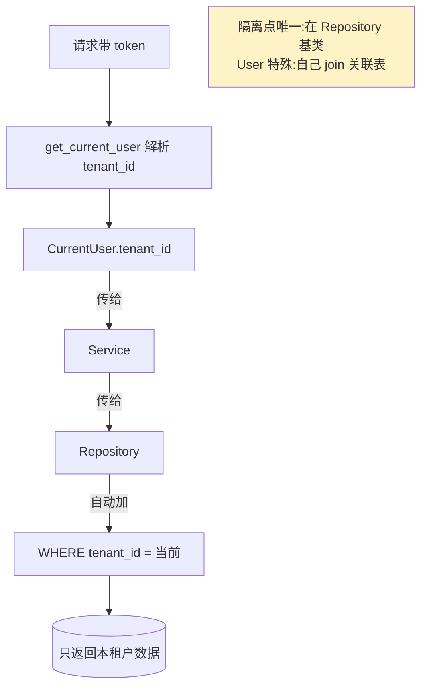
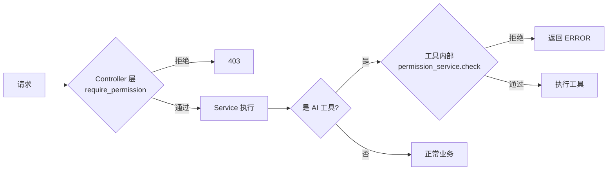
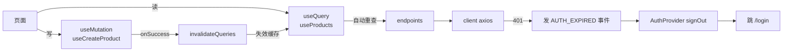
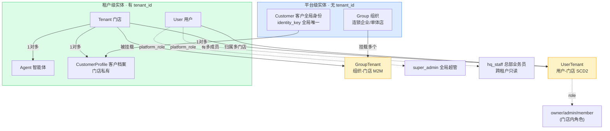
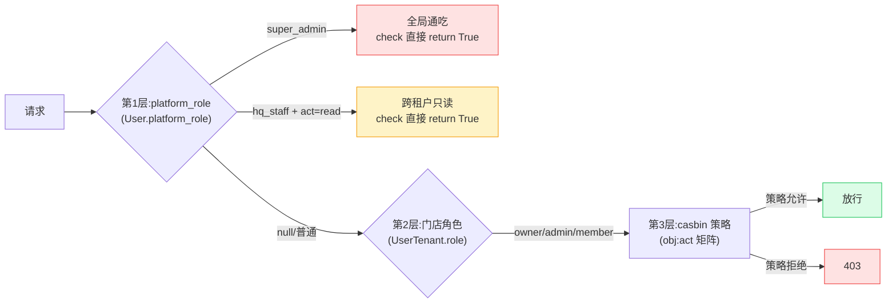

# 关系图

> 这里集中了项目的各类「关系图」。排查问题、理解全局、评估改动影响时来这里。
> 📖 [README](../README.md) · [术语表](术语表.md)

---

## 一、整体模块依赖图

前端三层 ↔ 后端四层 ↔ 外部服务:



---

## 二、后端调用链(文件级)

「创建用户」从前端到库,经过的文件:



**记忆口诀**:Controller(`api/v1/`)→ Service(`services/`)→ Repository(`repositories/`)
→ Model(`models/`)。Schema(`schemas/`)横切校验。

---

## 三、核心数据模型(ER 简图)



> 💡 完整 ER 图见 `docs/db-schema.mmd`(可用 mermaid 渲染)。
>
> ⚠️ **三类实体**(不是所有业务表都带 tenant_id):
> - **平台级实体(无 tenant_id)**:`groups` / `customers` —— 跨租户的全局身份/经营主体
> - **租户级实体(有 tenant_id)**:`agents` / `conversations` / `customer_profiles` —— 门店私有数据
> - **关联表**:`user_tenants`(用户↔租户 SCD2)/ `group_tenants`(组织↔门店 M2M)

---

## 四、认证时序图(token 全旅程)



---

## 五、多租户隔离机制



---

## 六、权限校验链



**双重校验**:Controller 声明式 + AI 工具内部再查。改权限两处都要想到。

---

## 七、前端数据流闭环



---

## 八、🔥 改动影响速查表

「我要改 X,会影响谁?」

| 我要改... | 影响范围 | 必看文档 |
|----------|---------|---------|
| **加/改数据库字段** | Model + 迁移 + Schema + 前端 types | [03-数据库](../02-后端架构/03-数据库与ORM.md) |
| **加新接口** | API + Service + Repo(如需)+ 路由注册 + 前端 endpoint + hook | [04-二开/02](../04-二开脚手架/02-新增后端模块.md) |
| **加新页面** | page + 路由 + 导航 + (可能)endpoint/hook | [04-二开/03](../04-二开脚手架/03-新增前端模块.md) |
| **改权限规则** | permission_service seed + casbin_model.conf + AI 工具内校验 | [06-RBAC](../02-后端架构/06-权限模型RBAC.md) |
| **改 token 算法/TTL** | config + local_auth + security + 前端(client 透明) | [05-认证](../02-后端架构/05-认证体系.md) |
| **改多租户隔离** | Repository 基类 + 所有 repo + deps(get_current_user) | [04-隔离](../02-后端架构/04-多租户隔离.md) |
| **加新 AI 工具** | agents/graph.py 的 `_build_tenant_tools` + 工具内加权限 | [07-Agent](../02-后端架构/07-Agent与LLM集成.md) |
| **改默认角色权限** | permission_service.seed_tenant_defaults | [06-RBAC](../02-后端架构/06-权限模型RBAC.md) |
| **改 JWT_SECRET** | config(.env)+ 重启 | [02-配置](../02-后端架构/02-配置与环境.md) |
| **加配置项** | config.py Settings + .env.example + 代码引用 | [02-配置](../02-后端架构/02-配置与环境.md) |
| **改主题/配色** | index.css(CSS 变量)+ tailwind.config.js | [05-UI](../03-前端架构/05-UI组件与页面模式.md) |
| **加 UI 组件** | components/ui/ 下新建 | [05-UI](../03-前端架构/05-UI组件与页面模式.md) |

---

## 九、目录速览

```
ai-agent-platform/
├── app/           后端(四层 + core + agents)
├── frontend/src/  前端(api/components/hooks/pages/lib)
├── alembic/       数据库迁移
├── tests/         后端测试
├── docs/          其他文档(LOGTO/db-schema)
└── 项目指南/       你正在读的这套文档
```

---

**相关文档**:
- [02-架构全景图](../00-总览/02-架构全景图.md) — 更宏观的图(适合第一遍看)
- [常见任务速查](常见任务速查.md) — 具体任务该看哪几篇

---

## 十、业务实体全景图(MVP 业务模块)

> 新增于 2026-07-12(demo-seed 任务)。MVP 业务模块(groups/customers/hq-platform-role)落地后的完整业务实体关系。

### 10.1 实体关系全景



### 10.2 三个核心概念

**① 成员 vs 客户(别混淆)**

| | 成员(Member) | 客户(Customer) |
|---|---|---|
| **谁** | 门店员工(有系统账号) | 门店顾客(无系统账号) |
| **实体** | `User` + `UserTenant`(绑定角色) | `Customer` + `CustomerProfile` |
| **关系** | `UserTenant.role` = owner/admin/member | `CustomerProfile` = 门店档案 |
| **可见性** | 登录后看到本门店 | 被 member 查询/管理 |

**② 跨店身份复用(客户去多家门店)**

- `Customer.identity_key`(手机号/证件号)**全局唯一** —— 同一个人在系统里只有一条 Customer 记录。
- `CustomerProfile` **每个门店一条** —— 张先生去朝阳+海淀 = 1 个 Customer + 2 个 Profile。
- 总部(super_admin/hq_staff)能看到「张先生跨 2 家门店」;门店只看到自己的那条 Profile。

**③ 平台级 vs 租户级(隔离边界)**

| 类型 | 实体 | 隔离方式 |
|------|------|---------|
| **平台级** | Group / Customer | 无 tenant_id,全局唯一(identity_key 部分唯一索引) |
| **租户级** | Agent / Conversation / CustomerProfile | 有 tenant_id,Repository 层 WHERE 过滤 |
| **关联表** | UserTenant / GroupTenant | M2M 连接,本身无独立业务含义 |

### 10.3 权限模型(三层)



- **第 1 层**:`permission_service.check()` 开头短路 —— super_admin 直接 True;hq_staff + 读操作直接 True。
- **第 2 层**:通过 `UserTenant.role` 确定门店内角色(owner/admin/member)。
- **第 3 层**:查 casbin 策略表(role 是否有 `obj:act` 权限)。

---

## 十一、演示案例说明(demo-seed + demo-seed-full)

> 新增于 2026-07-12,2026-07-13 全量补全。配套种子脚本 `scripts/seed_demo.py`,
> 大健康连锁「颐和堂」演示场景。覆盖项目全部业务表。

### 11.1 种子脚本

**路径**:`scripts/seed_demo.py`

**用法**(需先跑 `init_admin.py` 建超管):
```bash
python scripts/init_admin.py             # 建 super_admin(若未建)
python scripts/seed_demo.py              # 建演示数据(幂等可重跑)
python scripts/seed_demo.py --reset      # 清空演示数据 + 全量重建(白名单边界,不误伤)
```

⚠️ 所有演示账号密码统一 `Demo@123456`,**仅演示用,生产勿用**。
⚠️ LLM 配置的 `api_key` 是占位符 `sk-demo-placeholder`,真实对话请在 settings 页填真实 key。

### 11.2 演示账号清单

| 角色 | 用户名 | 密码 | 所属门店/范围 |
|------|--------|------|--------------|
| super_admin | `admin` | `Demo@123456` | 全局(init_admin 建立) |
| hq_staff | `hq_dudao` | `Demo@123456` | 总部(跨租户只读) |
| owner | `chen_guanzhang` | `Demo@123456` | 朝阳理疗中心 |
| senior_therapist | `li_shifu` | `Demo@123456` | 朝阳理疗中心(自定义角色) |
| member | `wang_shifu` | `Demo@123456` | 朝阳理疗中心 |
| owner | `zhao_guanzhang` | `Demo@123456` | 海淀中医门诊 |
| member | `sun_shifu` | `Demo@123456` | 海淀中医门诊 |
| owner | `wu_guanzhang` | `Demo@123456` | 王府井理疗馆 |

### 11.3 数据全景

| 数据类型 | 数量 | 明细 |
|---------|------|------|
| 门店(Tenant) | 3 | 朝阳理疗中心 / 海淀中医门诊 / 王府井理疗馆 |
| 组织(Group) | 2 | 颐和堂中医馆(挂朝阳+海淀)、独立养生馆(挂王府井) |
| 员工(User) | 7 | 6 门店员工 + 1 hq_staff |
| 客户档案(CustomerProfile) | 5 | 张先生(朝阳)、刘女士(朝阳)、张先生(海淀,跨店)、周先生(海淀)、刘女士(王府井,跨店) |
| 客户全局身份(Customer) | 3 | 张先生/刘女士(各跨2店)、周先生 |
| Agent | 4 | 朝阳(temp=0.3 严谨)/海淀(0.7 默认)/王府井(0.9 发散)/总部督导(0.2 保守),推理参数各不同 |
| 对话(Conversation) | 5 | 每门店 1-2 段 + 平台级总部汇总 1 段 |
| 消息(Message) | 22 | 4-6 条/段,user/assistant 交替,大健康场景文本 |
| LLM 配置(LlmConfig) | 2 | 平台级 deepseek-chat + 朝阳店租户级 deepseek-reasoner(演示三级 fallback) |
| API Token(ApiToken) | 2 | 朝阳/海淀 owner 各 1 个(AtoA 集成,明文仅展示一次) |
| 自定义角色(Role) | 1 | 资深理疗师(senior_therapist,朝阳店,customers:read/update + conversations),李师傅绑定 |
| 审计日志(SystemLog) | 6+ | Service 调用自然产生(role.create/role.grant 等) |
| 多登录方式(UserLoginMethod) | 1 | chen_guanzhang 加手机号 13800001111(邮箱+手机号双登录) |

### 11.4 核心验证点

登录不同角色,验证业务价值:

1. **门店隔离**:登录 `chen_guanzhang`(朝阳 owner)→ 客户页只见 2 个档案(张先生+刘女士本店),看不到海淀/王府井。
2. **跨店聚合**:登录 `admin`(super_admin)→ 客户聚合视图可见张先生 profile_count=2(朝阳+海淀)、刘女士 profile_count=2(朝阳+王府井)。
3. **hq_staff 只读**:登录 `hq_dudao` → 能看所有门店客户档案(只读),但不能创建/修改。
4. **组织视角**:Group 页可见「颐和堂中医馆」挂了 2 家门店、「独立养生馆」挂了 1 家。
5. **三级 fallback**:登录 `chen_guanzhang`(朝阳)→ Agent 下拉显示 deepseek-reasoner(租户级覆盖);登录 `zhao_guanzhang`(海淀)→ 显示 deepseek-chat(回退平台级)。
6. **自定义角色生效**:登录 `li_shifu`(senior_therapist)→ 能改客户档案(customers:update)但不能删(无 customers:delete);能创建对话(conversations:create)。
7. **对话历史可见**:对话页可见 5 段对话,点开有完整的 user/assistant 轮次消息。
8. **AtoA Token 可用**:朝阳/海淀 owner 的 API Token(脚本输出明文)可用于 agenthub CLI 登录。
9. **Agent 推理参数差异化**:Agent 详情页可见 4 个 Agent 的 temperature/max_tokens/top_p 各不同。
